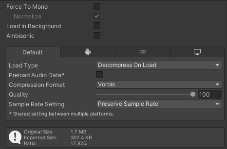
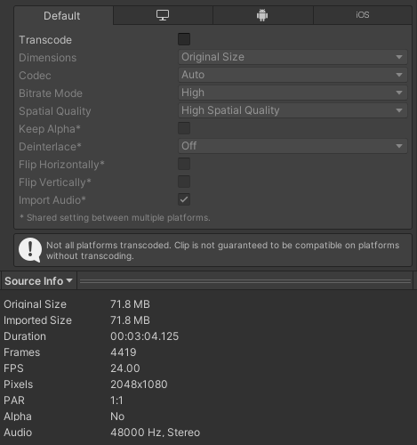

# 资源导入优化

游戏引擎中实际打包使用的资源文件和导入的文件是不一样的。`.wav`,`.png`,`.fbx` 这些都为了存储、开发或特定于软件的格式，有些并不利于跨平台、实时加载、硬件使用。因此资源放入 Unity 到实际打包使用，基本都会被转换成一些更直白、运行更快、更适配硬件的存储格式。

此外很多原始资源，还存在内容冗余、内存不规范等需要后处理的情况，这些都使得我们需要利用资源导入去解决这些问题。

因此我们需要了解资源的导入机制，这是优化存储和加载最有效的一个途径。

## 音频

### 数据编辑

- `Compression Format`：音频文件实际打包后的存储格式。
  - `PCM`：直接存储最原始的音频波形数据，最高的音质，但空间占用也大。
  - `Vorbis/MP3`：以有损压缩的形式存储音频，质量下滑但体积小。支持流式解码甚至可硬件直接播放，有些许的CPU开销。适合于中等长度的音乐音效。
  - `ADPCM`：有损压缩，压缩比没有 `Vorbis` 高，但解码开销几乎没有，适合于脚步、撞击等需大量播放的短小音效。
- `Sample Rate Setting`：调整音频的采样率，采样率越低声音越糊，但可减少大小并减轻播放开销
  - `Preserve Sample Rate`：维持原始音频的采样率
  - `Optimize Sample Rate`：让Unity自动决定是否优化（偏保守）
  - `Override Sample Rate`：手动指定采样率
- `Force To Mono`：将具有左右声道的音频强制重制为单声道，对于不需要区分左右耳或3D音频，此举可以节省一半存储空间。
  
### 加载优化

- `Preload Audio Data`：默认情况下 Unity 会在场景加载后就直接加载所有可能被播放的音频文件，如果关闭，则只在真的需要播放时才加载。关闭后可节省内存和启动开销，但可能导致音频播放延迟。
- `Load In Background`：启用后加载音频时将会采取异步加载，如果此时需要播放音频，则播放器会自动等待。开启后可以加快应用启动速度。
- `Load Type`
  - `Streaming`：将音频放在外存按流式的方式加载，可以节省内存消耗，避免加载卡死，适合长段的背景音乐等。
  - `Decompress On Load`：音频加载后将立即存放到内存中，播放开销小，但内存占用大，适合频繁短小的音效。
  - `Compressed In Memory`：音频加载后以压缩的格式存放到内存，可以减少内存开销，但每次播放时都需要解压，导致CPU计算量增大，建议仅当内存确实不够时再尝试改选项。

## 视频

视频设置中重新编码的可选的，因此允许直接使用源文件的格式，但这也带来了平台兼容性问题：
https://docs.unity3d.com/2022.3/Documentation/Manual/VideoSources-FileCompatibility.html

由于视频默认都是硬件解码，所以不兼容带来的问题很大，过往已有多次编辑器内或打包后因视频导致的画面不正常的情况。因此建议每次都让Unity重新编码，这样还可借此优化视频文件。

- `Dimensions`：调整视频的分辨率。当视频画面在空间中占比很小时，降低分辨率不会带来模糊问题，反而还能显著减少文件大小，且降低播放开销。

## 模型
