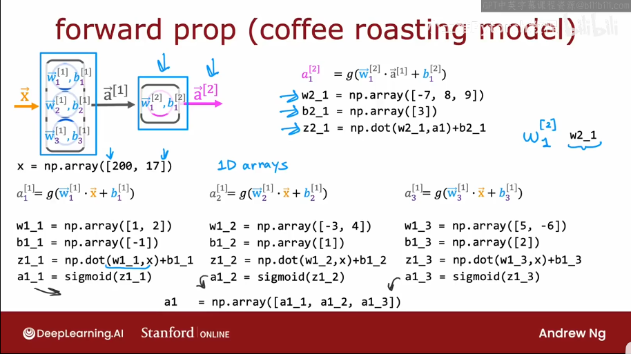

# 【人工智能】深度学习

深度学习又叫神经网络，最早是人们仿照人脑工作原理设计的算法，不过如今更多的是利用工程学的思想去开发而不是生物学。

## 基本概念

- 激活（单元）：一个神经元。
- 激活值：一个神经元的输出。
- 层：一组具有相同或相似输入的神经元。
  - 输入层：用于初始输入的层。
  - 输出层：用于最终输出的层。
  - 隐藏层：用于中间计算的层。
- 层数：隐藏层和输出层的数量。
- 层序号：输入层为第 0 层，其他层按序编号。

## 基本原理

深度学习的结构类似人脑的神经网络，由多个激活组合而成，其中每个激活都对应着传统机器学习中的某一模型，若干模型连接在一起，便构成了深度学习结构。

这些激活被分组为多个层，每个层都完全接收前一层的输出特征向量，并继续输出特征向量给后一层。深度学习中层与层之间的关系以及特征向量的具体内容都是不需要深究，这也是深度学习强大的地方，连特征的定义都成了模型预测的一部分。也就是说，你甚至不需要去考虑挑选模型的输入特征，你只要把你能获得的东西一股脑全给模型即可。

例如用深度学习识别人脸，实际上根本没人教程序应该识别哪些面部特征，而是程序自行发现了人脸的特征并以此识别。并且识别这些特征往往还需要搭配一些小特征的识别，但这些技巧都是程序自行发现的。而你的输入也不需要挑选，直接把图片像素排成向量，一股脑塞给模型即可（感觉好逆天）。

每一层输入一个数字向量并应用一堆逻辑回归单元，层层传递计算直到输出层输出结果。

## 激活值

对于每一个激活值可以表述为：$a^{[i]}_j$

- $i$：网络中的第几层
- $j$：层中的第几个神经元

其代表了每个神经元的输出，等价于传统机器学习中的输入输出特征。由于神经网络大多数全连接层，因此一般激活值以向量的形式表示 $\vec{a}$，表示当前层的所有激活值。

对于输入层，$\vec{a}$ 是从数据集中获取的，而对于隐藏层或输出层，$\vec{a}$ 则是通过一些神经元算法计算得出，其基本过程如下：

$$
\vec{a}^{[i]}_j=g(\vec{w_j}^{[i]}\cdot\vec{a}^{[i-1]}+b_j^{[i]})
$$

- $\vec{a}$：输出的特征向量
- $g$：激活函数

## 神经元算法

深度学习中所有神经元使用的算法，都是线性函数+激活函数。

### 线性函数

神经元中采用的线性函数都是固定的：

$$
z=\vec{w}\cdot\vec{a}^{last} + b
$$

- $\vec{a}^{last}$：前一层输出的特征向量。
- $\vec{w}$：一种模型参数，被称为权重。
- $b$：一种模型参数，被称为偏置。

### 激活函数

线性函数是固定的，参数数量与输入特征有关。激活函数则是可插拔的，其中最常用的是 ReLU，主要用于实现非线性变换。

- Linear：$g(z)=z$
- Sigmoid：$g(z)=\frac{1}{1+e^{-z}}$
- ReLU：$g(z)=max(0,z)$
- Softmax：$g(\vec{z},j)=\frac{e^{z_j}}{\sum_{k=1}^{N}e^{z_k}}$（j 指当前神经元，N 指同层神经元数量）

## 传播算法

### 前向传播

前向传播算法用于在已训练完成的模型的进行推理计算。前向是指他的计算方向是从输入特征开始一层一层逐步计算直到输出结果。

### 反向传播

反向传播与前向传播的计算方向相反，主要用于模型参数的训练。

## 层类型

### 全连接层

每一层都使用前一层输出的所有特征。这是最常用的类型，但除此之外也确实存在这一些其他层类型。

### 卷积层

每个神经元只关注前一层部分区域的输出特征。这样可以带来更快的计算速度，少的训练数据，以及减少过拟合。当神经网络大量使用卷积层时，该网络也可称为卷积神经网络。
