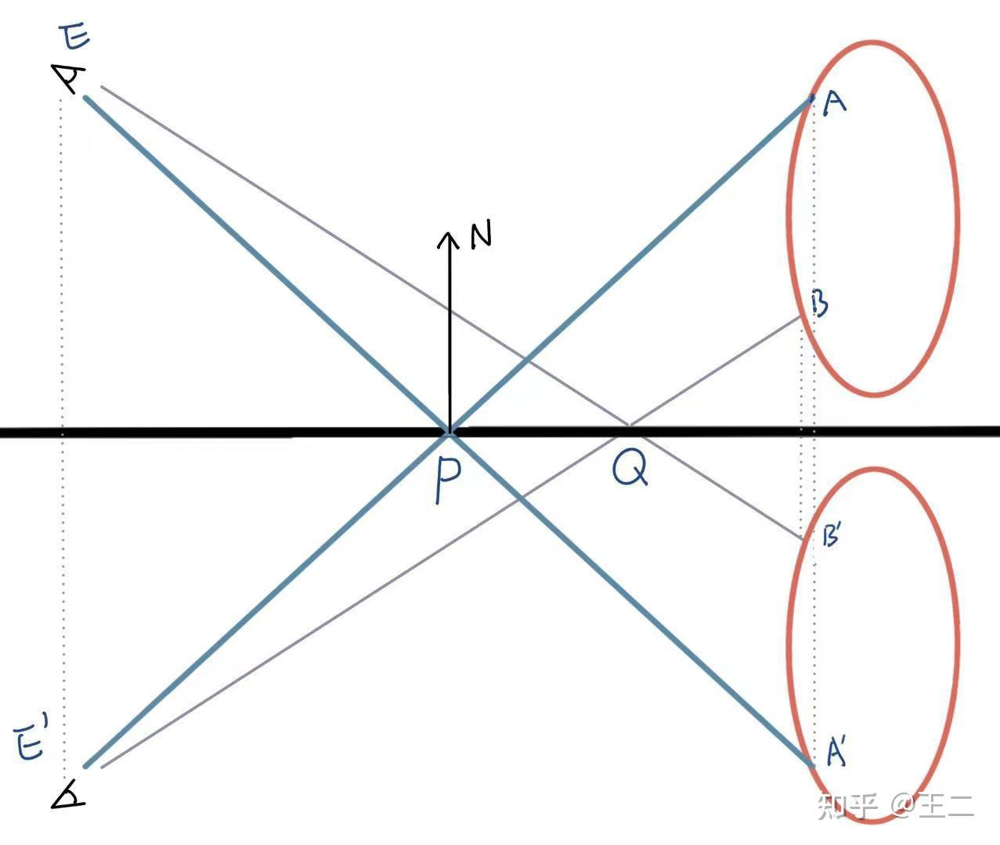

# 【技术美术】平面反射

如上图所示，实现平面反射说到底就是要实现，P 采样到 A，Q 采样到 B。A~B显然是需要渲染到纹理以供采样的，实现该过程有两种方法：

1. 最简单的方式是放一个镜像的摄像机 E' 去渲染 A，B。
2. 更高级的做法是E不动，但渲染每个物体的镜像（A'，B'），因此需要给每个物体做一步镜像变换。

## 镜像矩阵推导

镜像矩阵的作用如上，使顶点相对平面镜像，即 $P' = MP$，M就是要求的镜像矩阵。

推导矩阵的方式就是先不考虑矩阵，而是考虑如何用代数式实现，然后再将代数式的过程反映到矩阵中。

### 用线性代数表示

已知条件：

- $P_0$：平面原点
- $N$：平面法线
- $P$：被镜像的顶点

求：

- $P'$：镜像后的顶点

过程：

$
\begin{aligned}
P'
&= P - 2(\vec{QP})  \\
&= P - 2(N * |\vec{QP}|) \\
&= P - 2 * N * ((P-P_0) \cdot N)
\end{aligned}
$

### 用实数表示

其中 $((P-P_0) \cdot N)$ 展开分量后可得：

$
\begin{aligned}
((P-P_0) \cdot N) &= x_n(x - x_0)+y_n(y - y_0)+z_n(z - z_0) \\
&= x_nx+y_ny+z_nz-(x_nx_0+y_ny_0+z_nz_0)
\end{aligned}
$

其中 $-(x_nx_0+y_ny_0+z_nz_0)$ 完全由统一的已知量构成，估可以先简单看成一个常数，以简化后续式子的表达：

$d = -(x_nx_0+y_ny_0+z_nz_0)$

再将上述式子带入到完整公示中可得：

$
\begin{aligned}
(x',y',z') &= (x,y,z)-2*(x_n,y_n,z_n)*(x_nx+y_ny+z_nz+d) \\
x' &= x-2x_n^2x-2x_ny_ny-2x_nz_nz-2x_nd\\
x' &= (1-2x_n^2)x-(2y_nx_n)y-(2z_nx_n)z-2x_nd\\
y' &= -(2x_ny_n)x+(1-2y_n^2)y-(2z_ny_n)z-2y_nd\\
z' &= -(2x_nz_n)x-(2y_nz_n)y+(1-2z_n^2)z-2z_nd\\
\end{aligned}
$

### 用矩阵表示

将上述对每个分量的线性计算过程反映到矩阵中即可得到反射矩阵：

$
\begin{bmatrix}
1-2x_n^2 & -2y_nx_n & -2z_nx_n & -2x_nd\\
-2x_ny_n & 1-2y_n^2 & -2z_ny_n & -2y_nd\\
-2x_nz_n & -2y_nz_n & 1-2z_n^2 & -2z_nd\\
0 & 0 & 0 & 1
\end{bmatrix}
$

其中

$d = -(x_nx_0+y_ny_0+z_nz_0)$

## 斜截视锥体