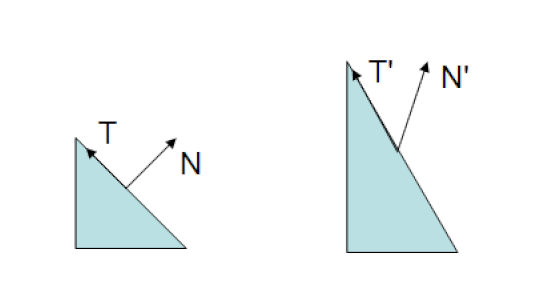

# 【技术美术】法线的空间变换

法线虽然是一种方向，但以常规方向的空间变换过程来变换法线时，可能会产生一些错误。因为当变换矩阵为非正交矩阵时（例如使用了非统一缩放），那变换后的法线将不会与切线再垂直。

切线是可以直接当方向变换的，因为切线是贴在模型表面上，所以应和表面一起变换。但法线必须保证与切线垂直，因此不能完全随模型变化。

当然如果确保变换矩阵是正交矩阵，那法线也可以像切线一样直接变换。

## 法线矩阵变换推导

根据法线和切线始终垂直的要求，可以推导出真正适用于法线的变换公式：

设 $M,G$ 分别是切线和法线的变换空间，前者是已知的（例如模型矩阵），而后者便是要推导的矩阵。

$\because$ 切线 $T$ 和法线 $N$ 始终垂直  
$\therefore$ $GN \cdot MT = 0$

点乘可以看成是行向量和列向量的矩阵乘法，故该式可以使用矩阵运算进行变形。

$
\begin{aligned}
& GN\cdot MT \\
&= (GN)^T(MT) \\
&= (N^TG^T)(MT)\\
&= N^T(G^TM)T
\end{aligned}\
$

其中已知 $N^TT = N \cdot T = 0$，故为了让 $N^T(G^TM)T = 0$ 成立，$G^TM=I$ （$I$ 表示单位矩阵）

$
\begin{aligned}
G^TM &= I\\
G^T &= M^{-1} \\
G &= (M^{-1})T
\end{aligned}
$

估法线的变换矩阵应等于**切线变换矩阵的逆矩阵的转置**。
