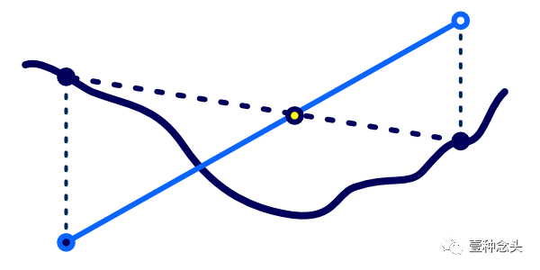

---
categories:
  - 个人研究
  - 技术美术
abbrlink: 514348372
---

# 【技术美术】视差贴图

## 基础概念

视差贴图又称高度贴图，类似法线贴图，同样是通过伪造表面信息来增加表面凹凸真实感的一种方法。

法线贴图利用光照明暗来体现凹凸，但从掠角观察时依旧不够真实，因为现实中的粗糙表面除了光照明暗的区别外，还存在高度遮挡的关系，而视差贴图就是从这方面增强凹凸真实感。

## 基本原理

考虑现实中的遮挡效果，本质就是原目标不可见，取而代之的是显示其前面的物体，反映在图形着色上，就是 uv 存在偏移，会采样到前面物体的颜色。根据高度计算 uv 偏移再采样颜色就是视差贴图的原理了。

设射线 BC 为相机方向（切线空间），B 为视线的落点。若 B 点使用高度图后高度为 BA，那实际的视线落点应在 C 点，因此采样颜色贴图的 uv 应该是 C 点而不是 B 点，而 BD 就是 uv 的偏移。

当$\begin{bmatrix}x\\y\\z\end{bmatrix}$为相机方向，h 为高度时，根据相似三角形有以下公式：

$$
\begin{aligned}
\frac{CD}{BD} &= \frac{z}{x}\\
BD &= CD * \frac{x}{z}\\
&= \frac{x}{z}*h
\end{aligned}
$$

对于 y 轴与 x 同理，故得出视差贴图的 uv 偏移为$\frac{xy}{z}*h$。

### 陡峭视差映射

最基础的视差偏移计算存在误差问题，因为它假定了周围所有高度都是一致的，但现实显然不是这样，一种优化方案就是利用类似光线步进的原理，增加采样次数，来检测高度变化。

基于这种方案，实际的 uv 偏移将不再是一次性计算得出，而是基于高度切分成多个采用点来采样高度图，再通过比对结果来获得最准确的视线落点。

如图所示（注意！由于示例图片使用的是深度图，所以采用与高度图相反的流程和采样参数）：

1. T0 是未使用视差贴图的原始视线落点，从 0 到 1 为深度范围。
2. 将深度范围均分并多次采样后可得出若干不同深度下的视线落点偏移位置（紫色点）。
3. 在深度图中采样这些紫色点的实际深度值，并与其预计算时的所用的深度值做比较。
4. 每一次对比相对于检测一次遮挡关系。其中 T0，T1，T2 的实际深度值都大于计算用深度值，说明未发生遮挡，而到 T3 时，实际深度小于计算深度，说明发生遮挡，因此 T2 和 T3 之间的位置才是真正的视线落点偏移处。
5. 最终为了方便计算，“陡峭视差映射”不考虑采样点间插值问题，故直接将 T3 的偏移值作为视差映射的结果。

### 视差遮蔽映射

陡峭视差映射虽然能一定程度上解决误差问题，但由于采样点和结果都是离散的，因此存在锯齿和图层间断层的问题。一种解决办法就是在陡峭视差映射结果的基础上，额外考虑其前一个采样点的结果，通过插值他们来获得最终的 uv 偏移。该方法就叫“视差遮蔽映射”。

不考虑因离散导致的遮挡检测未命中问题，显然当计算深度与实际深度一致时，此处的 uv 偏移才是最准确的。通过“陡峭视差映射”的计算，此时我们是可知实际采样点所在范围的两个端点的，因此该问题可以化简为求两条曲线的交点问题。

如图所示，为了便于计算，我们可以简单的假设采样点间的实际深度是线性的（上图虚线），因此很容易的便能计算出交点位置（上图黄点）。该位置的 uv 偏移，便是“视差遮蔽映射”的结果。相比“陡峭视差映射”，该结果会根据不同位置的深度而线性变化，因此不再是离散的了。

## 优化方案

1. 根据相机入射角调整“陡峭视差映射”的图层数量，入射角小时，表面 uv 变化不大，因此可以减少检测次数，反之增加检测次数。（那基于 mipmaps 的计算方法也可以吧？）
2. 通过噪波抖动“陡峭视差映射”的图层数量，来实现低精度也能达到高精度类似的视觉效果。

## 参考资料

- [【UnityShader】ParallaxMapping 视差映射（7）](https://zhuanlan.zhihu.com/p/574361162)
- [视差贴图](https://learnopengl-cn.github.io/05%20Advanced%20Lighting/05%20Parallax%20Mapping/)
- [视差贴图（Parallax Mapping）学习笔记](https://zhuanlan.zhihu.com/p/265317045)
