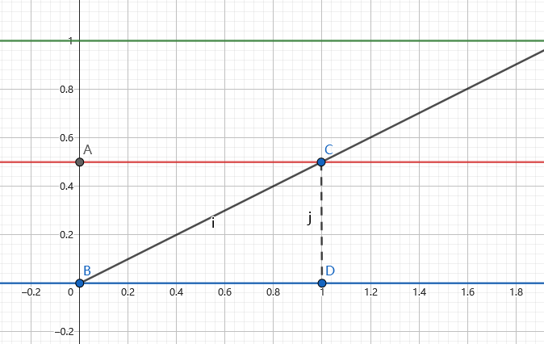
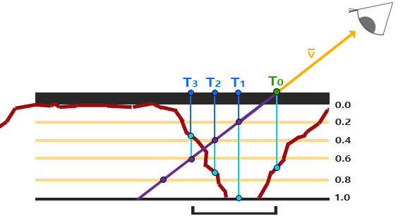

---
categories:
  - 个人研究
  - 技术美术
abbrlink: 514348372
---
# 【技术美术】视差贴图

## 基础概念

视差贴图又称高度贴图，类似法线贴图，同样是通过伪造表面信息来增加表面凹凸真实感的一种方法。

法线贴图利用光照明暗来体现凹凸，但从掠角观察时依旧不够真实，因为现实中的粗糙表面除了光照明暗的区别外，还存在高度遮挡的关系，而视差贴图就是从这方面增强凹凸真实感。

## 基本原理

考虑现实中的遮挡效果，本质就是原目标不可见，取而代之的是显示其前面的物体，反映在图形着色上，就是 uv 存在偏移，会采样到前面物体的颜色。根据高度计算 uv 偏移再采样颜色就是视差贴图的原理了。

设射线 BC 为相机方向，B 为视线的落点。若 B 点使用高度图后高度为 BA，那实际的视线落点应在 C 点，因此采样颜色贴图的 uv 应该是 C 点而不是 B 点，而 BD 就是 uv 的偏移。

当$\begin{bmatrix}x\\y\\z\end{bmatrix}$为相机方向，h 为高度时，根据相似三角形有以下公式：

$$
\begin{aligned}
\frac{CD}{BD} &= \frac{z}{x}\\
BD &= CD * \frac{x}{z}\\
&= \frac{x}{z}*h
\end{aligned}
$$

对于 y 轴与 x 同理，故得出视差贴图的 uv 偏移为$\frac{xy}{z}*h$。

### 陡峭视差映射

最基础的视差偏移计算存在误差问题，因为它假定了周围所有高度都是一致的，但现实显然不是这样，一种优化方案就是利用类似光线步进的原理，增加采样次数，来检测高度变化。

基于这种方案，当计算出 uv 偏移后不再直接使用，而是基于高度切成多份后再次采样高度图来验证计算结果。

如图所示，T0 是未受深度贴图（反转的高度贴图）视线落点。从 0 到 1 为深度范围，分成多层后多次采样得出紫色点的预估深度，再对紫色点的高度图采样得出实际深度。两两对比后发现 T3 处实际深度小于预估深度，说明发生遮挡，因此 T3 才是真正的深度偏移处。

### 视差遮蔽映射

陡峭视差映射虽然提高了精度，但存在锯齿和图层间断层的问题，一种解决办法就是在此基础上，利用相邻两层的深度差，插值他们的 uv 偏移结果。

## 优化方案

1. 根据相机入射角调整“陡峭视差映射”的图层数量，入射角小时，表面uv变化不大，因此可以减少检测次数，反之增加检测次数。（那基于mipmaps的计算方法也可以吧？）
2. 通过噪波抖动“陡峭视差映射”的图层数量，来实现低精度也能达到高精度类似的视觉效果。

## 参考资料

- [【UnityShader】ParallaxMapping 视差映射（7）](https://zhuanlan.zhihu.com/p/574361162)
- [视差贴图](https://learnopengl-cn.github.io/05%20Advanced%20Lighting/05%20Parallax%20Mapping/)
- [视差贴图（Parallax Mapping）学习笔记](https://zhuanlan.zhihu.com/p/265317045)