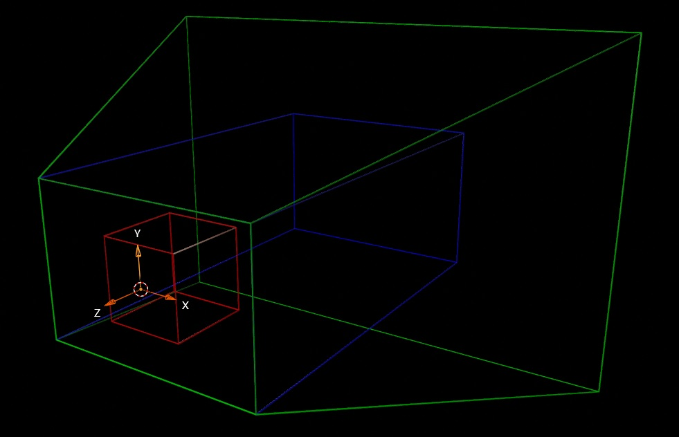
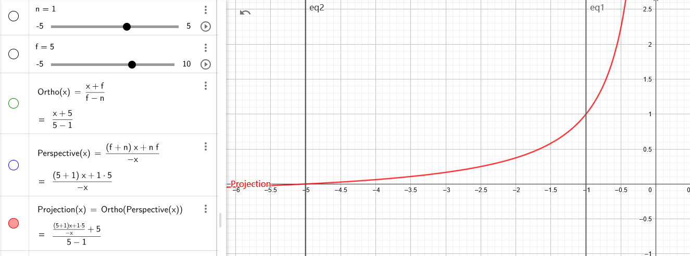

---
categories:
  - 个人研究
  - 技术美术
  - 矩阵变换
abbrlink: 2261641482
---

# 【技术美术】投影矩阵和线性深度推导

网络上有很多投影矩阵的推导，也有很多声称是基于 Unity 的，但和我的实测都不一致（现在看来是因为这些文章并不全面），此外有一些 Unity 本身的函数我也搞不懂它的原理，遂最终选择自行研究，总算把这些问题解决了。

现在通过这篇文章，你就可以完全搞懂 Unity 的投影矩阵是啥样，又是怎么来的。以及 Unity 逆推线性深度的函数是如何实现的。不过该文章也不是完全面向小白的，至少你应该对这些矩阵本来就有大概的了解。

## 渲染中的空间变换

渲染过程中将模型顶点转换到显卡设备的 NDC（标准设备坐标系）中，共要进行以下几个空间变换：

1. 物体到世界空间（通过物体矩阵）
2. 世界到视图空间（通过视图矩阵）
3. 视图到剪辑空间（通过投影矩阵）
4. 剪辑到NDC空间（通过齐次坐标实现透视除法）

物体到世界空间矩阵就是正常的 TRS（转移,旋转,缩放）矩阵，不是本文的研究对象，在 Unity 中主要是“视图矩阵”和“投影矩阵”有特殊的地方。

### 裁剪空间与NDC空间的区别

通过投影变换后得到的齐次坐标，如果不归一化，就属于裁剪空间坐标，否则为NDC空间坐标。从数学上来看剪辑空间和NDC空间的坐标本质是相同，但要注意的是，在GPU中他们是不同的！

~~因为GPU需要利用剪辑空间的z做深度测试（这也解释了为什么深度缓冲区需要高精度浮点数，仅用0-1太浪费了），然后再转换到NDC空间做裁剪测试（以上为采用早期深度测试时的管线流程）。~~

我不知道为什么，但不要提前手动归一化齐次坐标，这会导致渲染问题！

## 视图矩阵

视图矩阵本质就是不受缩放影响的相机的 TRS 矩阵的逆矩阵。除此之外，在 Unity 中该矩阵还有个特别的地方。

虽然 Unity 是左手坐标系引擎，但它的视图空间却是用的右手坐标系的（z 轴正负与左手坐标系相反），更官方的表述是 Unity 采用的是 opengl 风格的视图矩阵。故最终会对 z 轴进行反转，使相机正前方为-z（即会对矩阵中的 m33 （z 轴系数）取反）。

虽然这一操作让人感觉有些不适，但也便于了我们后续将深度计算为 D3D 风格的 1-0（越远深度值越小），而不是传统风格的 0-1（越远深度值越大）。

## 投影矩阵

投影矩阵用于将视图矩阵的结果转换到剪辑空间。在Unity中，CPU端（相机组件）和GPU端（着色器）上的投影矩阵是不一样的，并且GPU端根据当前所使用的图形 API 不同，其投影矩阵还会进一步差异（因为NDC不同）。

<https://docs.unity.cn/cn/2022.3/Manual/SL-PlatformDifferences.html>

### DX和OpenGL的NDC风格差异

对于 NDC 的 x,y 轴，全平台都是一致的：

- 屏幕从左到右为 x 轴的-1 到 1
- 屏幕从下到上为 y 轴的-1 到 1

对于 NDC 的 z 轴，即视图空间下的近平面到远平面的 z 轴：

- 在 OpenGL 平台：屏幕从后到前为 z 轴的-1 到 1
- 在 Direct3D 平台：屏幕从前到后为 z 轴的 1 到 0

### 关于DX在Unity中被故意反转的问题

上文对NDC空间的描述是没有错的，但当使用DX渲染时，如果在Unity中用着色器输出NDC坐标，却会发现y轴被上下翻转，为什么？

另外这种情况如果直接渲染到屏幕，模型按道理是颠倒的，但为什么我们最终看到的画面又是正确的？

#### DX与OpenGL纹理坐标的差异

DX的二维坐标均采用右手坐标系，纹理坐标也遵循该守则，即左上角为原点，y向下增加。但Unity中uv却是使用的OpenGL风格，即左下角为原点，y向上增加。

#### 实现DX与OpenGL纹理坐标的兼容

为了使DX在采样纹理时能兼容该UV坐标系，Unity在存储DX平台的纹理时会故意上下颠倒存储，这样用颠倒的UV采用时，反而能负负得正，使采样结果正确。

这一特性对渲染纹理也不例外。而恰巧Unity渲染时不是将结果直接输出到屏幕，而是先放到一个渲染纹理中，所以为了遵守规则，故意使模型渲染到的NDC空间上下颠倒。

因此如果渲染一个平面，最底部反而是NDC的最大y值。然后经过反转存储（投影矩阵y轴取反，导致模型颠倒着渲染到纹理），和反转读取（DX使用OpenGL的UV读取纹理），负负得正，模型最终不会有问题，但Shader中计算的NDC坐标，由于缺少反转读取的过程，它依然是反的。

### 读写投影矩阵的方式

如果是从相机中直接获取投影矩阵（`Camera.projectionMatrix`），Unity 始终返回 OpenGL 风格。但若想获取着色器中实际使用的矩阵，则需要调用`GL.GetGPUProjectionMatrix`，而该矩阵会随图形 API 不同而不同。

但要注意的是，GPU端的投影矩阵是根据CPU端变形而来，因此如果不关心GPU中的具体值，那选择读写CPU端的投影矩阵才是更通用的方式。

## DX投影矩阵推导

投影矩阵在 Unity 中有多种实现方式，但考虑 Unity 的深度图是采用 Direct3D 风格存储的（包括那些解算深度图的函数），而且 Windows 平台更常用（这种情况下着色器内实际使用的是 DX 投影矩阵），故选择了先推导 Direct3D 风格的透视矩阵（后面再简要推导一下OpenGL风格投影矩阵）。

### 投影矩阵的构成

投影矩阵有两种类型：

- “正交投影”（不实现近大远小）
- “透视投影”（实现近大远小）。

其中透视投影比较特殊，本质上是“正交”和“透视”两种变换的复合矩阵：

1. 透视（上图绿框变蓝框）：将锥形的视野范围缩放成长方体。
2. 正交（上图蓝框变红框）：将长方体的视野范围缩放到 NDC 空间（也是长方体）。

因此只需要学会透视投影，也就能学会正交投影，而且这样子理解起来会更简单。

### 正交变换（等价于正交投影矩阵）

正交投影矩阵由以下参数构成：

- size：视锥体半高度。
- aspect：宽高比（宽度/高度），用于得出半宽度。
- near：近平面位置。
- far：远平面位置。

由这些参数可以简单得出以下变量：

- h：半高度（size）
- w：半宽度（size\*aspect）
- n：近平面（near）
- f：远平面（far）

正交投影矩阵是线性变换，所以可以直接通过直线公式（$y=Ax+B$）来拟合（如下图），具体而言是要实现以下映射：

1. $(-w,w)=>(-1,1)$
2. $(-h,h)=>(-1,1)$
3. $(-n,-f)=>(1,0)$（受视图矩阵的 z 反转影响，故远近平面取反）

对于第一第二点，只要设置直线斜率（即对输入的 x,y 坐标直接除以 w,h 即可）。对于第三点则可以通过带入 z=-n 和 z=-f 两个线段端点成以下公式：

- $-An+B=1$
- $-Af+B=0$

进一步推导可得：

$
\begin{aligned}
(-An+B)-(-Af+B) &= 1-0 \\
-An+B+Af-B &= 1 \\
Af-An &= 1 \\
A(f-n) &= 1 \\
A &= \frac{1}{f-n} \\
\end{aligned}
$

$
\begin{aligned}
-(\frac{1}{f-n})f+B&=0\\
B &= \frac{f}{f-n}\\
\end{aligned}
$

最终根据上述结论，可用相关参数可构成正交投影矩阵：

$$
\begin{bmatrix}
\frac{1}{w} & 0 & 0 & 0 \\
0 & \frac{1}{h} & 0 & 0 \\
0 & 0 & \frac{1}{f-n} & \frac{f}{f-n} \\
0 & 0 & 0 & 1 \\
\end{bmatrix}
$$

### 透视变换（透视投影矩阵的一部分）

透视变换（后也称透视矩阵）的目的是实现近大远小，即根据 z 位置缩放 xy 轴，使任何位置的 x,y 都等于近平面的 x',y'（映射关系如下图）。

上图根据相似三角形定理可得对于 y 轴的透视变换如下公式：

$
\begin{aligned}
\frac{y'}{n} &=\frac{y}{z} （n,z此处为长度，故不是负数）\\
y'&=\frac{yn}{z}\\
x'&=\frac{xn}{z}（x轴同理）
\end{aligned}
$

现在要将上述公式反应在矩阵变换上：

- 对于 n，这是一个定值，直接利用缩放矩阵的原理就可以实现。
- 对于 z，这是一个变量，肯定无法直接写在矩阵中，但可以借助齐次坐标 w 归一化的特性，将向量的 w （位置在 m43）设为 z 即可。

于是便可得出初步矩阵：

$
\begin{bmatrix}
n & 0 & 0 & 0 \\
0 & n & 0 & 0 \\
? & ? & ? & ? \\
0 & 0 & -1 & 0
\end{bmatrix}
$

注意因为视图矩阵中 z 被反转，此处为保证 xy 不受影响，因此需要将 m43 设置为 -1 来获取 +z。

此外 z 的系数都被标记为？，因为 z 也会受 w 归一的影响，而我们实际需要 z 保持不变，故需要对这些能对 z 产生作用的系数进行推导，以确保最终计算出的向量归一化前的 z 分量为$-z^2$（齐次坐标是实现除 z 而不是-z，所以为保持最终结果依然是视图空间的 -z ，z 分量应该是负数 z）。

由于前两个系数（m31,m32）是与 x,y 相乘，我们不需要所以始终为 0。而剩余的两个系数（m33,m34）设分别为 A,B 时，再加上视图空间向量（投影变换的输入向量）的 w 分量（B 的乘数）默认为 1，带入 z=-n 和 z=-f 两个特例后可得以下公式：

- $-An+B=-n^2$
- $-Af+B=-f^2$

推导可得：

$
\begin{aligned}
(-An+B)-(-Af+B) &= (-n^2)-(-f^2) \\
-An+B+Af-B &= f^2-n^2 \\
Af-An &= (f-n)(f+n) \\
A(f-n) &= (f-n)(f+n) \\
A &= f+n \\
\end{aligned}
$

$
\begin{aligned}
-(f+n)f+B&=-f^2\\
B &= -f^2+(f+n)f\\
B &= -f^2+f^2+nf\\
B &= nf\\
\end{aligned}
$

最终根据上述结论，可用相关参数可构成透视矩阵：

$$
\begin{bmatrix}
n & 0 & 0 & 0 \\
0 & n & 0 & 0 \\
0 & 0 & f+n & nf \\
0 & 0 & -1 & 0 \\
\end{bmatrix}
$$

### 透视投影矩阵

将正交变换和透视变换的矩阵相结合可得如下矩阵：

$
\begin{aligned}
&=\begin{bmatrix}
\frac{1}{w} & 0 & 0 & 0 \\
0 & \frac{1}{h} & 0 & 0 \\
0 & 0 & \frac{1}{f-n} & \frac{f}{f-n} \\
0 & 0 & 0 & 1 \\
\end{bmatrix}
*\begin{bmatrix}
n & 0 & 0 & 0 \\
0 & n & 0 & 0 \\
0 & 0 & f+n & nf \\
0 & 0 & -1 & 0 \\
\end{bmatrix}\\
&=\begin{bmatrix}
\frac{n}{w} & 0 & 0 & 0 \\
0 & \frac{n}{h} & 0 & 0 \\
0 & 0 & \frac{f+n}{f-n}-\frac{f}{f-n} & \frac{nf}{f-n} \\
0 & 0 & -1 & 0 \\
\end{bmatrix}\\
&=\begin{bmatrix}
\frac{n}{w} & 0 & 0 & 0 \\
0 & \frac{n}{h} & 0 & 0 \\
0 & 0 & \frac{n}{f-n} & \frac{nf}{f-n} \\
0 & 0 & -1 & 0 \\
\end{bmatrix}
\end{aligned}
$

在透视投影中，Unity 不直接提供 h（半高），需要利用 fov（视野角度）计算。利用三角函数可以轻松得出:

$
h = \tan(fov/2)*n\\
w = h * aspect
$

重新整理后可得最终透视投影矩阵：

$$
\begin{bmatrix}
\frac{1}{\tan(fov/2)*aspect} & 0 & 0 & 0 \\
0 & \frac{1}{\tan(fov/2)} & 0 & 0 \\
0 & 0 & \frac{near}{far-near} & \frac{near*far}{far-near} \\
0 & 0 & -1 & 0 \\
\end{bmatrix}
$$

## OpenGL投影矩阵推导

OpenGL投影矩阵的推导流程与DX类似，故以下仅简要介绍。

### 正交投影矩阵

OpenGL投影矩阵要实现的正交变换效果如下：

1. $(-w,w)=>(-1,1)$
2. $(-h,h)=>(-1,1)$
3. $(-n,-f)=>(-1,1)$（受视图矩阵的 z 反转影响，故远近平面取反）

其中 xy 与DX同理（即对输入的 x,y 坐标直接除以 w,h ）。对于 z 则带入 z=-n 和 z=-f 两个特例计算：

- $-An+B=-1$
- $-Af+B=1$

$
\begin{aligned}
(-An+B)-(-Af+B) &= -1-1 \\
-An+B+Af-B &= -2 \\
Af-An &= -2 \\
A(f-n) &= -2 \\
A &= \frac{-2}{f-n} \\
\end{aligned}
$

$
\begin{aligned}
-(\frac{-2}{f-n})f+B&=1\\
B &= 1+\frac{-2}{f-n}f\\
B &= 1-\frac{2f}{f-n}\\
\end{aligned}
$

最终根据上述结论，可用相关参数可构成正交投影矩阵：

$$
\begin{bmatrix}
\frac{1}{w} & 0 & 0 & 0 \\
0 & \frac{1}{h} & 0 & 0 \\
0 & 0 & \frac{-2}{f-n} & 1-\frac{2f}{f-n} \\
0 & 0 & 0 & 1 \\
\end{bmatrix}
$$

### 透视投影矩阵

OpenGL的透视变换实现近大远小，与DX一致，故不重复推导，直接计算最终的透视投影矩阵。

$
\begin{aligned}
&=\begin{bmatrix}
\frac{1}{w} & 0 & 0 & 0 \\
0 & \frac{1}{h} & 0 & 0 \\
0 & 0 & \frac{-2}{f-n} & 1-\frac{2f}{f-n} \\
0 & 0 & 0 & 1 \\
\end{bmatrix}
*\begin{bmatrix}
n & 0 & 0 & 0 \\
0 & n & 0 & 0 \\
0 & 0 & f+n & nf \\
0 & 0 & -1 & 0 \\
\end{bmatrix}\\
&=\begin{bmatrix}
\frac{n}{w} & 0 & 0 & 0 \\
0 & \frac{n}{h} & 0 & 0 \\
0 & 0 & \frac{-2(f+n)}{f-n}-(1-\frac{2f}{f-n}) & \frac{-2nf}{f-n} \\
0 & 0 & -1 & 0 \\
\end{bmatrix}\\
&=\begin{bmatrix}
\frac{n}{w} & 0 & 0 & 0 \\
0 & \frac{n}{h} & 0 & 0 \\
0 & 0 & \frac{-2n}{f-n}-1& \frac{-2nf}{f-n} \\
0 & 0 & -1 & 0 \\
\end{bmatrix}
\end{aligned}
$

其中：

$
h = \tan(fov/2)*n\\
w = h * aspect
$

## 线性深度推导

注意：以下线性矩阵基于DX风格的投影矩阵推导

经过透视投影后得到的深度不是线性的（如上图），但很多特效实现都有利用 NDC 深度重建世界信息的需求，因此还需要研究一下如何逆推得到线性深度。

以下都是对 Unity 中相关线性深度求解函数的解析，利用下方链接可以查看每个函数的函数图，以便直观的感受深度变化效果：

<https://www.geogebra.org/calculator/nxrfrkzj>

### LinearEyeDepth

将 NDC 中的深度反推为视图空间中的非反转深度（即原始的 z 轴坐标）。

该函数的实现可分成两个步骤，先执行 $透视投影$ 的 $逆函数$ 得出视图空间中的深度。由于视图空间中的深度为反转的 z 轴，故对该深度二次反转，以得到非反转深度。

即 $LinearEyeDepth(z) = -逆透视投影(z)$

1. 根据之前的矩阵计算可得，透视投影对z的计算过程相当于：

   $
   \begin{aligned}
   &(\frac{n}{f-n}z+\frac{nf}{f-n})\div(-z)\\
   &= \frac{(\frac{n(z+f)}{f-n})}{-z}\\
   &=\frac{n(z+f)}{z(n-f)}\\
   \end{aligned}
   $

2. 设 $z'$ 是投影后的非线性深度，再对该函数求逆，即可得出逆透视投影公式：

   $
   \begin{aligned}
   z'&=\frac{n(z+f)}{z(n-f)} \\
   z(n-f)z'&=nz+nf\\
   z(n-f)z'-nz&=nf\\
   z((n-f)z'-n)&=nf\\
   z&=\frac{nf}{(n-f)z'-n}\\
   \end{aligned}
   $

3. 由于视图矩阵对z进行了反转，因此为了获取原z，需进行反转，然后再进行一定变形就可以获得 Unity 中的同款函数了：

   $
   \begin{aligned}
   &-\frac{nf}{(n-f)z'-n}\\
   &= \frac{nf}{(f-n)z'+n}\\
   &= \frac{1}{\frac{f-n}{nf}z'+\frac{1}{f}}\\
   \end{aligned}
   $

故最终结论为：

$$
LinearEyeDepth(z)=\frac{1}{\frac{f-n}{nf}z+\frac{1}{f}}
$$

### Linear01Depth

将 NDC 中的深度反推为线性 0-1 深度（相机位置为 0，远平面为 1）。

很容易想到，只需要对 $LinearEyeDepth$ 的结果除以远平面大小即可，即：

$
\begin{aligned}
&= \frac{LinearEyeDepth(z)}{f}\\
&= \frac{1}{\frac{f-n}{nf}z+\frac{1}{f}} * \frac{1}{f}\\
&= \frac{1}{\frac{f-n}{n}z+1}\\
\end{aligned}
$

故最终结论为：

$$
Linear01Depth(z)=\frac{1}{\frac{f-n}{n}z+1}
$$

### Linear01DepthFromNear

~~求解线性 0-1 深度（近平面为 0，远平面为 1）。~~（Unity 中的注释是这样写的，但实测根本不是）。

该函数的本质为：

$
\begin{aligned}
&=Linear01Depth(z)*z\\
&=\frac{1}{\frac{f-n}{n}z+1}*z\\
&=\frac{1}{\frac{f-n}{n}+\frac{1}{z}}\\
\end{aligned}
$

其计算出的深度确实是线性，但近平面等于 $Linear01Depth$（z 等于 1，相乘后不变），远平面等于 0（z 等于 0，相乘后等于 0）。

若要实现真正的 $Linear01DepthFromNear$ ，应对 $逆透视投影函数$ 的结果直接进行 $正交变换$，然后调换深度为 0-1 方向，即：

$
\begin{aligned}
&= 1 - 正交变换(逆透视投影(z))\\
&= 1-\frac{1}{f-n}LinearEyeDepth(z)+\frac{f}{f-n}\\
&= 1-\frac{1}{f-n}(\frac{nf}{(n-f)z-n}+f)\\
\end{aligned}
$
