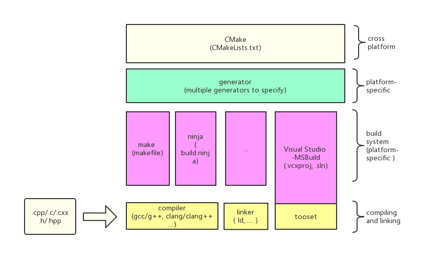

# 【软件开发】CMake 学习笔记

## CMake 是什么？

是构建系统（如 Visual Studio）的文件（如 .vcxproj .sln）的创建器，具体要生成的构建系统可以通过 CMakePresets 文件中的 generator 指定。

构建系统一般不是跨平台的，但 CMake 支持在不同的操作系统上生成不同的构建系统文件，通过这种包装的方式从而实现了 C++项目的跨平台。



## CMake 指令

https://cmake.org/cmake/help/latest/manual/cmake.1.html

```bash
# 将目标位置的CMakeLists生成为原生构建系统的项目
cmake <path>
# 编译已生成的原生构建系统的项目
cmake --build <path>
```

## CMakeLists 指令

`CMakeLists.txt`是生成 CMake 项目的说明文件，用专门的 CMake 语言编写，由于 CMake 也是一种编程语言，因此也支持判断循环等，此外还提供了很多便利的功能性指令。

`CMakeLists.txt`可以有多份，但每个文件夹至多能放一个，此外顶层`CMakeLists.txt`文件中的首条指令必须用于指定 CMake 版本，版本指令如下：

```cmake
# 描述CMake的最低支持版本（顶层CMake文件必带）
cmake_minimum_required(VERSION <version>)
```

### 环境变量

CMake 中没有常规编程语言中的变量概念，所有中间数据都用环境变量存储。环境变量即一对字符串键值组，恰好充当变量名和变量值。用户可以自己设置环境变量，也可以获取系统的环境变量。

#### 基本读写

```cmake
# 设置环境变量[环境变量作用域扩大到父范围（默认为当前函数或目录）]
set(<varName> <varValue> [PARENT_SCOPE])
# 设置缓存变量（相当于全局变量）
set(<varName> <varValue>... CACHE <type> <docstring> [FORCE])
# 获取环境变量（下方代码将被直接替换成环境变量值）（支持嵌套使用）
${<varName>}
```

#### 编辑内容

```cmake
# 替换变量内容
string(REPLACE <match-string> <replace-string> <out-var> <input>...)
```

#### 预设环境变量

CMake 系统预设的环境变量，用户可以从中读写一些重要的配置数据。

- 编译环境

  1. `CMAKE_CXX_STANDARD`：项目中所用的 C++标准（数字，如 17、20）
  2. `CMAKE_CXX_STANDARD_REQUIRED`：指定的 C++标准是否是必须的，从而决定编译器不支持时是否停止生成（布尔值）

- 项目信息

  1. `<projectName>_VERSION_MAJOR`：声明项目时额外提供的主版本号。
  2. `<projectName>_VERSION_MINOR`：声明项目时额外提供的次版本号。

- 目录

  1. `CMAKE_SOURCE_DIR`：顶级 CMakeLists 的源目录。
  2. `CMAKE_BINARY_DIR`：顶级 CMakeLists 的构建目录。
  3. `CMAKE_CURRENT_SOURCE_DIR`：当前 CMakeLists 的源目录。
  4. `CMAKE_CURRENT_BINARY_DIR`：当前 CMakeLists 的构建目录。
  5. `PROJECT_BINARY_DIR`：上次调用`project()`的 CMakeLists 对应的构建目录。
  6. `PROJECT_SOURCE_DIR`：上次调用`project()`的 CMakeLists 对应的源目录。
  7. `CMAKE_RUNTIME_OUTPUT_DIRECTORY`：构建系统最终输出的二进制文件的地址。

  备注：指令 5、6 不受`add_subdirectory()`影响。

### 环境变量列表

CMake 中没有常规编程语言中数组的概念，相应的是改用“环境变量列表”代替。环境变量列表本质也是一个环境变量，其值也是一个字符串，但特别的是该值通常是由多个用“;”分隔的条目组成。

许多指令都支持环境变量列表作为输入来支持多参数，同时也配有专门的工具指令来编辑环境变量列表。

```cmake
# 从变量列表中去除指定项
list(REMOVE_ITEM <list> <value> [<value> ...])
# 根据正则表达式过滤变量列表
list(FILTER <list> <INCLUDE|EXCLUDE> REGEX <regex>)
# 追加条目
list(APPEND <list> <value>)
```

### 流程控制

既然是编程语言，自然也支持逻辑控制。

#### 条件执行

```cmake
# 基本用法：[不]满足条件时执行
if([NOT] <bool>) \ endif()
# 比较变量的值（由于没有变量的概念，都是通过显式指定比较方式来比较）
if(<variableName> EQUAL <value>)
# 确认字符串是否满足指定的正则表达式
if(<var> MATCHES <regex>)
# 查看环境变量是否定义
if(DEFINED <variableName>)
# 确认路径是否存在
if(EXISTS <inputPath>)
```

#### 遍历执行

```cmake
# 遍历环境变量列表
foreach(<var> <list>) \ endforeach()
```

### 函数定义

既然是编程语言，自然也支持自定义函数。

```cmake
# 定义一个宏函数
macro(<macroName> [inputVar]...) \ endmacro()
```

### 依赖处理

由于`CMakeLists.txt`可以有多份，甚至打包成模块，因此需要相关的指令处理依赖。

```cmake
# 添加一个子目录（子目录需要带有CMakeLists）
add_subdirectory(<source_dir>)
# 寻找一个模块（带有特定配置文件的目录将会被识别为模块，可当成项目使用）
find_package(<packageName> CONFIG REQUIRED)
```

### 项目配置

`CMakeLists.txt`主要用于创建 C++项目，必然需要很多声明项目属性的指令。每个`CMakeLists.txt`文件中只能声明一个项目，当有多个项目时需要创建多份`CMakeLists.txt`。

#### 基础配置

以下指令是创建一个项目必须要提供的。

```cmake
# 创建一个项目
project(<projectName>)
# 声明项目的输出为可执行文件
add_executable(<projectName> <sourceFile>...)
# 声明项目的输出为静态/动态库文件
add_library(<projectName> [STATIC|SHARED] <sourceFile>...)
# 声明项目是特殊的无输出项目
add_custom_target(<projectName> SOURCES <sourceFile>...)
```

#### 可选配置

可选的影响项目属性的配置

```cmake
# 为项目添加附加包含目录
target_include_directories(<projectName> {PUBLIC|PRIVATE} <headerDir>...)
# 为项目添加附加库
target_link_libraries(<projectName> {PUBLIC|PRIVATE} {<projectName>|<libFile>...})
# 为项目添加预处理定义
target_compile_definitions(<projectName> {PUBLIC|PRIVATE} <definition>...)
# 为项目添加编译选项
target_compile_options(<option>...)
# 将项目分类到vs中的解决方案文件夹（3.26之前需先打开 USE_FOLDERS 功能）
set_target_properties(<projectName> PROPERTIES FOLDER <folderName>)
```

- 依赖项传递说明：

  - `PUBLIC`：使用该选项添加引用，引用的头文件将传染给使用该项目的其他项目。
  - `PRIVATE`：引用不具备传染性，其他使用该项目的项目可能要再次添加头文件引用。

  除非项目已经将引用的库完全封装，希望后续的使用者不要再直接调用该引用的库时才该用`PRIVATE`，否则应设置为`PUBLIC`。

- 全局项目设置说明：

  上述部分指令如果去除`target_`前缀和部分参数，可转为对所有项目的设置的指令。

#### 全局配置

以下指令对所有项目都生效

```cmake
# 设置全局项目的编译选项
add_compile_options(<option>...)
```

#### 读取配置

反向获取关于项目的一些配置信息

```cmake
# 获取项目类型（EXECUTABLE|STATIC_LIBRARY）
get_target_property(<outVar> <projectName> TYPE)
```

### 文件系统

既然是基于文件的生成系统，自然经常需要和文件系统打交道。

#### 文件处理

```cmake
# 获取{当前目录|包括子目录}的满足glob通配符的文件路径并将其路径打包在一个变量列表中
file({GLOB | GLOB_RECURSE} <list> <glob>...)
# 获取相对路径
file(RELATIVE_PATH <output> <root-path> <path>)

# 创建或覆盖一个文件并写入指定内容
file(WRITE <file> <content>)
# 向指定文件末尾追加内容
file(APPEND <file> <content>)
# 复制文件或文件夹到目标目录
file(COPY <sourceDir> DESTINATION <destinationDir>)
# 复制并修改文件到指定位置。自动替换文件中的环境变量值（@<var>@）并自动移入当前CMakeLists的构建目录。
configure_file(<inputFile> <outputFile>)
```

#### 路径计算

```cmake
# 获取路径对应的父目录地址
cmake_path(GET <path-var> PARENT_PATH <out-var>)
# 获取路径对应的文件名
cmake_path(GET <path-var> FILENAME <out-var>)
```

### 其他特殊指令

其他一些特殊但常用的指令

```cmake
# 在vs中将指定文件分类到与文件系统一致的筛选器结构，而不是默认筛选器。
source_group(TREE <fileRootDir> FILES <inputFile>...)
# 在vs中禁用对指定文件的编译
set_property(SOURCE <files> PROPERTY VS_SETTINGS "ExcludedFromBuild=true")
```

## CMakePresets

https://cmake.org/cmake/help/latest/manual/cmake-presets.7.html

“CMakePresets.json”是 CMake 的配置文件，存放在项目的根目录中，用于配置一些 CMake 构建选项。

示例内容如下：

```json
{
  //CMakePresets所用的版本
  "version": 6,
  //定义生成配置。可定义多个，然后在构建指令中指明。
  "configurePresets": [
    {
      //配置名称
      "name": "default",
      //所用的生成器，用于将CMake项目转为原生项目
      "generator": "Visual Studio 17 2022",
      //生成输出目录（构建目录）
      "binaryDir": "${sourceDir}/build",
      //配置CMake缓存变量（一种长期存储的环境变量，存在CMakeCache.txt文件中）
      "cacheVariables": {
        //构建中使用的一些构建工具，由cmake语言写成
        "CMAKE_TOOLCHAIN_FILE": "$env{VCPKG_ROOT}/scripts/buildsystems/vcpkg.cmake"
      }
    }
  ]
}
```

配置完毕后生成时通过添加`--preset`选项，如`cmake --preset=<presetName>`指令使用。

## 使用技巧

- 仅添加些文件到 CMake 生成的解决方案文件夹中？

  无法直接支持，但可使用`add_custom_target`指令间接实现：  
  https://stackoverflow.com/questions/20251829/is-it-possible-to-add-files-to-a-cmake-generated-solution-folder-in-visual-studi

## 参考资料

- [CMake 官方教程](https://cmake.org/cmake/help/latest/guide/tutorial/index.html)
- [CMake 官方文档](https://cmake.org/cmake/help/latest/index.html)
- [理解 cmake 中 PRIVATE、PUBLIC、INTERFACE 的含义和用法](https://blog.csdn.net/qq_41314786/article/details/129970547)
