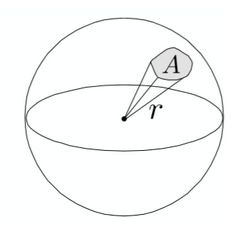
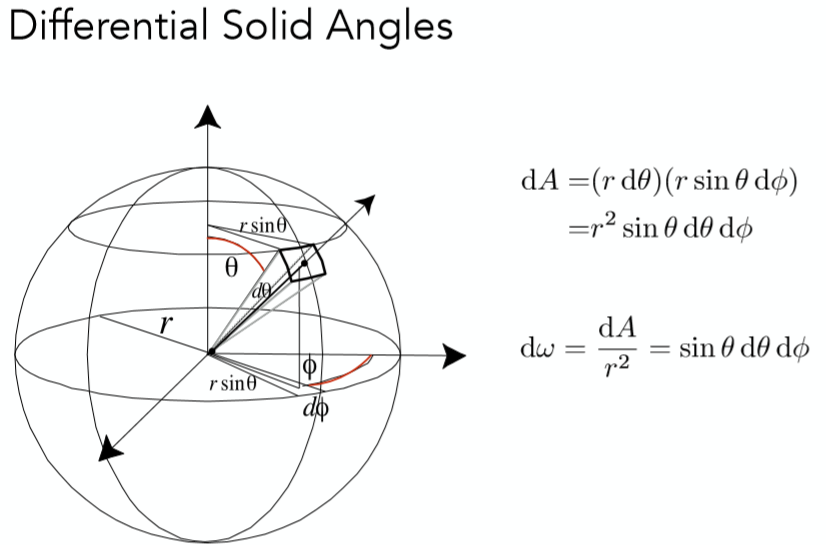

# 【数学】立体几何

## 线

若有

- $\vec{n}$：线的方向
- $\vec{p}$：线的位置
- $\vec{a}$：线上任意一点
- $t$：点 $\vec{a}$ 相对线位置的法向偏移关系

则根据线的性质有：$\vec{a} = \vec{n}t +\vec{p}$

即 a 点为：

$
\begin{cases}
\vec{a}_x=\vec{n}_xt+\vec{p}_x\\
\vec{a}_y=\vec{n}_yt+\vec{p}_y\\
\vec{a}_z=\vec{n}_zt+\vec{p}_z\\
\end{cases}
$

由此可得出直线的参数方程：

$$
\begin{cases}
x=\vec{n}_xt+\vec{p}_x\\
y=\vec{n}_yt+\vec{p}_y\\
z=\vec{n}_zt+\vec{p}_z\\
\end{cases}
$$

或对称式方程：

$$
\frac{x-\vec{p}_x}{\vec{n}_x}=\frac{y-\vec{p}_y}{\vec{n}_y}=\frac{z-\vec{p}_z}{\vec{n}_z}=t
$$

- $\vec{n}$：线的方向
- $\vec{p}$：线的位置
- $t$：线上任意点的位置系数

## 面

若有

- $\vec{n}$：平面的法线
- $\vec{p}$：平面的位置
- $\vec{a}$：平面上任意一点

则根据平面的性质有：

$
\begin{aligned}
\vec{n} \cdot (\vec{a}-\vec{p}) &=0 \\
\vec{n} \cdot \vec{a} - \vec{n} \cdot \vec{p} &= 0\\
\vec{n}_x\vec{a}_x + \vec{n}_y\vec{a}_y +\vec{n}_z\vec{a}_z -\vec{n} \cdot \vec{p} &= 0\\
\end{aligned}
$

由此可得出平面的一般式方程：

$$
Ax+By+Cz+D=0
$$

- $A=\vec{n}_x$
- $B=\vec{n}_y$
- $C=\vec{n}_z$
- $D=-(\vec{n}_x \cdot \vec{p})$

### 面与线交点

## 多面体

### 棱柱

### 棱锥

## 非多面体

### 圆柱

### 圆锥

### 球

## 立体角

角在三维空间中的衍生。

$$
\Omega = \frac{A}{r^2}
$$

球的总计角度为 $4\pi$。

### 微分立体角

当立体角中的$A$为最小值时得到的立体角。

