---
categories:
  - 书本知识
  - 数学
  - 函数
abbrlink: 1125538061
---

# 【数学】反三角函数

- 反正弦函数：$ \arcsin(\frac{y}{r})=a$
- 反余弦函数：$ \arccos(\frac{x}{r})=a$
- 反正切函数：$ \arctan(\frac{y}{x})=a$

## 用反三角函数逆推角度

由于三角函数是“满射”的，即存在多个角度对应一个值的情况，这意味着直接用反三角函数是没法完全取得原值的，必须要对结果进一步判断才行。

由于反推角度必须要知道 x，y 才行，因此接收 x，y 比值的“反正切函数”成为了最适合实现逆推角度功能的反三角函数，所以实际使用中若要实现角度逆推，要尽可能通过“反正切函数”实现。

### 逆推正切角度

由于有多种 x,y 组合（正负号不同）可以得到相同的 tan 值，故 $tan^{-1}$ 计算出的结果需要根据(x,y)所在的象限不同进一步处理：

- (x,y)在象限 I: 直接用计算器的值
- (x,y)在象限 II: 计算器的值加 $\pi$（计算器的值在第四象限）
- (x,y)在象限 III: 计算器的值加 $\pi$（计算器的值在第一象限）
- (x,y)在象限 IV: 计算器的值加 $2\pi$（统一角度为正数，即 0-$2\pi$）

由于 $tan^{-1}$ 接收的是 x，y 的比值，因此有理由同时接收 x，y 参数，这使得 $tan^{-1}$ 的自动角度纠正成为了可能，因此很多计算机语言会提供该功能函数，如 C 语言中为 `atan2(y,x)`。
