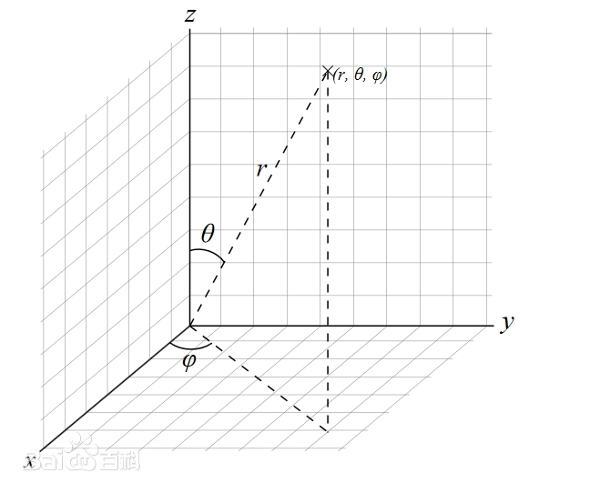

---
categories:
  - 书本知识
  - 数学
  - 线性代数
abbrlink: 4251411578
---

# 【数学】坐标系

## 直角坐标系

又称笛卡尔坐标系，是最常用的坐标系。用离原点各轴方向的距离来表示位置。根据维度的不同分两种：

### 平面直角坐标系

表示形式如下：

$$(x,y)$$

- 象限：坐标系中每个轴之间的面被划分为象限。两轴正半轴的区域称为第一象限，后续象限按逆时针顺序排列。

### 空间直角坐标系

表示形式如下：

$$(x,y,z)$$

- 坐标面：坐标系中任意两条坐标轴确定的平面被成为坐标面，如 xy 轴确定的坐标面叫 Oxy。
- 卦限：相互垂直的坐标面将空间划分成了八份，每份叫一个卦限。xyz 正半轴所在的卦限叫第一卦限，同一层逆时针顺序分别为二、三、四卦限，它们的下一层各为五、六、七、八卦限。

## 极坐标系

一种二维坐标系，用离中点的距离和角度来表示位置：

$$(r,\theta)$$

- $r$：离中点的距离
- $\theta$：离 x 正半轴的弧度或角度（用符号区分，默认用弧度表示）

### 坐标转换

- 直角坐标转极坐标：

  - $r=\sqrt{x^2+y^2}$
  - $\theta=tan^{-1}(y/x)$

- 极坐标转直角坐标：

  - $x = r\cos(\theta)$
  - $y = r\sin(\theta)$

## 球坐标系

一种三维坐标系，由方位角、仰角和距离构成。

$$
(r,\theta,\varphi)
$$

- $r$：距离
- $\theta$：仰角（天顶角）
- $\varphi$：方位角

### 坐标转换

- $x=r\sin{\theta}\cos{\varphi}$
- $y=r\sin{\theta}\sin{\varphi}$
- $z=r\cos{\theta}$