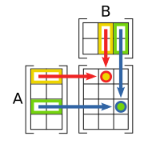

# 【数学】矩阵

数学上，一个 m × n 的矩阵是指一个有 m 行 n 列元素的矩形阵列。

$$
A=
\begin{bmatrix}
a_{11} & a_{12} & \dots & a_{1n} \\
a_{21} & a_{22} & \dots & a_{2n} \\
\vdots & \vdots & \ddots & \vdots \\
a_{m1} & a_{m2} & \dots & a_{mn} \\
\end{bmatrix}
$$

## 矩阵的作用

1. 表示一个空间

   矩阵由多个基向量构成，恰巧可以描述一个多维空间。

2. 表示一种变换

   当矩阵的基向量本质是另一个空间的向量时，该矩阵的向量，也可以重新转换回基向量所在的空间，这个过程就叫变换。

   例如：物体空间实际是利用物体在世界空间中的三个向量组成的新空间，该空间矩阵可与其向量做乘法运算，使其向量转换回世界空间。

所以根据上述内容的分析可以得出常见矩阵之间的关系：

$物体空间矩阵=物体变换矩阵=物体到世界空间变换矩阵。$

## 矩阵的分类

- 对称矩阵：以主对角线为对称轴，各元素对应相等的矩阵。
- 对角矩阵：主对角线之外的元素皆为 0 的矩阵。
- 数量矩阵：主对角线元素都为同一数量的对角矩阵。
- 单位矩阵：数量为 1 的数量矩阵，字母表示为 E。
- 正交矩阵：乘上自身转置矩阵后等于单位矩阵的矩阵。

### 正交矩阵

#### 定义

若矩阵 A 为正交矩阵，则：

$$
AA^T=E
$$

#### 性质

- 快速求出正交矩阵的逆矩阵：

  - $A^{-1}=A^T$

- 快速判断是否为正交矩阵：

  （以下条件可以通过对正交矩阵与其转置矩阵的乘法过程和结果分析来得出）

  1. 各列（行）之间分别正交（各列两两点乘后都等于 0）
  2. 各列（行）都是单位向量（各列的模都等于 1）

- 正交矩阵相乘还是正交矩阵：

  $AB(AB)^T=ABB^TA^T==A(BB^T)A^T = AA^T=E$

## 矩阵的运算

### 转置

将矩阵沿主对角线反转后得到的矩阵。

#### 性质

- $(A^T)^T=A$
- $(A+B)^T=A^T+B^T$
- $(kA)^T=kA^T$
- $(AB)^T=B^TA^T$

### 加法

矩阵加法要求左右两个矩阵大小一致，运算上直接对每个相同位置的元素相加即可。

$$
\begin{bmatrix}
a_{1} & a_{2} \\
a_{3} & a_{4}
\end{bmatrix}
+
\begin{bmatrix}
b_{1} & b_{2} \\
b_{3} & b_{4}
\end{bmatrix}
=
\begin{bmatrix}
a_{1}+b_{1} & a_{2}+b_{2} \\
a_{3}+b_{3} & a_{4}+b_{4}
\end{bmatrix}
$$

### 乘法

所有乘法本质都是乘以矩阵，因为标量和向量都可以转换或看成矩阵的一种。针对矩阵相乘，一种简单的记忆方法，是对于每个元素，取左矩阵一行，右矩阵一列，相乘再加即可（如下图）。

#### 乘以标量

乘以标量时直接对每个元素乘以该标量即可。

$$
\begin{bmatrix}
a_{1} & a_{2} \\
a_{3} & a_{4}
\end{bmatrix}
*
b
=
\begin{bmatrix}
a_{1}*b & a_{2}*b \\
a_{3}*b & a_{4}*b
\end{bmatrix}
$$

#### 乘以向量

相当于给矩阵中每个基向量乘以一个系数后相加（线性组合）。

$$
\begin{bmatrix}
i_{x} & j_{x}\\
i_{y} & j_{y}
\end{bmatrix}
*
\begin{bmatrix}
x\\
y
\end{bmatrix}
=
\begin{bmatrix}
i_{x}*x\\
i_{y}*x
\end{bmatrix}
+
\begin{bmatrix}
j_{x}*y\\
j_{y}*y
\end{bmatrix}
=
\begin{bmatrix}
i_{x}*x+j_{x}*y\\
i_{y}*x+j_{y}*y
\end{bmatrix}
$$

#### 乘以矩阵

相当于左矩阵乘以右矩阵的每个基向量后重新拼成一个矩阵。

$$
\begin{bmatrix}
a_{11} & a_{12}\\
a_{21} & a_{22}
\end{bmatrix}
*
\begin{bmatrix}
b_{11} & b_{12}\\
b_{21} & b_{22}
\end{bmatrix}
=
\begin{bmatrix}
a_{11}*b_{11}+a_{12}*b_{21} & a_{11}*b_{12}+a_{12}*b_{22}\\
a_{21}*b_{11}+a_{22}*b_{21} & a_{21}*b_{12}+a_{22}*b_{22}
\end{bmatrix}
$$

### 余子式

将矩阵中某些行或列去除后，剩下的元素组成的新矩阵。

- **k 阶余子式**

  去除行或列的数量被称为余子式的阶数。

  对于 1 阶余子式通常记作$M_{ij}$，表示去除了 i 行 j 列。

- **代数余子式（余因子）**

  一种拥有正负号的余子式叫做代数余子式，其正负号是通过移除的行列序号判断的。

  如$M_{ij}$的代数余子式记作 $C_{ij} = (-1)^{i+j} M_{ij}$。

### 行列式

输入一个矩阵，输出一个标量。记作 $det(A)$ 或 $|A|$ 。

- **求解 n 阶矩阵**

  $设 S_n 是序列 \set{1,2,\dots,n}（即列编号）的全部置换的合集$（相关知识见“组合与排列”）

  $$
  |A| = \sum_{\sigma \in S_n} sgn(\sigma) \prod_{i=1}^{n} a_{i,\sigma(i)}
  $$

  或者利用代数余子式计算：

  $$
  |A|= \sum_{j=1}^n a_{1,j}|C_{1,j}|
  $$

- **求解 2 阶矩阵**

  $$
  \begin{vmatrix}
  a_{1,1} & a_{1,2} \\
  a_{2,1} & a_{2,2} \\
  \end{vmatrix}
  = a_{1,1} a_{2,2} - a_{1,2} a_{2,1}
  $$

### 余因子矩阵

每一个元素都等于该元素位置在原矩阵的子行列式（代数余子式的行列式）。

$$
cof(A) =
\begin{bmatrix}
|C_{11}| & \dots & |C_{1n}| \\
\vdots & \ddots & \vdots \\
|C_{m1}| & \dots & |C_{mn}|
\end{bmatrix}
$$

### 伴随矩阵

余因子矩阵的转置矩阵，记作 $adj(A)$ 或 $A^*$。

$$
adj(A) = cof(A)^T
$$

### 逆矩阵

$$
A^{-1} = \frac{adj(A)}{det(A)}
$$
