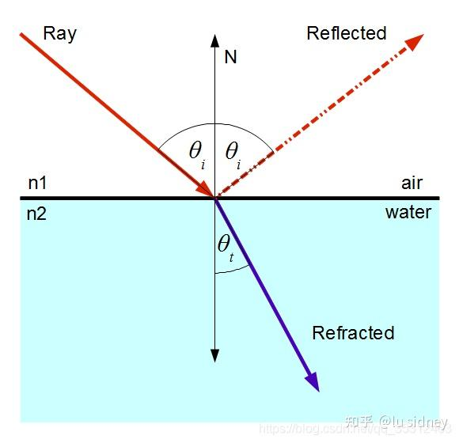

# 【物理】几何光学

- $\theta_i$：入射角（反射角）
- $\theta_t$：折射角

## 反射

## 折射

折射是指光从一种介质穿过另一种介质时，传播方向被偏移的物理线性。

### 生成原因

光是一种波，波具有体积，因此当倾斜着穿过介质时，存在一边先进去一边后进去的情况，而由于两种介质的光速不一样，导致一边会拖拽（加速）另一边，导致光路发生偏移。

### 现象特征

当光线从空气射入水中时：

- 折射角小于入射角。
- 入射角增大，折射角增大。
- 入射角为 0，不会发生折射。

当光线从水中射入空气时：

- 折射角大于入射角。

### 折射率

光在真空中的传播速度与光在该介质中的传播速度之比。从另一个角度可以理解为，该介质将光减速的比率，将光速拖的越慢，其折射率越高。

$$
n=\frac{c}{v}
$$

- c：光在真空中的速度
- v：光在该媒质中的速度

常见材质折射率：

- 真空：1.0000
- 空气：1.0003
- 冰：1.3090
- 水：1.3333
- 玻璃：1.5000
- 钻石：2.4170

在可见光范围内，由于光在真空中传播的速度最大，故其它介质的折射率都大于 1。

#### 折射率与折射角的关系

光的折射方向，由光路两侧介质的折射率决定：从底折射率介质穿过高折射率介质，光的折射角小于入射角，反之大于。具体关系如下：

$$
\frac{\sin\theta}{\sin\theta'} = \frac{\eta'}{\eta}
$$

- $\theta$：入射角
- $\theta'$：折射角
- $\eta$：入射介质折射率
- $\eta'$：出射介质折射率

#### 已知入射方向和法线求解折射方向

- $r$：入射方向。
- $n$：法线。
- $r'$：折射方向。

将 $r'$ 拆成与表面平行和垂直两个向量：$r'=r'_\parallel+r'_\perp$

- $r'_\parallel = \frac{\eta}{\eta'}(r+\cos{\theta}n)$

由于 $r'$ 是单位向量且 $r'_\perp$ 方向已知，故可得：

- $r'_\perp = -\sqrt{1-|r'_\parallel|^2}n$

其中 $\cos{\theta} = |-r||n|\cos{\theta} = -r \cdot n$，故可以完全消除对角度参数的依赖。再将上述公式整理后即可得到折射光方向计算公式：

- $r'_\parallel = \frac{\eta}{\eta'}(r+(-r \cdot n)n)$
- $r'_\perp = -\sqrt{1-r'_\parallel \cdot r'_\parallel}n$
- $r' = r'_\parallel+r'_\perp $
