---
categories:
  - 书本知识
  - 物理
abbrlink: 558360582
---
# 【物理】辐射度量学

包含了对光照的一套测量系统和单位定义的学科，其中几个比较重要的定义如下：

## 辐射能量（Radiant energy）

光的能量

$$
Q[J]
$$

- J：焦耳

## 辐射通量、辐射功率（Radiant flux）

光的每时间做工能量

$$
\Phi(q) = \frac{dq}{dt}[W][lm]
$$

- q：辐射能量
- W：瓦特
- lm：流明

## 辐射强度（Radiant intensity）

从光源发出的每单位立体角上的辐射功率

$$
I(\omega)= \frac{d\Phi}{d\omega}[\frac{W}{sr}][cd]
$$

- $\omega$：立体角
- sr：立体角（solid angle）
- cd：烛光（candela）、$\frac{lm}{sr}$

## 辐照度（Irradiance）

每单位照射面积所起效的辐射功率

$$
E(q)=\frac{d\Phi(q)}{dA}[\frac{W}{m^2}][lux]
$$

- $m^2$：平方米
- lux：勒克斯、$\frac{lm}{m^2}$

当已知的是光线投射面积（$A'$）而不是接收面积时，则为：

$$
E = \frac{d\Phi\cos\theta}{dA'}
$$

推导过程

$
\begin{aligned}
A' &= A\cos\theta \\
A &= \frac{A'}{\cos\theta}\\
E &= \frac{d\Phi\cos\theta}{dA'}
\end{aligned}
$

## 辐射率（Radiance）

每单位垂直面积的每单位立体角的辐射功率

$$
\begin{aligned}
L &= \frac{dΦ}{dω dA\cos θ }[\frac{W}{sr~m^2}]\\
\end{aligned}
$$
