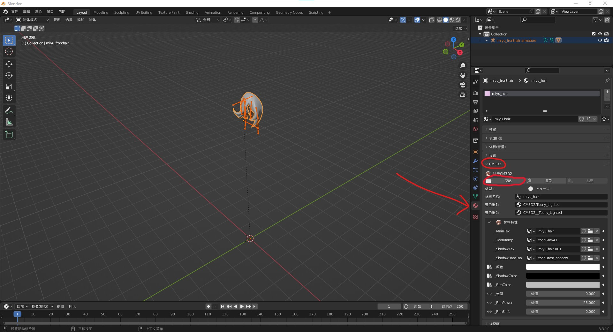
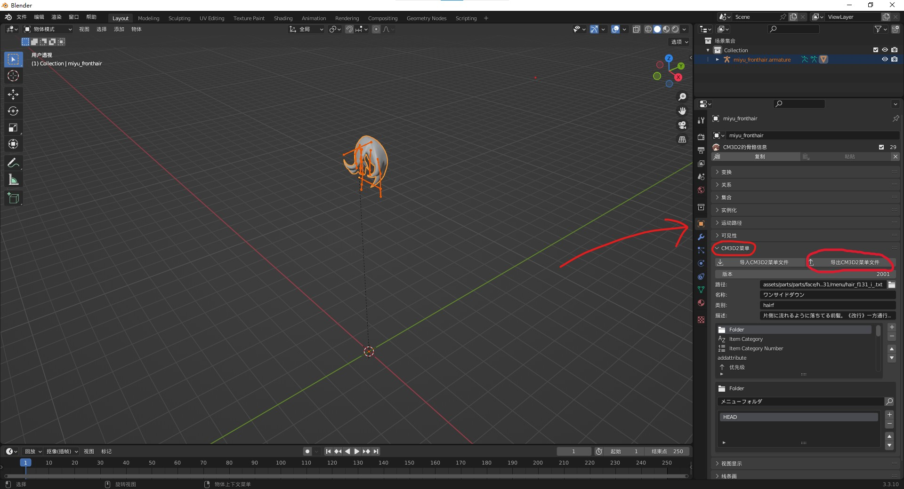
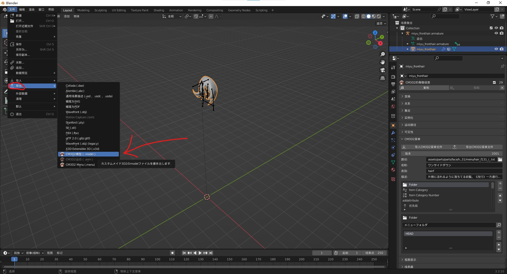
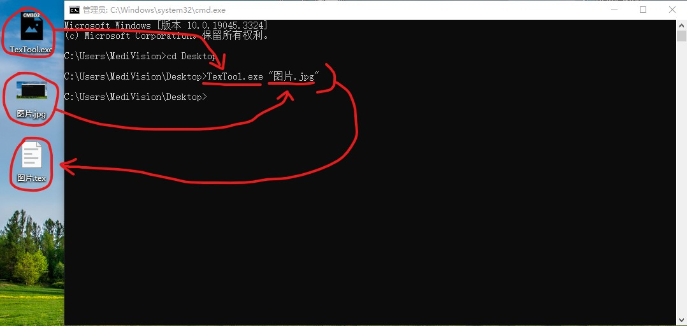
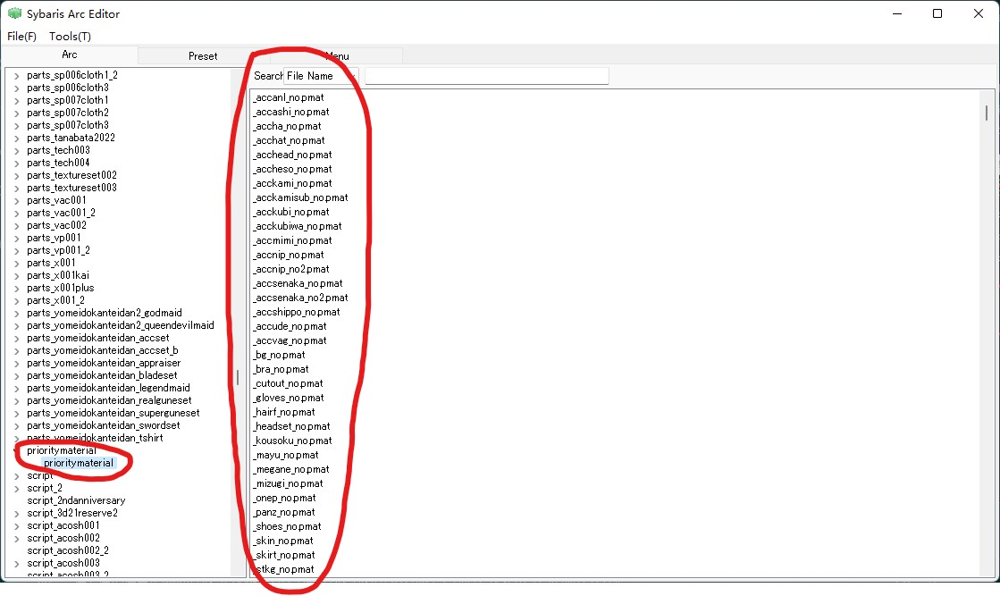
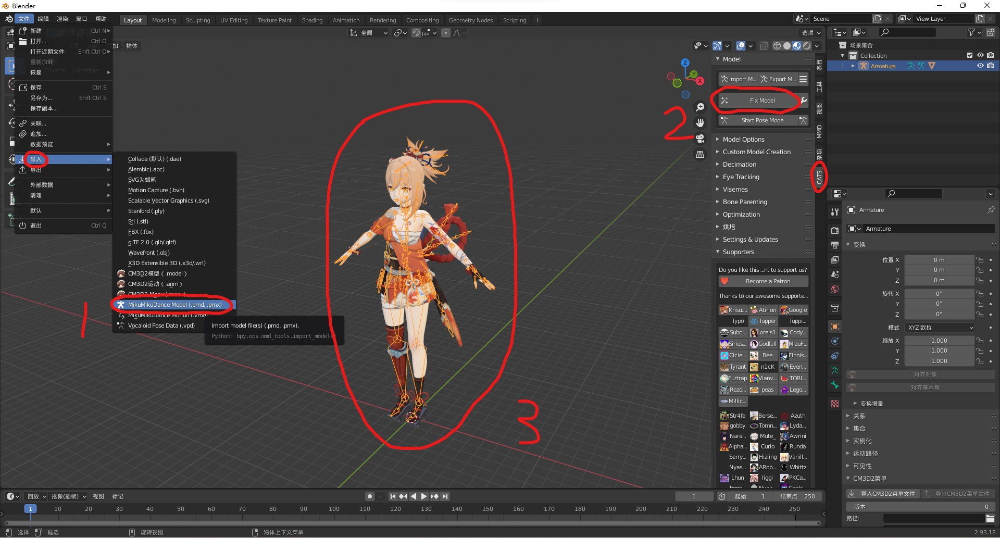
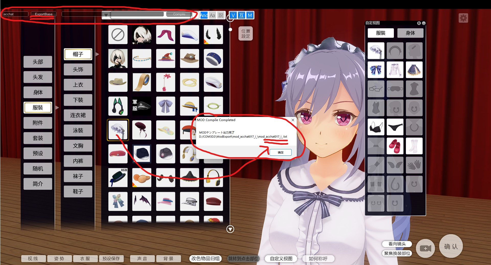
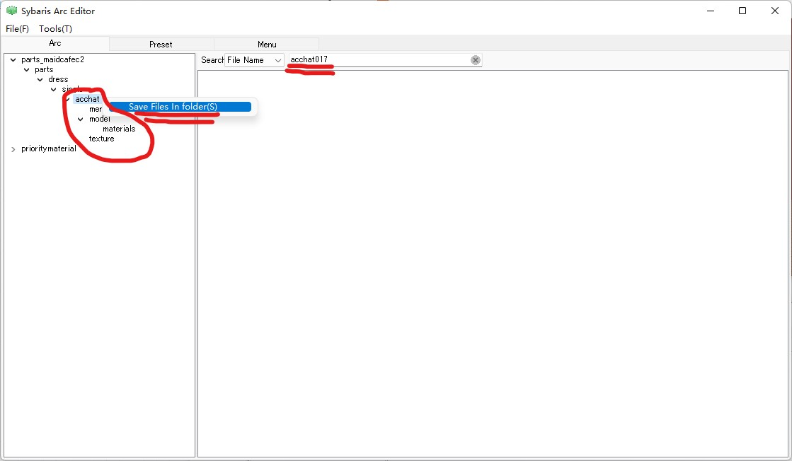
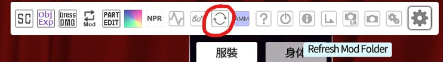

# 【COM3D2Mod 制作教程（3）】Mod 制作概要

制作工具整合包：<https://mod.3dmgame.com/mod/205516>

该工具包简单整合了本章需要一些小型工具和其他一些后续教程需要的资源，所以你**必须下载**它。但如 GIMP、Blender、CMI，这些则需要你自行下载。

## Mod 制作工具

书接上文，我们知道了 Mod 由五种文件构成，而特制的文件自然要用特制的工具制作，具体需要以下工具。

### GIMP

<https://www.gimp.org/downloads/>

修图软件，和 Blender 一样免费开源。这类软件易于获取且干净体积小，这也是为什么选择 GIMP 而不是 PS。但如果你会使用 PS 或其他修图软件也建议继续使用，基本上我们只会使用抠图之类的简单功能，所以没有强制要求。

### Blender

<https://www.blender.org/download/lts/3-3/>

建模软件，使用 3.3LTS 是因为这是 Blender-CM3D2-Converter 插件的推荐版本。

### Blender-CM3D2-Converter

<https://github.com/luvoid/Blender-CM3D2-Converter/releases/tag/luv.2023.08.16a>

一款 Blender 插件。既是 CM3D2 文件转换器，同时也是建模辅助工具，可以实现在 Blender 中导入导出**menu**，**model**，**mate**文件，预览人物体型，转移权重形态建等操作。

#### 安装说明

根据官网描述，安装时插件需要安装依赖性（这是自动进行的），所以首次安装可能会失败，根据报错提示，此时我们需要重启 Blender，再尝试重新安装。

如果多次重装都失败，请尝试删除所有和 Blender，Python 等有关的软件和文件，并按推荐版本重新安装。之前我遇到过这种情况，并以此成功解决了。

_自行顺着 WIKI 上的链接下了本插件，但和我这个不一样？这就是我之前提到 WIKI 过时的问题之一，这个插件的原作者早就退坑了，但这是款开源插件，因此所有人都有机会接力，第二位作者也退坑了，现在是第三位作者在接力，且仍在更新。_

#### 使用简介

根据上一章可知基本上 Mod 文件在 Blender 中都有对应的类型，也因此编辑和导出他们的地方就可以确定了。（注意导出时检查文件名是否有填写、类型是否正确，不然无法导出。）

- mate 文件在材质面板编辑和导出（交配按钮实则是导出按钮，此处翻译有问题）

  

- menu 文件在物体面板编辑和导出（虽然物体不是 menu，但两者是最接近的层次）

  

- model 文件像正常的模型一样编辑和导出就行

  

### TexTool

<https://github.com/ghorsington/TexTool/releases/tag/v3.0.1.0>

COM3D2 的**tex**文件转换工具。Blender-CM3D2-Converter 也提供相应功能，但似乎有漏洞无法正常使用，所以使用该工具单独处理。

#### 使用简介

该应用无法直接打开，需要配合命令提示符使用。使用命令提示符将该应用作为启动程序，并将要处理的图片路径作为参数，这样就可以在原图片目录转换出结果（如下图）。另外一种更简便的使用方式是将需要转换的图片直接拖拽到该应用程序图标上即可。支持多种图片格式，如 png，jpg 文件等，反向转换 tex 文件也可以。

### pmat 編集

<https://www.mypcrun.com/file-download-for-windows/2/264755/3264e7053f02241ea42525bcd2d5bf38/>

用于编辑**pmat**文件。初始的 pmat 文件可以通过 SybarisArcEditor 导出官方文件。

#### 使用简介

我未找到自行创建 pmat 文件的方法，所以只能通过修改官方文件来实现，官方的 pmat 文件都被存储在/GameData/prioritymaterial.arc 文件中，需要用 SybarisArcEditor 进行导出。  

## Mod 移植工具

现在工具已经有了，但我想没人真准备从头开始做吧，反正我没那实力，那咋搞？抄作业呗，国内基本都是抄作业，甚至有人拿抄来的作业盈利，所以我们这些圈外人就更不用担心了。

### 模之屋

<https://www.aplaybox.com/>

一个 MMD 模型分享网站，上面有很多免费分享的模型，并且最关键的是大部分游戏官方为了鼓励二创都会在上面发布自己的官模，作为源模型再合适不过了。

### Cats-Blender-Plugin

<https://github.com/absolute-quantum/cats-blender-plugin>

模之屋的模型是 pmx 格式，是 MMD 软件的专属格式，所以在 Blender 中我们必须要用专门的插件导入。

#### 使用简介

从模之屋下载到 MMD 模型文件后，像正常导入模型一样导入 pmx 文件，接着使用插件提供的修复功能，即可轻松获得我们的移植源模型。（如果点击修复后模型贴图仍然异常，可以尝试删除模型后重新导入）

### SybarisArcEditor 和必要优化插件

- **SybarisArcEditor**

  模之屋只是解决了模型来源的问题，但其他 menu，pmat 等文件你不会想自己从头写吧，反正我记不住里面该填啥，另外包括骨架模型和权重信息这些，我也没有也不想自己刷啊。但如果有现成的模板，我肯定能稍微改改，那这个软件就能解决这些问题，他能直接导出官方 Mod 用于参考，配合 Blender 插件甚至能一键抄作业。

- **MaidLoader**

  一个游戏插件，优化了官方的 Mod 加载功能，并增加了很多其他加载项，比如 pmat 文件，否则我们只能通过改系统文件实现，那做出来的 Mod 根本没法分享。另外这个插件还支持在游戏中实时重载 Mod 文件，这太方便了，否则每次我们添加新文件必须要重启游戏，那速度简直龟速。

- **ExtendedErrorHandling**

  一个游戏插件，优化了装扮文件丢失时的处理方式，在原版游戏中一旦文件缺失就是直接弹窗加自动退出，然而几乎所有第三方 Mod 都是“缺文件”的，比如官方头发有多种颜色选项，如果 Mod 没有做支持那从官方发色切换过来时基本都会触发。如果坚持原版的处理方式，这对玩家体验影响太大同时也大幅增加了 Mod 制作者的工作量（当然也有通过 menu 参数人为矫正的方法，但这无疑增加了 Mod 制作的复杂度），如果不想累死，这个插件也是必装的。

#### 安装说明

<https://krypto5863.github.io/COM-Modular-Installer/>

建议直接使用 CMI 的开发者预设安装上述工具和插件，这是最简单的做法。如果你想要单独安装，请自行参考 WIKI。

#### 使用简介

- **SybarisArcEditor**

  1. 首先 SybarisArcEditor 必须放在游戏根目录才能起效。

  2. 既然是导出器，那第一件事就是要确定我们要导出的文件名。一般获取装扮文件名的方式是首先在游戏中同时按下“M”,“O”,“D”三个字母，调出游戏左上角内置的导出菜单，接着选择装扮再点击导出按钮即可从导出弹窗中看到装扮名称信息。（实际上 SybarisArcEditor 也内置装扮菜单的可视化，可借此获取文件名，但想要实时预览肯定没有游戏内方便）

     

  3. 接着使用该名称在 SybarisArcEditor 中搜索即可找到目标文件，右键导出即可（可以看到官方装扮本质也是 Mod，其文件结构和类型和我们上一章讨论的一致）。

     

- **MaidLoader**

  加载功能为自动触发，刷新 Mod 功能则在右上角工具栏中。
  

- **ExtendedErrorHandling**

  自动触发。

## Mod 兼容性确定

> 如果你希望把 Mod 分享给别人，或让 Mod 在未来也可继续使用，那你必须要考虑兼容性的问题。

所要制作的目标和制作工具都已齐全，现在我们可以正式制作 Mod 了，但为了保证我们做出的 Mod 持久易用，开工之前我们还要明确有关 Mod 兼容性的问题。

所谓兼容性就是指 Mod 对不同游戏环境下的适应能力，比如是否能不依赖插件运行，在不同版本的游戏中是否继续有效等。兼容性越好的 Mod，可以使用的人群就越多，需要维护的代价也越小，所以无论是为别人还是为自己这都是要考虑的一点。

### 版本兼容性

> 旧版游戏可用的 Mod 在新版游戏中也肯定可用，但反之不行。所以制作 Mod 的游戏版本越低，可用的玩家就越多。
>
> 本教程使用 COM3D2 2.28 版本。

版本兼容性是来自官方的功能，是保障游戏更新后 Mod 能继续使用的重要指标。COM3D2 的系列已有多代作品，每一代都有自己的 Mod 功能，如果每次出新游戏 Mod 都得全部重做，所有过去累积的 Mod 化为乌有，那玩家肯定不会买账。游戏官方总是希望玩家能玩最新版，且不希望因此流失玩家，所以 COM3D2 的 Mod 具有向后兼容的功能。

目前国外应该是主流使用 COM3D2.5，国内是 COM3D2，而 CM3D2 我未曾接触过。COM3D2 的 Mod 在 COM3D2.5 中也可正常使用，所以本教程的游戏版本选择使用目前国内主流的 COM3D2 2.28 版本。

- CM3D2->COM3D2（我们在这）->COM3D2.5

### 插件兼容性

> 存在版本不兼容风险，无法确保安装环境统一，会增加额外学习成本，少用慎用。
>
> 本教程仅使用“MaidLoader”和“ExtendedErrorHandling”两个插件，这是必要的游戏优化插件。

插件可以为游戏添加很多额外的功能，但问题是插件并非官方内容。虽然得力于游戏具有向后兼容的原因，插件具有一定的版本适应能力，但这终究是不稳定的，实际上现在已经出现了很多过去很常用的插件在新版游戏中无法使用的情况。所以过多的使用插件功能会把这层风险转移到你的 Mod 身上，而且你并不能确保每位玩家都和你装着同样的插件。

另外插件属于扩展功能，这就代表这需要额外的学习成本。而且因为来自第三方，所以其功能可能并不稳定，资料也会更匮乏，所付出的学习成本可能相当大。

但另一方面插件又能给我们带来很多原版游戏享受不到的便利性，有些功能甚至达到了必要的程度，并且因为 CMI 之类整合包的普及，插件具有一定的广泛性，完全拒之门外也是很愚蠢的行为。

因此我们择情选择，会使用少许游戏优化性的必要插件，但其他功能扩展类插件一律不会使用，比如高跟鞋，额外体型编辑，高画质材质等，实际上这里面的一些插件在新版游戏中已经不兼容，所以如果你想用这些扩展性功能，你需要自行研究。

### DLC 兼容性

> 官方内容，比插件兼容性好，但也无法保证安装环境一致。一般可作为移植源模型，或当成允许缺失的占位装扮使用。
>
> 本教程会使用 GP-01Fb 中的捏脸系统做人物脸部，并使用部分 DLC 装扮做移植源模型。

DLC 相当于是官方 Mod，增加了大量的额外装扮选项，对于我们开发者来说这就相当于一下增加了好多可以抄作业的对象，或者也能拿来偷懒，少做件衣服什么的，另外还有部分功能性的 DLC 也相当实用，比如 GP-01Fb，可以为游戏增加额外的捏脸系统，大幅降低人物面部的制作难度。

由于 DLC 是官方内容也因此具有一定普及性，几乎网上的所有 COM3D2 游戏资源都是连带 DLC 的版本，另外受插件功能影响，衣装面部即使丢失也会被正确回退到原本的默认值，但那样 Mod 也可能因此失去意义。

总体来说 DLC 的兼容性比插件好一些，毕竟是官方支持的功能，但依旧无法确保用户安装环境统一，而且单纯用 DLC 偷懒的 Mod 我觉得很不厚道，所以 DLC 更大的作用是作为无关紧要的的临时替补，是允许用户丢失的存在，另外就是给移植时增加更多的参考对象，又因为本身是官方文件，所以没有“版权风险”，发布 Mod 时根据需要我们可以连带打包。

### 第三方 Mod 兼容性

> 请不要使用这种方式，除非你能保证会连带打包，否则产出的 Mod 毫无分享价值。

第三方 Mod 兼容性是指你在自己的 Mod 中引用第三方 Mod 的情况，这种方式和上述的三种兼容性有一个本质区别。“游戏，插件，DLC”这三者都存在后天获取的途径，因此即使出了问题，也有办法修复，但第三方 Mod 则不同，这基本没有官方站点的东西本来就很难找到，算上如今的环境更是雪上加霜，几乎不可能保证用户拥有或能找到该 Mod。

如果你想在你的 Mod 中额外使用第三方的 Mod 文件，请确保你会连带打包，否则产出的 Mod 毫无分享价值。但通常 Mod 制作者对于自己的 Mod 都有很强烈的版权意识，基本不可能同意你用来二次生产或分享，所以你也无法做到这一点。

所以请杜绝这种做法，但如果你是故意要这么干，那我也没法阻止，只能表示深感遗憾。

## Mod 制作流程

### Mod 加载顺序

了解文件的加载顺序有利于我们理清文件之间的依赖关系，并便于后续制作流程的规划，COM3D2 的 Mod 加载顺序有以下几个流程。

1. 游戏先识别 menu 文件，这些文件会显示在玩家的装扮菜单中，menu 中指明了装扮对应的 model 文件。
2. model 文件提供了模型点线面信息，并告知绘制模型时该用哪一个 mate 文件。
3. mate 文件告诉游戏如何绘制画面（即用什么 shader），并描述绘制的参数和用到的 tex 文件。
4. pmat 文件则在特殊情况下出现，用于应对绘制顺序问题。

总结可得以下先后结论：

1. menu（所有文件的指路人，确定了我们要做的文件）
2. model->mate->tex（凑成了一套完整 3D 模型）
3. pmat（可选作）

### Mod 制作顺序

因为依赖关系的原因，前者的需求可能导致对后者有特殊要求（如 model 的 uv 变了，导致 tex 要重新绘制），所以 Mod 的制作顺序应与 Mod 加载顺序一致，具体而言大致的通用顺序可以如下规划（更细致的实际制作流程我将在后续章节讲述）。

1. **准备用于移植的原始模型**

   1. 浏览“模之屋”网站，挑选一个自己喜好的模型并下载。
   2. 使用“Cats-Blender-Plugin”导入下好的模型文件。
   3. 理清大概的模型结构，按装扮分类将源模型拆成多个单件装扮模型。

2. **准备用于仿制的官方 Mod**

   1. 根据准备移植的装扮模型，用“SybarisArcEditor”导出一份与其最接近的官方 Mod。
   2. _观察官方 Mod 文件组成，通过模仿，我们就能知道如何从零制作相应的 Mod。_

3. **制作 menu 文件**

   1. 使用“Blender-CM3D2-Converter”导入官方 Mod 文件中的 menu 文件。
   2. 对官方 menu 文件进行适当修改，比如修改装扮名，图标，所用 model 文件等信息。
   3. 此时 menu 文件制作成功。
   4. 依据该 menu 文件，确定我们下面要制作的目标，一般都是需要 model 文件（但也可能是需要 tex）。

4. **制作 model 文件**

   1. 使用“Blender-CM3D2-Converter”导入官方 Mod 文件中的 model 文件。
   2. 将装扮模型调整至和官方模型差不多的位置大小，重新绑骨为官方骨架。
   3. 利用权重转移形态键转移等功能，将官方模型相关数据转移到新装扮模型上。
   4. 此时 model 文件制作成功，这个新装扮模型就是实际的 model 文件。

5. **制作 mate 文件**

   1. 找出刚做好的 model 文件所用的材质，使用“Blender-CM3D2-Converter”将其转换为 CM3D2 格式，具体不同情况可能要选择不同转换材质，如透明不透明等。
   2. 正确填写好新材质中的各种参数，包括对贴图的引用信息等。
   3. 此时 mate 文件制作成功，这个刚被转换的材质就是实际的 mate 文件。

6. **制作 tex 文件**

   1. 找出刚做好的 mate 文件所用的贴图，并依据 model 的情况进行些额外处理，比如制作额外的图标贴图，扣除皮肤部分使其隐藏等。
   2. 此时 tex 文件制作成功，这个刚处理的贴图就是实际的 tex 文件。

7. **导出 Mod 文件**

   1. 将上述的所有文件进行简单的检查，确保各文件名无误，引用信息正确。
   2. 接着将他们全部导出到游戏的 Mod 文件夹中。“menu、model、mate”直接通过“Blender-CM3D2-Converter”插件即可导出；“tex”可能需要用外部的“TexTool”工具进行导出。

8. **Mod 文件查修**

   1. 启动游戏，找到对应的装扮菜单项，穿上新做的 Mod。
   2. 检查各种情况下的穿模情况，并以此修改模型重新导出。
   3. 进行各种常规的游戏活动，确保 Mod 文件无问题。

9. **Mod 文件发布**

   1. 穿好完整的 Mod，保存其 Preset 文件，并拍照保存预览图。
   2. 将相关所有文件进行整理分类，确保文件完整无冗余。
   3. 将文件打包发布至网络。(我用这个：<https://mod.3dmgame.com/COM3D2>)

## 总结

本章主要是正式制作 Mod 前的一个准备环节，指明了进行 Mod 制作所需的各种工具，以及确定了 Mod 的运行环境兼容性，并对整体制作流程进行了概述。

不过看了这些你可能仍然处于懵逼状态，因为这些仍然是概念性的前置课程，但将上文所说的这些都配置好后，我们便可以正式开始制作 Mod 了。

下一章我们将真正站在实战的角度去做 Mod 中的身体部分，我会将更具体的流程和注意点写在其中。
