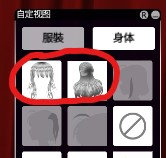
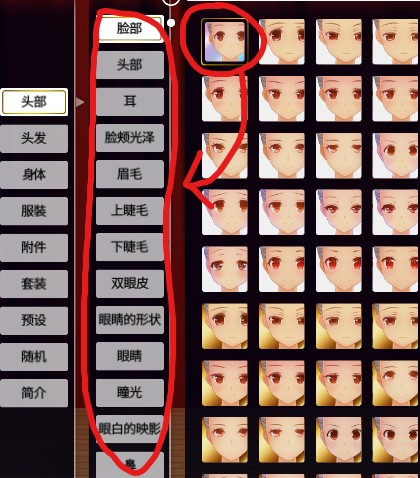
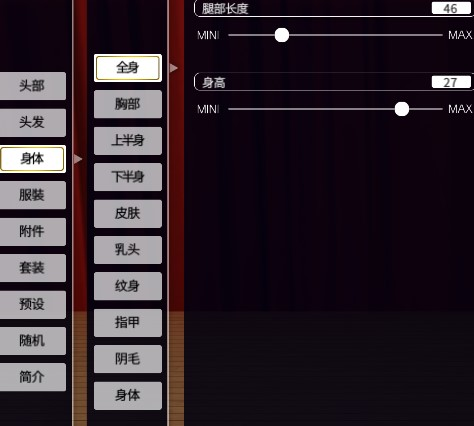
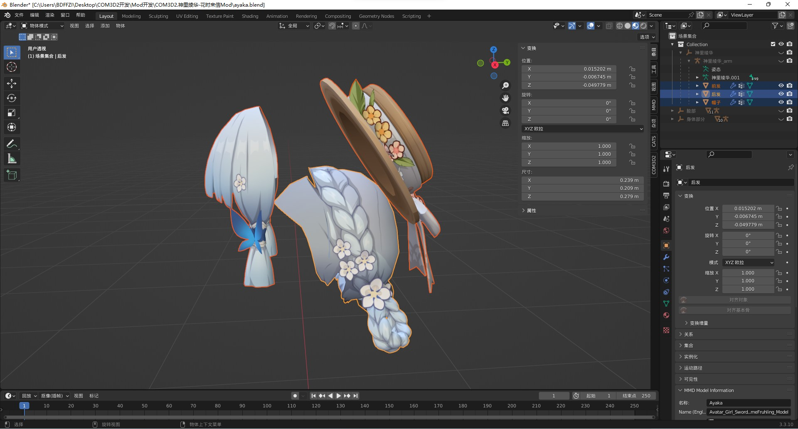
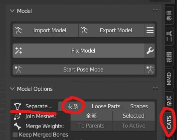
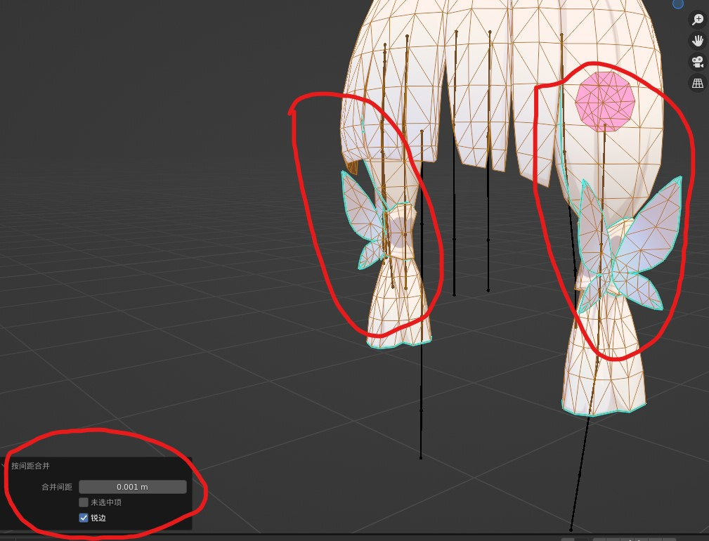
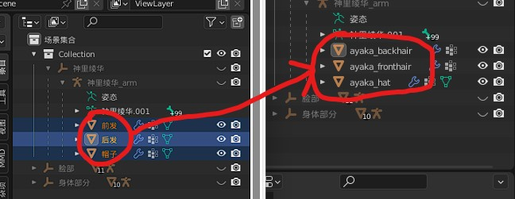

# 【COM3D2Mod制作教程（4）】实战！制作身体部分（上）

## 教程介绍

现在正式进入实战教程环节，我会以我的实际制作过程详尽的教授每个细节，也因此受限于篇幅大小，“实战！制作身体部分”被分为了上中下三个过程。

- 上：

    我们将首先确定我们的制作目标，并以此进行环境搭建和资源准备工作，目标是将正式制作Mod的前置需求全部完成。

- 中：

    现在正式开始制作Mod，以典型的帽子Mod为例，我们会一步步将“上”中准备的资源逐渐转化为COM3D2中的Mod，并在最终实际放入游戏中，完成第一个Mod制作。

- 下：

    在累计了“中”的制作经验后我们开始完成剩下的头发Mod部分，并简单介绍身体和脸型的制作流程，并最终将Mod打包发布至网络，彻底完成一套完整制作流程。

接下来我们正式开始教程。

## 确定目标

我们这次只制作身体部分，身体部分是最简单最实用的部分，是人物最重要的特征点，快的话一个小时就能搞定，但足以达到让人直呼老婆的水平，毕竟衣服是可以随意换的，但身体始终不变。

所谓的身体部分是实际按照游戏中右侧装备栏的身体分栏确定的，具体而言我们一般需要做以下几个部分，在这之后我们便开始根据第二章的流程概述实际做Mod。

### 头发  

头发具体在游戏中有多个分类，其中必须装备的是“前发”和“后发”两种，为简化制作流程，我们也只做这两者。

### 眼睛

眼睛并非模型而是纯贴图。我们将使用修图软件进行处理，当然作为游戏装扮的一员，它也是有一套自己的menu文件要填写的。

### 帽子（头饰）

头饰按道理是服装装扮的部分，为何此处也需要制作？因为大部分游戏模型会将部分光照阴影直接绘制在贴图上，由于我们的头发是移植的，这些阴影也直接反应在了头发上，如果不带上原本的头饰遮掩，就会存在黑斑问题（如下图）。

### 脸型

我们将直接使用DLC“GP-01Fb”提供的特制捏脸脸型选项制作。

### 体型

体型也是直接使用游戏自带的系统捏制即可。

## 前期准备

这些基本是第二章已讲述的内容，你需要将其配置好，才可开始制作Mod。

### 开发工具

第二章所说的各种编辑工具，你需要将他们安装好，安装方式在第二章已有说明，此处不再重复。

### 移植模型

这是第二章提到模之屋以及导入pmx文件的内容。由于是实战，所以这次我们要实际准备一个模型，因为我是原批，所以这里用原神中的角色“神里绫华”做参考。

### 参考Mod

由于脸型和体型是游戏内置功能，我们只需要考虑“头发”，“眼睛”，“帽子”的Mod文件制作即可。我们需要导出与之相关的官方Mod文件做移植参考，具体操作还要根据移植模型所拆分出的装扮类型和形状来定。

## 原模型预处理

### 装扮拆解

本次我们只制作身体部分，所以移植模型的衣服部分我们可以直接排除，这样就只剩下头部，将头部模型拆解整理后，我们可以得到以下三种装扮：“前发”、“后发”、“帽子”，这和我们上述的Mod目标正好对应。

提示：导入pmx的那个插件支持按材质拆分模型，可以方便我们的拆解工作（见下图）

### 网格优化

为了方便后续权重绘制、顶点调整等操作我们要检查网格是否整洁规范，比如是否有断面或重叠面之类的问题，这些若不处理都会对后续操作产生不良影响。

#### 合并断面

比如我这个“神里绫华”模型就存在断面问题，解决方法很简单，利用blender的按距离合并顶点功能即可，使用时记得勾上锐边选项，因为断面似乎是模型有意为之，下图那些蓝色的地方就是断面处，也恰好是应该锐边的地方。

#### 消除重叠面

我这个模型实际上也同时有着重叠面的问题，和断面问题一样也是模型有意为之，这个主要和材质有关，一个面如果有多个材质原模型就会多一层面，所以通过材质选中加删除的方式就能解决，当然因为我上一节“装扮拆解”中恰是通过材质拆解的模型，所以整理好后问题正好解决了。

### 文件命名

#### 为什么要注意文件命名？

COM3D2识别区分Mod的方式就是靠文件名，包括不同文件间的引用关系也是靠文件名指明的，文件名一旦设置有误就很可能导致Mod无法使用，有关文件名必须遵循以下几个注意点。

- **文件名无视路径。**

    如果有同名文件，但所在文件夹不同，对COM3D2来说依旧是同一个文件，结果就会导致覆盖或重复加载。
- **文件名不能为中文。**

    因为导出插件是只考虑了英语环境做的，所以使用非英语语言，如日语，汉语等都会导致文件无法导出。
- **文件名不区分大小写。**

    如果文件名除字母大小写外都相同，对COM3D2来说这也是同一个文件，那也会出现上述的问题。

#### 推荐的命名规范？

由于上述问题所以对于文件命名我们需要一定规范：  

- **使用角色名做前缀。**

    因为第一点，所以我们要尽可能保证文件名不重复，所以可以选择加一些前缀，我一般会选择角色名做前缀，这够用了毕竟角色Mod太难找了。

- **使用全小写英文，并用下划线做单词分隔符。**

    因为第二点所以我们要用英文名称，而因为第三点不区分大小写，所以我们统一全用小写，并用额外的符号分割英文单词，我一般都是用下划线“_”作为分隔符。

- **使用部位名做名称主体。**

    最后为了让文件具有可读性且保证多个装扮名不重复，我们需要提供一个名称主体，我一般会使用部位名做主体，这样清晰易懂还不会重复。

#### 实战结果

以此命名方式对我们的示例模型进行重命名可得如下结果，且后续的其他文件我们也将遵照上述规则。

## 导出参考Mod

由于制作Mod的源模型已经到手，根据其形状我们可以正式导出用于参考的官方Mod了，这是必须的一环。

### 为什么要导出官方Mod？

- **只有观察官方Mod文件构成我们才知道要准备什么。**

    不同的装扮可能有着不同的需求，有些是单纯的建模，有些是要专门的贴图，有些需要特制menu文件，等等，并不是所有装扮的文件需求都是一成不变的。

- **只有通过官方menu文件我们才知道应该填写什么。**

    menu文件相当复杂，也相当重要，没写好就会导致无法使用或事倍功半，但我们没有途径也没有精力将其完全摸透，所以只有通过观察官方menu文件，在其基础上修改才是上策。

- **只有通过官方model文件我们才能进行骨架绑定。**

    人物建模最重要的就是骨架绑定，这是实现原理，也是后面最费时间的地方，只有通过官方model文件我们才能获得用于绑定的源骨架，以及知晓正确的权重刷取要求。

### 为什么要根据源模型形状选取官方Mod？

因为我们需要绑定骨架，不同装扮对骨架的需求是不同的，比如：裙子就需要带裙骨的；双马尾就需要有两条骨链的。所以必须根据形状选择官方Mod，这样得到的骨架才能匹配。

比如我们源模型发型都是双耳前后有两簇头发，那我们选择的官方Mod也应如此，因为这几簇头发一定是需要骨骼的；而帽子我们也是尽可能选择一个形状位置最像的。

### 实战结果

所以根据我们的示例模型特征，我选取了以下三个对应的官方装扮（此处改口叫装扮没有问题，是因为官方装扮就是官方Mod，这是上一章描述过的）。

接着我们使用SybarisArcEditor导出这三个装扮的Mod文件（导出方式也已在第二章讲过）。

## 总结

本章我们获取到了用于移植的原模型，并进行了一些必要的预处理操作，接着我们借此推断并导出了用于参考的官方Mod，所以此刻所有的前置文件都已经准备好了，接下来我们可以正式制作Mod了。
