# 【COM3D2Mod 制作教程（6）】实战！制作身体部分（下）

有了上一章制作帽子的经验，此时做头发很多就不必再重复赘述了，但如果用完全一样的流程和方法，把头发做好后直接装扮就会导致游戏报错，这就是我之前说的，不同装扮的制作需求并不是一成不变的，所以本章就也就此开始。

## 一. 制作头发 Mod

头发装扮的大部分制作流程和帽子的流程都是一样的，比如也要绑骨骼，写 menu，设置 mate、tex 这些，但光这些还不够，因为头发是支持更换颜色的，它额外有一套帽子没有的颜色系统需要我们处理。

重复的流程我就不展示了，利用和上一章类似的做法制作就行，**但提醒一点：如 mate、tex 等文件是可以共用的，在 blender 中共用材质就行，可千万别傻傻的又去做一遍**。

那接下来我就直接开始讨论关于头发中的新增流程

### menu 中的颜色选项

头发的 menu 比帽子多了很多新条目，但还是那句话多一事不如少一事，看不懂就不需要管，那些选项里大部分都是内置数据所以当成默认值就好，唯有一个“Color-Set”选项里面引用了一个外部文件，显然这个我们肯定是要处理的。

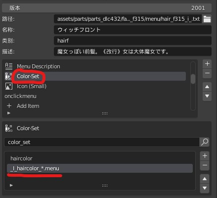

#### 这个外部 menu 是什么？

从命名来看这个 menu 显然不属于任何一个特定模型，应该是某种官方的通用文件，那简单，我们直接用我们的导出器找来看看就知道了：  
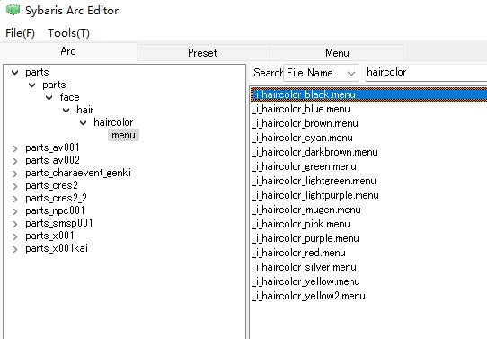

并没有找到名为“haircolor\_\*.menu”的文件，但如果不限定“ \* ”内容，那就可以找到好多同类文件，有理由怀疑此处的“ \* ”是起到一种通配符的作用，那样的话这个条目应该是起到了一个提供大量颜色选项的功能。这么一说的话你联想到了吗？没错，这就是头发装扮中额外的发色菜单。  
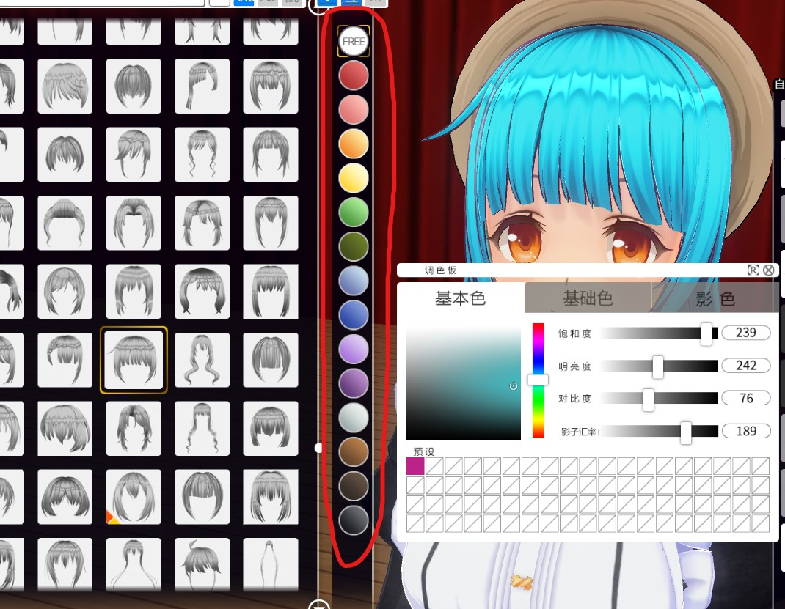

#### 如何选择发色选项？

现在我们已经知道了上述 menu 就是发色选项而已，因此我们的头发也必须要选择一种颜色（我已经试过删除这个条目了，那样会报错），但实际上由于我们的的原贴图上本身就有颜色，所以我们是不需要二次发色调整的，因此如果必须要混合颜色，那我们需要的是白色，但显然菜单里没有白色选项啊，别慌看一下这些菜单选项的具体内容（下图），就可以从中发现这些端倪。

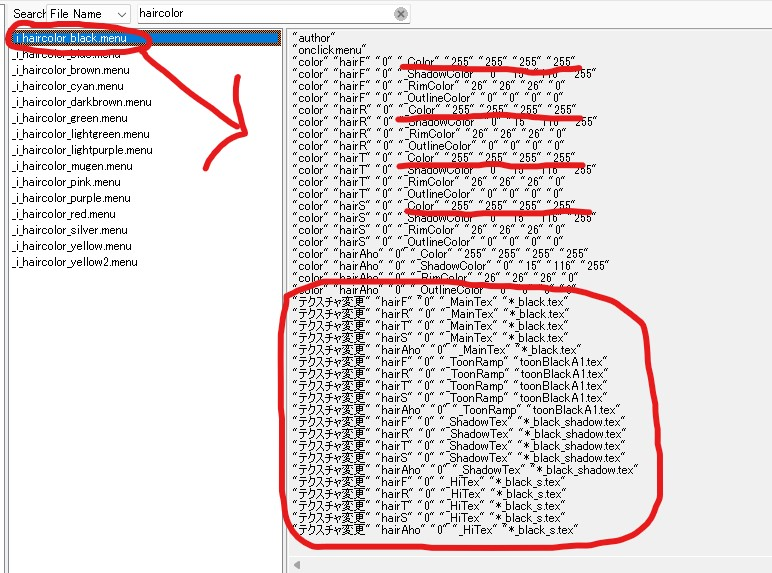

黑色的 rgb 值明明是(0,0,0)结果上图的画线处却是(255,255,255)，这不明明是白色吗？而且想想也很不对劲，要是真拿黑色做混合颜色，那不就相当于原贴图内容完全失效了吗？所以啊，其实这个名为黑色的选项实际上就是我们想要的白色。

另外一件可怕的事是上图的画圈处，里面大量使用了些外部 tex 文件，而且不少都是带“ \* ”通配符的，所以这些贴图很可能是需要我们准备的，而且每种颜色需要的 tex 都不同，想想就头大，所以也是为了偷懒，我们就定死一个颜色选项，黑色好了。

#### 实战结果

根据上文分析，我们的 menu 文件就知道如何修改了，把原颜色选项定死为黑色（如下图），另外上文那些未知 tex 需求，也将推动我们下一节的任务。  
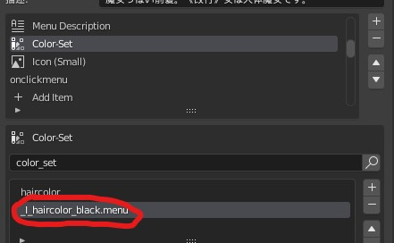

### 额外的颜色贴图

将新的 menu 文件导出到游戏并选上黑色选项后，我们的装扮仍然没法使用，游戏会呈现如下错误，头发的模型轮廓出现但表面呈粉红色，左上角也弹出了报错信息（该报错信息在小黑窗中也可见）：  
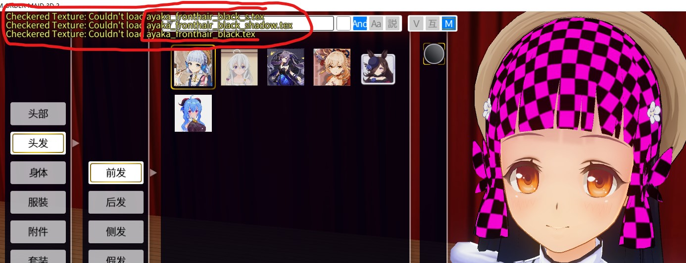

显然这是贴图丢失的表现，没错，正是我们上一节提到的那些未知 tex，并且此时可以看出之前的那些“ \* ”所代表的其实就是对应头发 model 的名称。不过有了上一节的分析我们可以从颜色的 menu 文件中很容易的看出这些贴图的作用，其实就是更换颜色贴图那些而已，那这个贴图我们早有了，多复制几份改个名就行：  
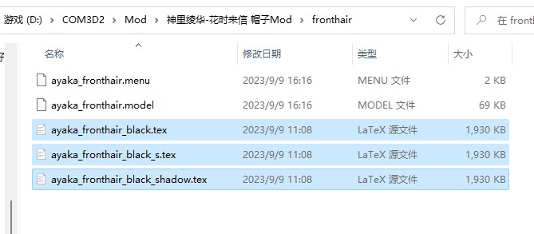

#### 实战结果

成功，头发问题完美解决了，另一个头发照葫画瓢的做就行，另外别忘了，**如果不重开游戏，那每次添加新文件都要用插件重载 Mod 文件**哦。
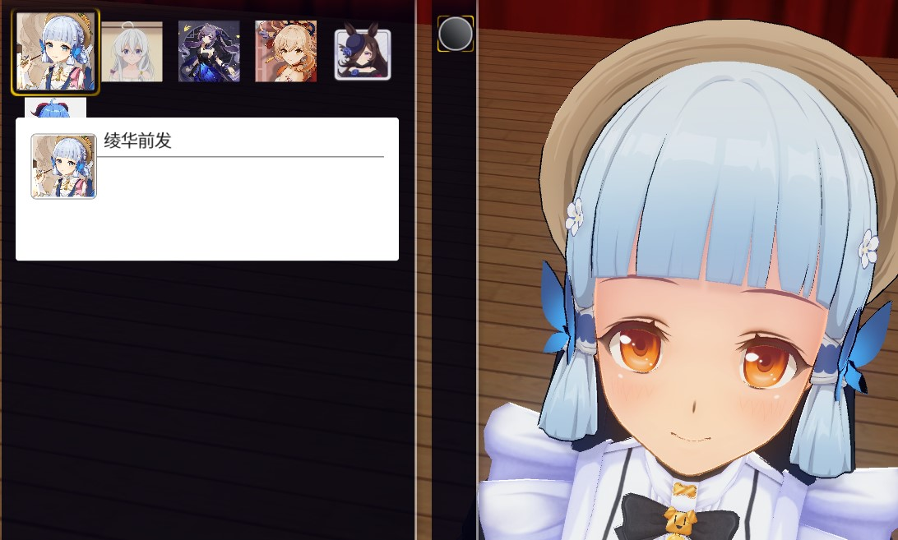

### 完善头发 Mod

我有罪我又干了件蠢事。还记得我们之前选材质的时候吗？那时候为了便于后续做单面衣服，我选择了轮廓线材质，接着帽子头发也都用了同一个材质，对帽子来说无所谓，但头发就很尴尬了，因为头发是前后发组合完成的，结果因为轮廓线的原因，导致两模型接缝处额外多了条黑线。必须要解决啊，那具体咋搞呢？

还记得我们讨论材质参数的时候吗？那时说过轮廓线材质中有一个轮廓线宽度参数，如果不想要轮廓线我们只要把它设成 0 即可，这样不需要更换材质，双面效果也得以保留：  
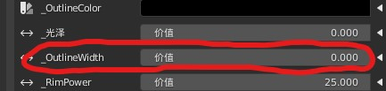

接着我们重新导出 mate 和 model 文件（**没错，修改 mate 后，~~相关 model 文件也要重新导出，不然 mate 不会生效，原因不明~~，因为 model 文件包含 mate 文件，所以实际上根本不需要单独的 mate 文件，直接导出 model 文件就行**）。现在再让我们看看效果，有内味了哈哈：  
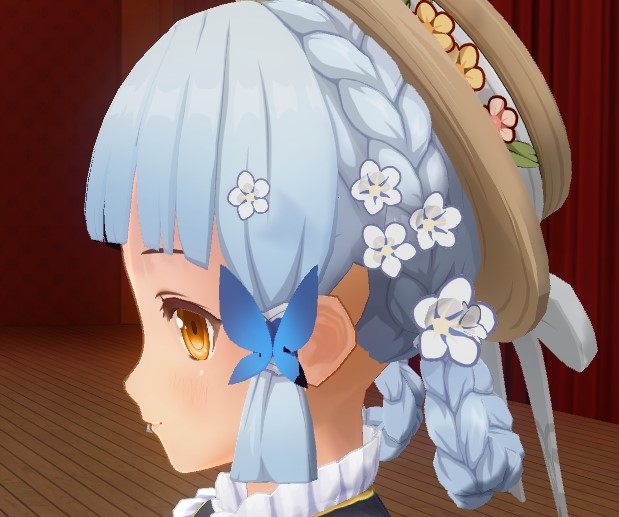

## 二. 制作眼睛 Mod

### 1. 观察示例 menu 文件

老规矩，不会就抄，我们先随便导出一个官方眼睛 Mod 做参考

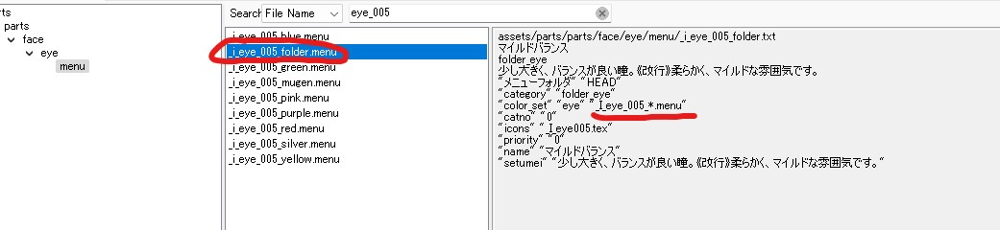

可以观察到官方眼睛 Mod 是有多个 menu 文件构成的，并且大多是颜色后缀，比较特殊的是里面有一个“folder”后缀的 menu 文件。打开后又可以看到哪个熟悉的通配符了，显然这是眼睛的颜色选项实现。

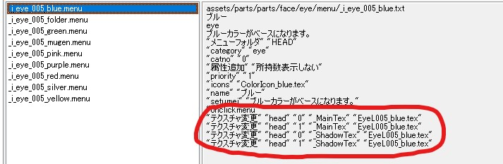

继续观察后我们可以发现，眼睛的 menu 文件中没有我们熟悉“Add Item”显然它不需要 model 文件，取而代之的是眼睛颜色贴图，且没用通配符，简单粗暴的把全名写在了选项 menu 文件中（画圈处），自此我们的后续目标就确定了：

- ayaka_eye_folder.menu：  
  等同于上图“\_i_eye_005_folder.menu”的作用，用于声明眼睛装扮提供的颜色选项。
- ayaka*eye_black.menu：  
  等同于上图“\_i_eye_005*任意颜色.menu”的作用，用于声明当前颜色对应的眼睛贴图。眼睛颜色没有 black，因为它们直接使用贴图，所以不需要特殊的混合颜色，这里我是受发色的影响，所以继续用 black 命名。
- ayaka_eye_black.tex：  
  眼睛贴图。

### 2. 制作眼睛贴图

我们将上图中官方的眼睛贴图“EyeL005_blue.tex”导出来做参考，用工具转换回 png 格式接着用 GIMP 打开，可以看到就是如下这样一个简单的图片：  
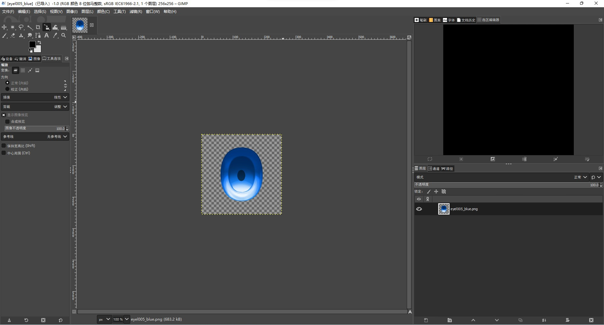

模型是移植的，眼睛也是同样，我们的原模型贴图中就有眼睛的部分，所以我们只要用修图工具扣下来，摆放到和官方眼睛一样的状态即可，最后将这个新图片保存成 png 文件，我们的眼睛贴图也就算做好了：  
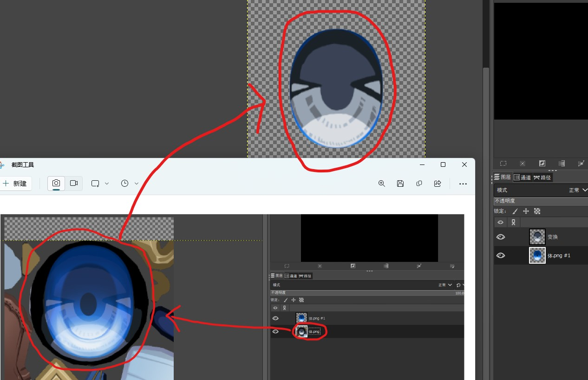

### 3. 编写 menu 文件

有了之前编写 menu 的经验，相信这次各位就知道怎么改了，所以其他的老面孔我就不说了，下图只给出主要的差异条目：

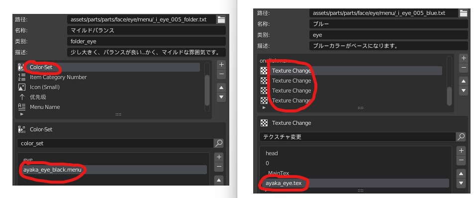

- 左侧是“ayaka_eye_folder.menu”，和头发一样把通配符去掉，改成我们自定的颜色选项 menu。
- 右侧是“ayaka_eye_black.menu”，也是把眼睛贴图换成我们自己的。

### 4. 导出 Mod 文件

三个文件都以做好，现在让我们把它们导出到游戏 Mod 文件夹中。重载 Mod，见证奇迹，成功又完成一种新 Mod。  
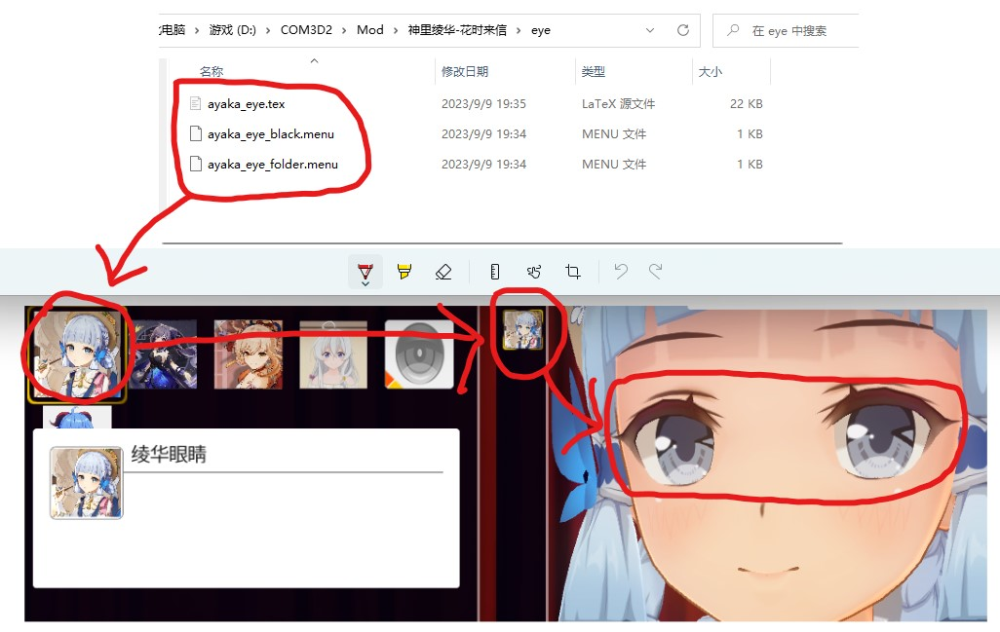

## 三. 制作体型和脸型

体型和脸型的制作在第三章中已经提过，直接使用游戏内置的功能捏制即可，这个非常简单我就不做说明了，而且你们也不想看我再啰啰嗦嗦写上一大堆吧，太累了，这个 Mod 教程的文稿大小已经远超我的预期了，为了你我他的身心健康，这种游戏内置功能我就不管了。

### 有关捏制体型的提示

blender 中的 com3d2 插件，提供一个创建预览体型的功能，只要创建该身体后在其姿势菜单中使用连接滑块功能，就能获得一个和游戏内体型参数一一对应的菜单，接着配合我们的原模型进行比对，或许能更方便的捏出原设人物哦！_（注意该身体是 CM3D2 版，和 COM3D2 版略有区别，所以不能用于细致的模型制作）_

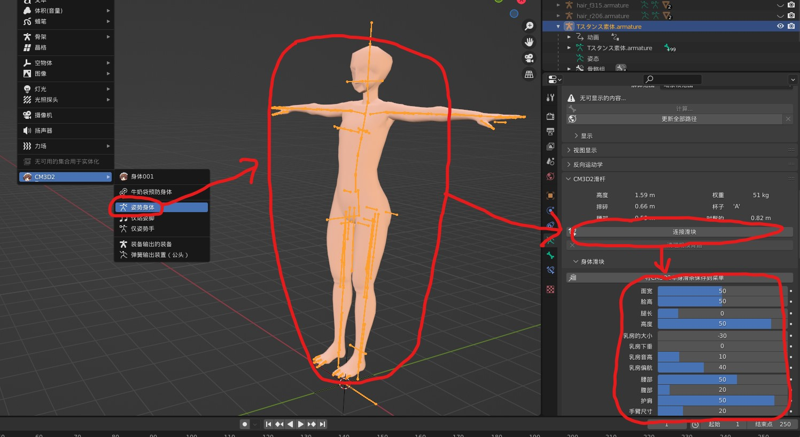

## 四. 验证完善 Mod

终于要结束了，现在把我们的角色装扮好，把体型脸型捏捏好，让角色摆几个 Pose，看看有没有出问题，比如头发穿模，破面，过于僵硬之类的。比如我的话发现头发似乎太高了、耳朵处出现了破洞、后发穿模进了后脑勺......要么调位置要么刷权重，这些问题或多或少都要改改，好在我们这期做的是头部，自动权重还是比较给力的不需要什么大修。

确定无误后，保存好我们角色 Preset 文件，因为接下来我们要退出编辑模式，站在一个玩家的视角去试用唱唱歌跳跳舞，看看 Mod 能否经过更严苛的考验，如果依旧不出问题，那可以宣布我们的 Mod 已经制作成功了。

## 五. 打包发布 Mod

最后一步将我们的 Mod 文件整理打包成一个整合包，一个规范的 Mod 整合包才更利于 Mod 的分享和使用，具体我们应进行以下检查：

- 是否有冗余文件：比如 png，bak 后缀之类的文件，这些游戏都用不到，所以全部删去。
- 是否有 Preset 文件：Preset 可以帮助用户选择正确的选项，比如头发颜色那些，不选对的话依然会有贴图丢失的问题。
- 是否有预览图：这可以让用户识别你的 Mod，也能用于判断 Mod 在游戏中的运行状态是否正确。
- 是否有说明文件：说明文件可以标注来源、记录版本号、备注一些前置需求等，有利于指导用户使用和后续跟踪 Mod。
- 文件布局是否符合游戏根目录：Mod 和 Preset 等文件应放对应的文件夹储存，这样结构清晰也便于让用户能有效安装。
- 文件夹分类是否规范，比如可以按装扮分类好文件，这有助于我们开发者编辑文件时的可读性。

依据上述要求我对我的 Mod 进行了整理和打包，目前发布在了 3DMMod 站上，各位可以参考参考：  
<https://mod.3dmgame.com/mod/202044>

> 我无偿分享自己的 Mod 和教程，也是希望能尽可能的优化这款游戏的国内环境。我所有的游戏资源，原材料，制作工具都是别人无偿公开分享的，所有我也同样希望无偿公开的分享出去，也希望这份精神也能同样传递到你的身上。

> 有人说国内环境是倒狗害的，其实不然，比如我一定不会因为倒狗而自我封闭，因为我的目标是分享，那样只会本末倒置。国内大量的资源其实都是从国外转手过来的，不管是付费还是所谓的免费，都不会留下原地址，为什么？如果说有信息差就有倒狗的话，那国内其实只有大倒狗和小倒狗的区别罢了。

> 后续我会将 Mod 转到 3DMMod 站投稿，那里是公开网站，曝光率更高，且满足我对直链下载的需求，希望各位也能在那试试投稿，无头苍蝇式的组织没法站稳脚跟，必须靠大家的力量，这款游戏在国内的环境才能改善。

## 第一期完结

祝贺在此的各位，你们成功完成了第一期的实战教程。

最后，新老婆 get，嘿嘿~
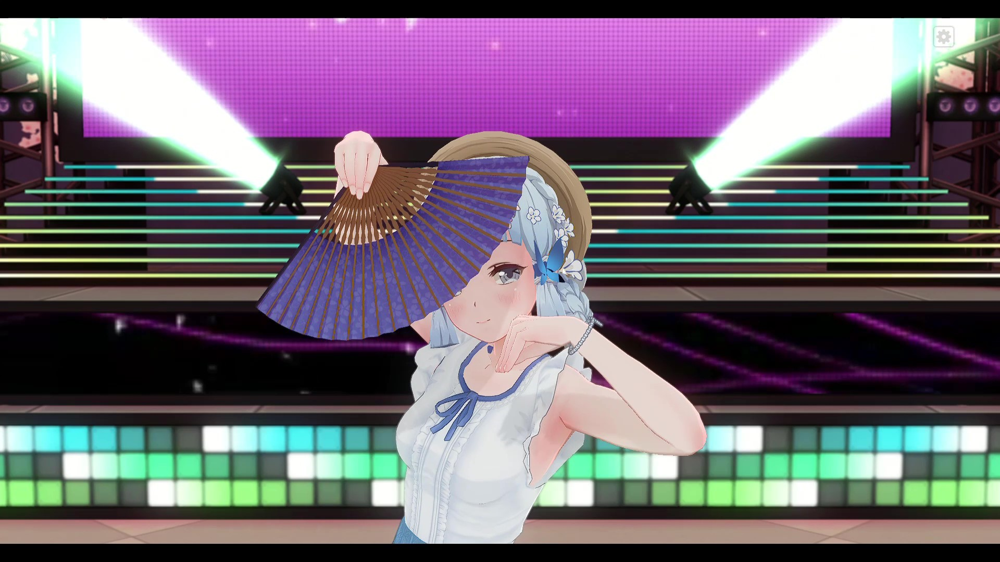
