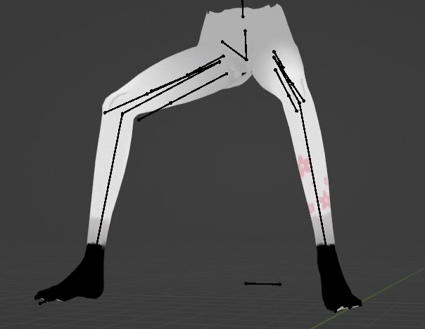
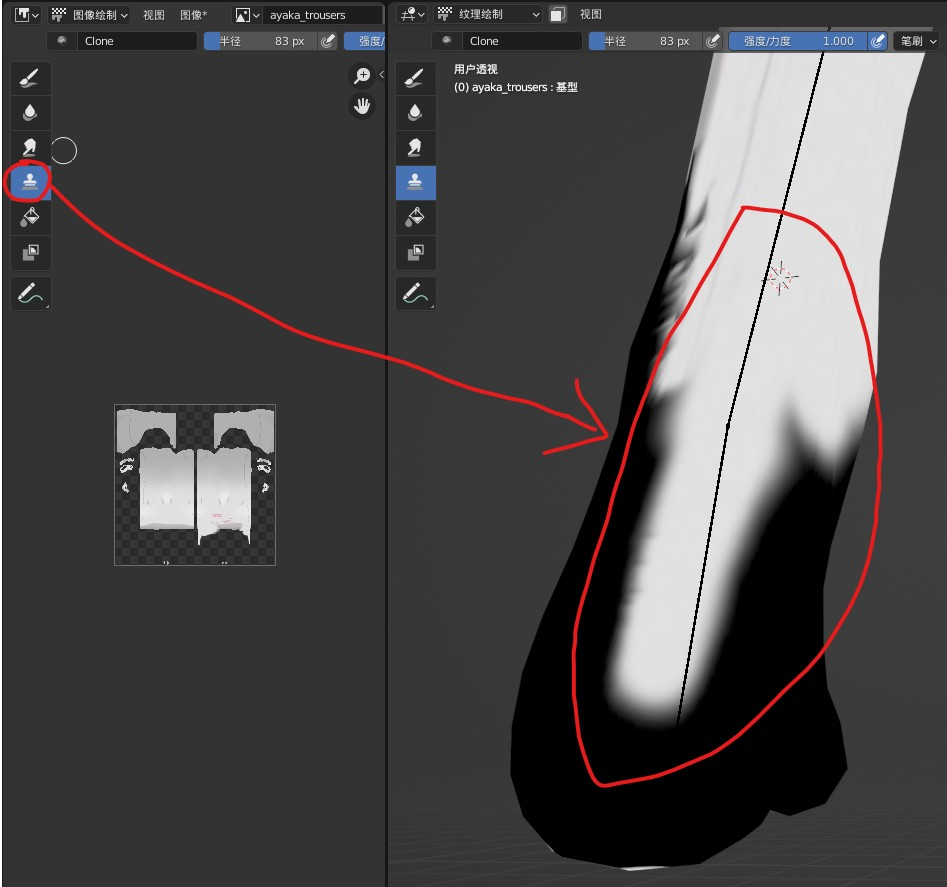
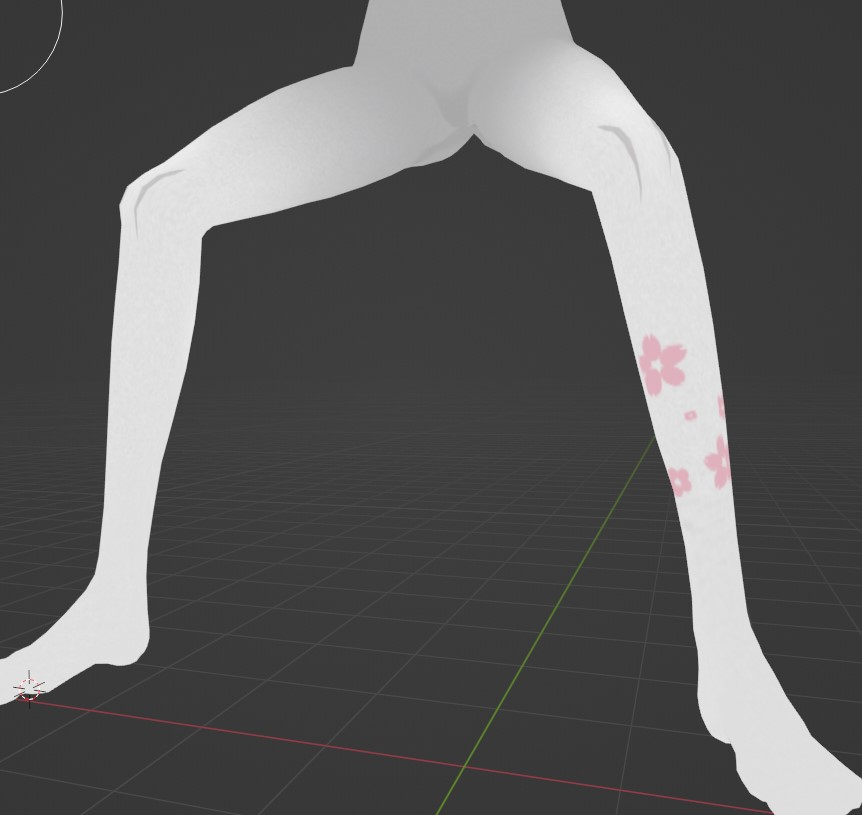
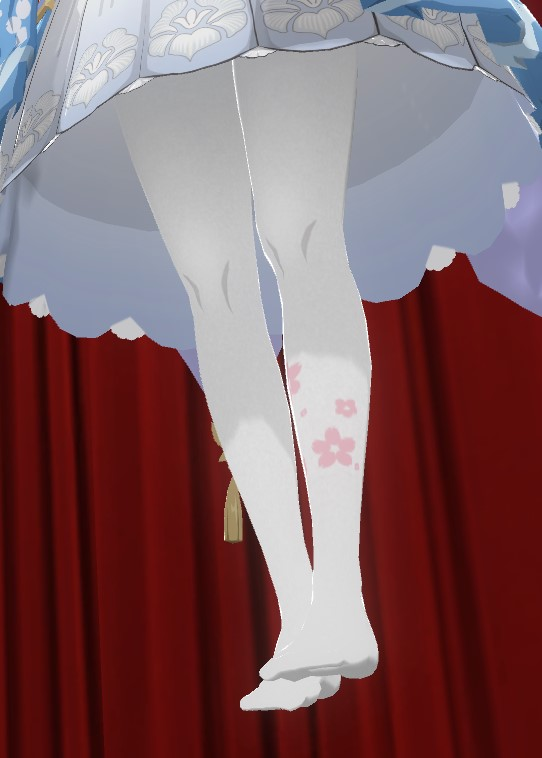
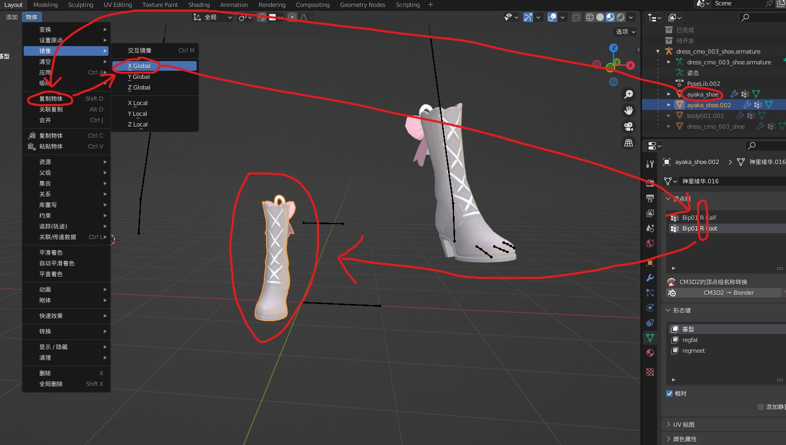
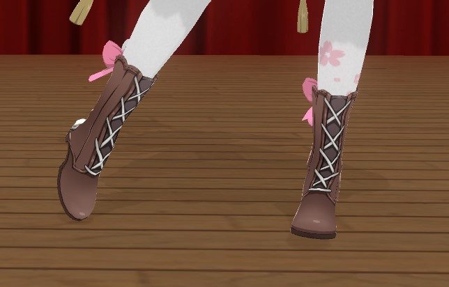
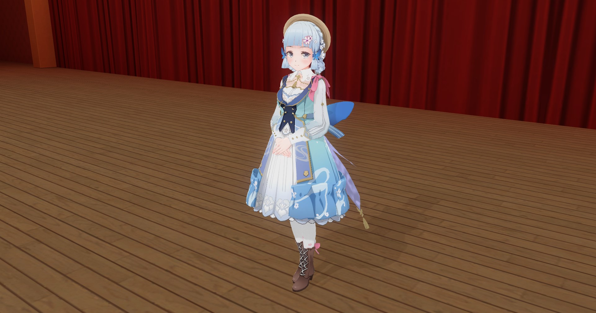

# 【COM3D2Mod制作教程（8）】实战！制作衣服部分（下）

## 制作袜子Mod

体会了裙子Mod的制作流程，不知道你有没有被麻烦的权重和形态键搞崩溃过，现在做袜子难道还得在来一遍？而且裆下的权重和形态键因为靠的太近做起来也很麻烦。

不用害怕，袜子有一个裙子没有的特征：它够简单，没用复杂的装饰布线，看起来示例Mod真的非常相似。利用这一点，我们将采取一种全新的制作方式，完全不用搞上面的麻烦事，还能做出绝对完美的衣服。

### 方法概述

> 使用官方模型然后改贴图的方式完成袜子Mod制作，贴图采用烘焙加人工微调的方式制作。

之前，示例Mod一直都只被用来转移数据和做参照，用完就扔，但今天它们将翻身做主人。我们将直接使用示例Mod作为导出Mod，所以权重和形态键完全官方正品，~~绝不会出问题~~，我们唯一要做的就是改一张贴图，让它看起来像源模型，从而狸猫换太子。

所以model文件不需要我们制作了，但也多了个tex文件要制作，或许你会担心自己不会画画，但没关系，这部分也是自动化的，我们将直接利用Blendr的烘焙功能，实现“贴图转移”，然后一样稍加调整即可。

#### 特点

- 直接使用官方model，完全跳过model制作环节，工作量大幅降低，质量还非常高。
- 需要示例模型与源模型非常相似才行，对衣装特征有局限性，不过袜子等就很适合。
- 有额外的tex制作环节，但因为可以利用烘焙自动化绘制，所以影响不大。

### 制作流程

#### 制作tex文件

1. 选取和源模型最接近的示例袜子Mod。

    - 如果你是半透明袜子，那官方袜子也一定要选半透明的，因为官方会用“Hide Node”偷懒。
    - 根据具体情况可能需要重新生成示例模型的uv，因为部分示例模型的uv是重叠的。

2. 将源模型加面并利用裹缩修改器贴合示例模型。

3. 利用Cycles渲染器的烘焙功能“转移贴图”。

    1. 将源模型材质设为自发光，确保场景没有其他光源干扰。
    2. 给示例模型添加材质和贴图，确保可以在贴图绘制模式绘制。
    3. 切换至Cycles渲染器，打开“所选物体->活动物体”功能。
    4. 稍微设置一些“挤出”参数，可以减少画面的坏块。
    5. 可以降低一些渲染采样参数，加快贴图烘焙。
    6. 先选源模型再选示例模型，点击烘焙即可出图。

    可以看一下效果还是很不错的，只有缺模型的脚部和裆下的犄角旮旯烘的有问题，后面简单修一下即可。

    

4. 利用印章工具绘制修补烘焙错误或缺漏的地方。

修补完成

#### 制作其他文件

剩下的mate和menu和之前的Mod一样做即可；model则直接用我们现在修改过的示例模型即可。因为mate不用导出，再除去tex文件，共计也就menu和model两个文件。

### 完成袜子Mod制作

nice~，成功又做完一个部件，这可真的比裙子简单多了。

## 制作鞋子Mod

鞋子Mod我感觉完全不需要我写了，因为它基本就是裙子Mod的那一套做法，不同同样也有些属于他的技巧和特点。

- 鞋子是对称的，所以我们只需要做一个，另一个镜像即可。
- 原版游戏是不支持高跟鞋的，硬上只会穿模，所以高跟鞋得特殊处理。

    可选的方案有以下几种：

    1. 改模型，将高跟鞋改成非高跟鞋。
    2. 利用“Hide Node”隐藏脚部，避免穿模。（但得保证鞋子模型确实能遮蔽脚部）
    3. 将鞋子旋转，根部放低，遮住穿模部位。（相当于把穿模换成了鞋子浮空）

- 由于是从袜子上拆下的模型，一般存在双面问题。

    最简单方法，可以利用之前说过的轮廓线材质解决。

目前大部分移植的鞋子Mod都是高跟鞋，都要处理高跟问题，这也是为什么鞋子需要一定的建模能力。不过也有很多Mod作者会利用高跟鞋插件来解决问题，但这有一定的兼容性问题，所以不是本教程的内容，有兴趣就自行研究吧。

### 制作流程

1. 将源模型鞋子由一双改为一只。

    后续我们可以通过镜像自动创建另一只，这样可以省去一半的工作量，而且转移权重时也能更准确。

2. 匹配源模型与示例模型，可根据之前的提示处理高跟问题。

    本次实战制作的鞋子很巧的是靴子，所以支持第二个解决方案，这样我甚至都不需要处理穿模问题了。

3. 和裙子Mod一样的流程，解决穿模刷权重做形态键，等等。

    操作细节也完全一样，如何解决穿模之前说过了，此外一样要注意权重刷取是否符合物理性质的问题。鞋子一共就两根骨骼，还是很好处理的。

4. 检查鞋子无误后，制作另一只鞋子。

    直接复制镜像即可，记得把顶点组的名字也改一下，然后合并成一个物体，修正一下法线即可。

    

### 完成鞋子Mod的制作

靴子做Mod还真方便，这下最后一个部件也终于做好啦！

## 完结撒花

恭喜你成功完成了所有Mod制作教程，如果继续深入，还有很多技术可以挖掘，但相信这些基础知识已经足以让你满足对老婆的需求了。

也恭喜我终于成功完结这个系列了，太费时间了，重获自由的感觉真好啊，很快我将退坑这款游戏，但你依然可以从网站的联系方式里找到我。

回想起来，一路从入坑到退坑，遇上了很多事，也学到了很多东西，真的感慨良多啊~所以我决定将这些经验留下，希望能帮到和我一样踩坑的你们。

最后，完结撒花！ o(*≧▽≦)ツ┏━┓

话说绫华好像做胖了......
