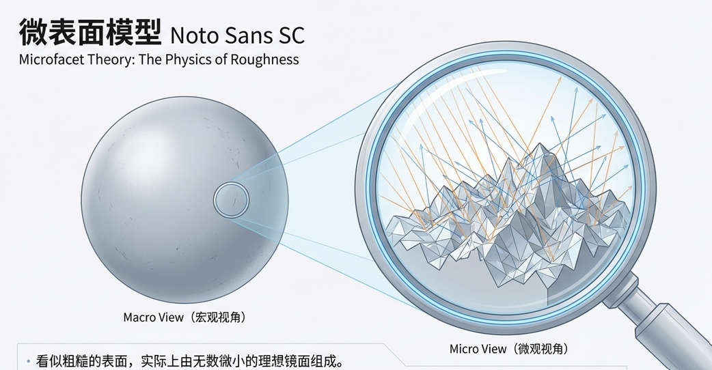
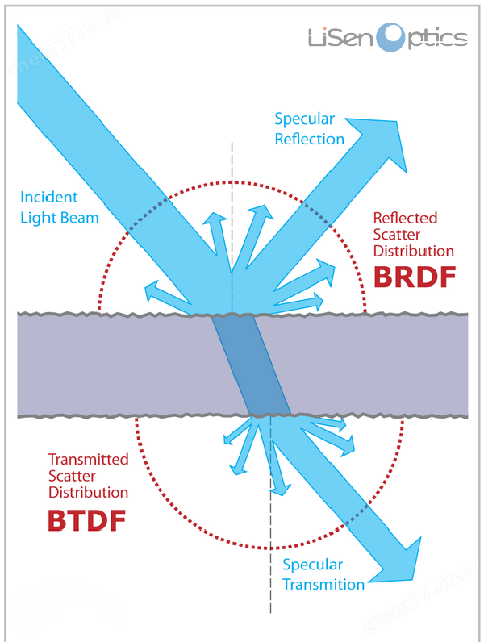
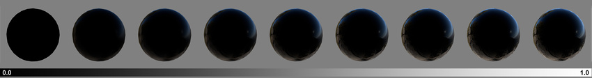

---
categories:
  - 技术堆栈
  - 技术美术
  - 光照模型
abbrlink: 2656087290
---
# 【技术美术】光照技术概述

和现实一样，即使是游戏中的虚拟物体，我们也可以认为都是因为发光才可见，包括不含光照计算的特效，因为本质上他们是发出的自发光。所以说，任何物体的渲染，本质都是在做光的渲染。

## 光的属性

- 可溯源的：光不是凭空产生的，一定是有源头的。
- 可传递的：光是可以通过介质传递的，也正是因为传递会使光的能量发生变化，我们才能观测到传递的介质。
- 可叠加的：光的能量可以直接简单的相加来合成的，大部分情况下光都是由若干不同类型的光组合而成。

## 光照分类

### 按光的能量来源分类

- 直接光：从光源直接打到物体后反射到眼睛的光。
- 间接光：从其他物体反射到物体再反射到眼睛的光。
- 自发光：物体自身表面发出的光。

### 按光的传递方式分类


- 反射光：光碰到介质后返回原介质的光。
- 透射光：光碰到介质后穿过介质从另一端射出的光。
- 自发光：物体本身就是光源，导致光线直接进入眼睛的光。

### 按光的反射方式分类

- 漫反射光（简称漫射光）：光在物体表面或内部多次弹射后再反射进眼睛的光。
- 镜反射光（简称镜射光）：光在物体表面未经二次弹射，直接反射进眼睛的光。

如果一个函数同时具有这两种光，则可称其为“双向反射分布函数（BRDF）”。

### 按光的透射方式分类

- 漫透射光：光在穿过介质的过程中，经过了多次弹射。
- 镜透射光：光在穿过介质的过程中，没有经过额外弹射。

如果一个函数同时具有这两种光，则可称其为“双向透射分布函数（BTDF）”。

### 按光的反射位置分类

- 非次表面：入射光与出射光位置相同，如默认的漫射、镜射光。
- 次表面：入射光和出射光位置不同，如次表面漫射。

## 光照物理

关于光有很多物理现象，人们对此总结出了各种经验公式和解决方案。（此处暂只讨论与光有关的物理现象，更多的是描述光的组成和物体间的关系，不涉及具体的光照反射计算）

首先我们需要获取一些关照计算上所需的参数：

- `float3 n`：法线方向（normal）
- `float3 v`：相机方向（viewDir）
- `float3 l`：灯光方向（lightDir）
- `float3 albedo`：反照率。物体反射光照的比例，更通俗名称叫颜色。
- `float metallic`：金属度。确定漫射和镜射的权重分配。
- `float smoothness`：光滑度。用于形容物体表面形状，对镜射光影响很大。

此外在此基础上还有些可预计算的常用参数：

- `float3 h = normalize(v + l);`：半角向量。一种经验参数，其混合了相机和灯光方向信息。
- `float roughness = max(HALF_MIN_SQRT, pow(1 - smoothness, 2));`：粗糙度。

注意：光照计算中存在光滑度和粗糙度两种工作流，Unity使用的是光滑度，但DCC软件一般用粗糙度，不过这两者是可以相互转换的。

### 微表面模型



从整体来看，物体表面各式各样没有规则。但利用积分的思想，我们可以想象这些表面都是有无数个相同的微小表面组合而成，于是我们便可以对各种物体的表面进行一套统一计算，一套针对微表面的计算。

### 辐射度量学

[辐射度量学](../../../../_posts/书本知识/物理/【物理】辐射度量学.md)是一种物理学科，但我们不需要深入学习，仅仅了解其中的一些学术概念就行。

- 辐射能量：光源做工。
- 辐射功率：光源每单位时间做工。
- 辐射强度：光源从每单位立体角发出的辐射功率。
- 辐照度（Irradiance）：光源每单位立体角照射到表面的光照强度。
- 辐射率（Radiance）：从表面每微表面反射的光照强度。

我们光照计算实际上只要考虑：获取“辐照度”和计算“辐射率”就行，这个过程也不是一定非要物理的，只是单纯用他们的名字和关系来表示一些计算中的光照参数。

其中辐射率是基于辐照度计算的，这两者代表入射光每单位（微分立体角）的总光强和出射光每单位的总光强。可想而知，如果两者面积总量一样，根据能量守恒，两者的值应该是相等的。但实际情况中，由于角度倾斜的原因，入射光的截面积和接收光的表面积是不一定对等的，所以反射时每单位面积的光强就会被均分。


具体而言两者的关系与法线有关，其公式如下：

```hlsl
float radiance = saturate(dot(n,l)) * irradiance;
```

提示：‘率’和‘度’应该是同一个意思，只是翻译的人没有统一，辐射率称为辐射度我想也没问题，那么“辐照度”和“辐射度”两者的名称差别恰巧反应了其特性：“照射”和“反射”。

### 光照分布函数



人们发现光从表现效果上，基本都可以被看成是由几种简单的光组合而成（见上文的光照分类）。因此根据具体实现的光照类型，光照函数被分为了一下 3 类：

- BRDF：双向反射分布函数（描述反射现象）
- BTDF：双向透射分布函数（描述透射现象）
- BSDF：双向散射分布函数（BRDF+BTDF）

基本上这些函数就是“反射”、“透射”和“漫射”、“镜射”的排列组合：

- 漫射：低频模糊，光线柔和。
- 镜射：高频清晰，能形成清晰光源画面。

注意：这些公式仅仅是一种分类，给我们一个计算光照的骨架，所以其具体实现完全可以因人而异自由搭配。

- [【技术美术】双向反射分布函数](./【技术美术】双向反射分布函数.md)
- [【技术美术】双向透射分布函数](./【技术美术】双向透射分布函数.md)

### 介电质全反射

只要是介电质（可以简单理解成所有物体吧），那就一定会发生轻微的全反射（即光线不被反照率影响，没有经过任何吸收就全部反射），这在后续的镜射率和非涅尔效应中也会有所体现，该最低全反射率是一个常量。

```hlsl
float dielectricSpec = 0.04;
```

### 分布能量守恒

如果要制作一个真实的光照，我们同样要考虑到能量守恒（当然，非物理的风格化光照不需要，否则反而还不好看）。根据“双向反射分布”，我们将光拆分为了“漫射光”和“镜射光”分开计算，因此也要注意两者在光能量上的分配。


对此人们使用一种称为“金属度”的参数，来分配两者的权重，越金属其漫射光越弱，镜射光越强，而这权重具体反映到的则是“反照率”的变化。

```hlsl
float3 diffuse = lerp(albedo * (1 - dielectricSpec), 0, metallic); //漫射反照率
float3 specular = lerp(dielectricSpec, albedo, metallic); //镜射反照率
```

注意：虽然非物理光照一般不用遵照能量守恒，但其金属度的概念却已经深度人性，即使卡通渲染，也经常会利用金属度来控制高光（镜射光）的强弱。

### 菲涅尔效应



菲涅尔是一种物理现象，其反应了物体的反照率强会随着物体折射率、法线、观察角度的不同而发生变化。最显著的例子是水面，垂直看水面时，清澈见底，平行看水面时则只能看到倒影而看不清水底了。

原始的非涅尔公式较为复杂还涉及折射率信息，难以使用，因为人们根据其实际表现形式，推出了一套经验公式（越掠角反射率越强，甚至全反射）。此外非涅尔只会影响到镜射光，故可简单将其视作是对镜射光的一道后处理。虽然漫射光也是一种反射光，但其是经过多次随机反弹后反射的光，故可以简单认为其丢失了法线、方向等信息，因此不会因为菲涅尔效应而发生变化。

```hlsl
float F = pow(1 - saturate(dot(n, v)), 4); //反射率增强系数（非涅尔系数）
```

在Unity中，非涅尔引起的反射率是有上限的，故不一定全反射，具体和物体的镜射率和光滑度有关。

```hlsl
float reflectivity = lerp(dielectricSpec, 1, metallic) //镜射率
float grazingTerm = saturate(reflectivity + smoothness);//掠角反射率
specular = lerp(specular, grazingTerm, F);
```

### 几何遮蔽


几何遮蔽用于表现微表面之间的遮挡导致的光线衰减现象，这在粗糙的表面尤为明显。这同样只对镜射光生效（漫射光本身就是经历过各种遮挡反弹返回的光，所以实际上已经考虑了几何遮蔽），可视作是镜射光的一道系数，其越大镜射光越亮，越小镜射光越小。

几何遮蔽有多种近似公式，在Unity中对直接光计算使用的是 sksm 几何遮蔽算法。

```hlsl
float G = saturate(dot(n, l) * dot(n, v)) / lerp(roughness, 1, pow(saturate(dot(l,h)), 2))
```

从该公式中可以观察到：

1. 分子分母的角度点乘次数都是平方且几何意义相似，故可以粗略看成是相等的。
2. lerp操作的终点是1，恰巧也是点乘的上限，所以可以猜出其数值会被限制在0-1。
3. 当点乘结果不为1时（即光照视角倾斜于表面），粗糙度将作为分母影响结果大小（越粗糙分母越大，得到的结果越小），从而满足了几何遮蔽衰减光照的效果。

对于间接光，因为不用考虑角度问题，Unity则比较简单，直接根据粗糙度衰减即可。

```hlsl
float G = 1 / (1 + pow(roughness,2));
```

## 入射光计算

计算反射光前，必须先获取入射光信息。

### 直接光

注意：对于直接光来说，入射光等价于辐照度，因此进行实际反射计算前，需转换为辐射率。

#### 实时灯光

直接从原始光源获取的灯光。Unity中将实时灯光分为“主灯光”和“附加灯光”两类，“主灯光”是平行光，但平行光也可以成为“附加灯光”，“附加灯光”自身也有很多种类。不过这些灯光信息都已经被Unity封装，成了一种可以统一处理的存在。

- `float3 positionWS`：微表面所在的世界空间位置。

```hlsl
float shadowMask = 1; //阴影遮罩技术，用于实现超远距离烘焙阴影，具体数值从哪来的，目前我也不知道
Light mainLight = GetMainLight(TransformWorldToShadowCoord(positionWS), positionWS, shadowMask);
for (int i = 0; i < GetAdditionalLightsCount(); i++)
    Light additionalLight = GetAdditionalLight(i, positionWS, shadowMask);
```

Unity提供的光照信息中并没有直接提供辐照度，需要利用光照信息计算。

- `Light light`：从Unity中获取的原始灯光信息（上文的计算结果）。

```hlsl
float3 irradiance = light.color * light.distanceAttenuation * light.shadowAttenuation;
```

### 间接光

间接光又叫环境光，是来自于环境中即四面八方的光。相比直接光，环境光是不可数的，因此无法直接实时计算，故环境光一般是基于一种叫“IBL”（基于图像的照明）的烘焙灯光技术实现的（将HDR环境贴图视作光源，均匀的随机采样若干次，再以实时灯光的方式计算累加）。

由于“双向反射分布”的存在，故环境光针对“漫射”、“镜射”两种光，也根据其特性，使用了两种不同的烘焙方式：“光照探针”和“反射探针”。


注意：间接光由于是预计算的，导致其存储的已经是计算好的辐射率，所以不需要额外的转换。

#### 光照探针

光照探针存储的是漫射光信息。漫射光是粗糙的低频灯光，因此不需要形成像镜子那种清晰的反射画面，依此特性，为了减少内存提高性能，可以将其用球谐函数（SH）存储。

球谐函数类似于用[泰勒级数](../../../书本知识/数学/微积分/【数学】泰勒级数.md)解三角函数，通过有限的多项式就可以近似出超越函数的效果，进而使得三角函数可被实际用于计算，非常实用。同理球谐函数只需要存储几个多项式的参数，就可以实现输入方向输出该方向大概亮度的功能，内存占用少计算也高效。

```hlsl
float3 irradiance = SampleSH(n);
```

#### 反射探针

镜射光是高频的需要形成清晰镜面的光照，因此不能使用SH，转而使用环境贴图存储。此外镜射光还与视角和材质粗糙度有关，其中视角是动态的因此无法烘焙，但粗糙度是固定的01范围，因此可以针对不同的粗糙度多烘焙几张。由于越粗糙频率越低，贴图分辨率需求越小，因此这多张不同粗糙度烘焙的贴图可以利用mipmap存储，借此还能实现GPU自动插值纹理内容。

环境贴图本质就是一张具有mipmap的立方体纹理，因此只要根据粗糙度和微表面法向，就能取出对应的镜射光辐照度。

- UNITY_SPECCUBE_LOD_STEPS：unity中默认环境贴图的最大mipmap等级。
- unity_SpecCube0：unity中的默认环境贴图。
- samplerunity_SpecCube0：unity中默认环境贴图的采样器。
- unity_SpecCube0_HDR：unity中默认环境贴图的编码信息。

```hlsl
float pr = 1 - s; //直觉上的粗糙度（perceptualRoughness）
float mipLevel = pr * (1.7 - 0.7 * pr) * UNITY_SPECCUBE_LOD_STEPS;
float4 encodedIrradiance = unity_SpecCube0.SampleLevel(samplerunity_SpecCube0, reflect(-v, n), mipLevel);
float3 irradiance = DecodeHDREnvironment(encodedIrradiance, unity_SpecCube0_HDR);//环境贴图一般是HDR贴图
```

### 自发光

#### 光照贴图

光照贴图是通过预计算将最终的光照结果烘焙到纹理中，下次渲染时便可避免高昂的光照计算，直接使用。由于是已经计算好的，所以光照贴图某种意义上已经不是光照了，直接看成自发光就好。

## 光照模型

光照模型是指用数学手段具体实现的完整光照计算方案，相当于是上述各种光照物理的实现和汇总，有了光照模型就可以实际的进行光照模拟计算了。

[【技术美术】光照模型](./【技术美术】光照模型.md)

### PBR光照模型

PBR 光照模型是市面上最主流的光照模型，同时也是引擎默认的光照模型，出于兼容性的缘故，基本所有的其他光照模型都是以其为基础进行修改的，因此 PBR 是必须要学会的一个光照模型。

PBR 模型的具体实现各式各样，导致每家渲染引擎都有着不同的 PBR 效果，因为 PBR 本质还是一种经验模型，只是其经验来源更加严谨完整。不过无论是哪一家的 PBR，基本上都是上文那些各种光学现象的汇总。

提示：如果想更深入的了解 PBR 并实现 Unity 中的同款，可以参考“基于物理的渲染”文集。

## 特殊光照实现

因为计算机无法真实模拟现实物体的所有性质（例如不可能真的把一根一根的头发丝做出来），因此对一些特殊光照效果，需要进行专门的处理（通过调整光照计算函数，用经验公式的方法近似模拟这些效果）。一些常用的特殊光照效果如下：

- 次表面散射
- 透射折射
- 各向异性光照
- 卡通风格光照
- 薄膜干涉
