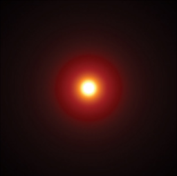
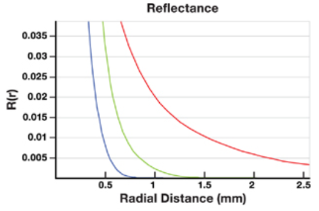
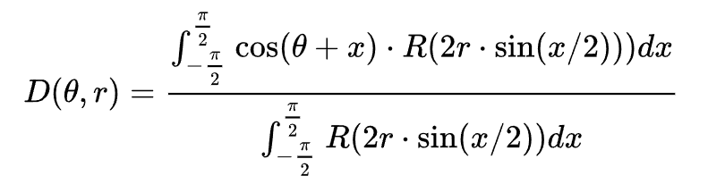
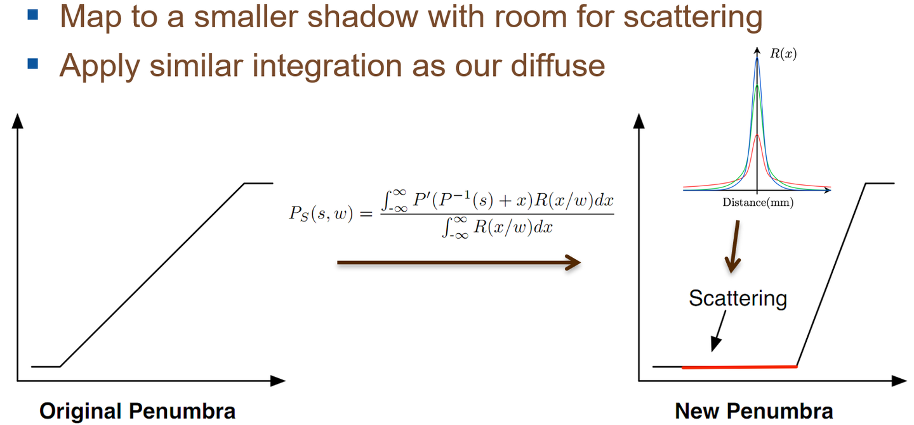
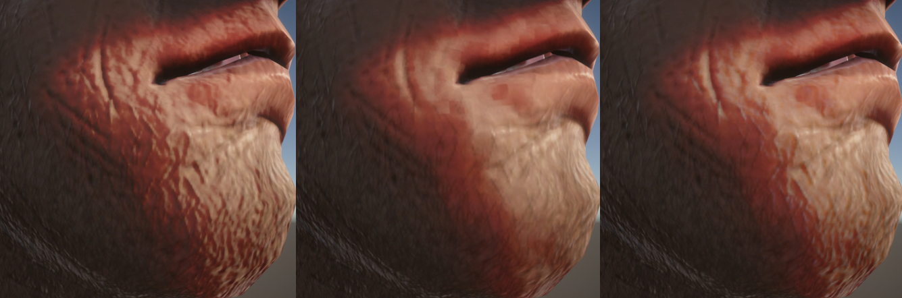

---
categories:
  - 技术堆栈
  - 技术美术
  - 光照模型
abbrlink: 4246974515
---
# 【技术美术】次表面散射

## 次表面散射的光照组成

次表面散射的光照结构：

- 从表面直接反弹的光（镜反射光）
- 进入物体内部的光
  - 在内部经过多次反弹出射的光（漫反射光 + 漫透射光）
  - 被遮挡较少或直接折射的光（镜透射光）

其中漫反射和漫透射本质是同一种光学现象，他们都是模拟光线从物体内部多次弹射的结果，两者的区分只是看出射方向是否超过入射方向的90度。故我认为应将他们统一视为“次表面漫反射”，只是根据不同的物体属性，其光斑范围会发生变化（这就类似于光滑度对镜反射的影响）。

他们的关系为：

- lerp（进入物体内部的光，从表面直接反弹的光，金属度）
- lerp（漫反射光，漫透射光，散射度）
- lerp（在内部经过多次反弹出射的光，被遮挡较少或直接折射的光，透射度）

对上述新增属性的解释：

- 散射度：决定散射光的出射位置分布情况（影响散射辐射率）。
- 透射度：决定散射光在漫射镜射之间的分布比例（类似金属度）。

## 备注

本章不介绍完整的次表面散射，只介绍“次表面漫反射”部分。因为它还缺少镜透射现象，**所以不应该称之为散射**（散射应该是反射和透射的总称）。所以要学习完整的次表面散射，还得阅读[【技术美术】双向透射分布函数](./【技术美术】双向透射分布函数.md)。

下方内容以皮肤次表面散射为例，但这套方法对所有散射现象都是有效的，不过是换个 LUT 的事（本质就是 $R(r)$ 不同）

## 次表面散射现象

在半透明的物体上，当光接触到表面时，其不会直接被反射或吸收，而是会穿透进内部继续传递，最终从附近的一个临近表面重新射出（如果从背面射出则叫透射）。这种入射位置和出射位置不同的现象，就叫次表面散射。



如上图就是当一道激光，照射到一个具有无限厚度的平面上时发生散射的现象。可以观察到中心的激光入射区域最亮，但周边未射到的地方也会因散射现象产生亮度，该亮度随着散射位置和入射位置的距离扩大而逐渐消失。



这种现象的典型之一就是人的皮肤。上图就是将这种亮度与距离的衰减变化记录下来的一张曲线图，y轴代表亮度，x轴代表散射位置和入射位置的距离。此外人的皮肤对不同波长的光吸收率也不一样，故上图的三条曲线就是对应3种不同光在皮肤上的扩散表现，可以看出红光最不容易被吸收，也因为人的皮肤散射后呈红色。

## 次表面散射强度分布函数

我们暂且可以将上文中散射亮度与距离的关系定义为一个函数：

$$
Reflectance(Radial Distance)
$$

简称 $R(r)$ 。当然其更学术的名字叫 Diffusion Profile。

而这就是上文图中的 y 轴标记为 $R(r)$ 的原因。包括后面的其他名为 $R$ 的函数，虽然其参数名可能变化，但你都要清楚，它指的都是散射亮度和距离关系的函数。

$R(r)$ 映射的是一种物理现象，所以没有绝对的公式或公式非常复杂，因此就和菲涅尔现象一样，人们通常会选择经验公式去近似。$R(r)$ 的映射曲线很类似正态分布，故一般会用正态分布去近似。

对于一些主流的材质（如皮肤），已经有了预计算的结果，故我们一般不需要实际实现 $R(r)$，只要明白这个概念即可。

## 次表面散射时机

次表面散射的特点就是在灯光照不到或光照不均匀的边缘区域会发生渗光，这种光照边缘区域存在于如下两种情况：

- 掠角处：在光照可照射方向和不可照射方向周边。
- 阴影处：在光照遮挡与未遮挡区域周边。

也因此产生了两种不同次表面散射现象需要模拟。

## 掠角处的次表面散射


由于入射与反射位置不再一一对应，故一处地方的散射光可能由多个入射光混合而成。此外由于物体一般不是均匀的平面，其厚度不同（光的吸收率不同），且法线和光的方向也不同。所以一个地方的实际散射光，必须通过累计光照并考虑厚度、角度来获取。这就是上图指代的事情。



这是上图中用于计算散射光的公式。其中参数的含义为：

- $\theta$：散射位置法线与光照方向的夹角
- r：散射位置厚度（用光的吸收率或光在内部弹射的距离形容更准确）
- $x$：一个半圆内所有的入射光与散射位置法线夹角

观察这个散射光公式，可以很容易的发现其中的一些计算思路：

- $2r\cdot sin(x/2)$：这恰巧是计算等腰三角形底边长度的公式，此处用于计算所有入射光与散射位置的距离值。

    相比 $R(r)$，此处将 $r$ 被拆分成了 $x$ 和 $r$ 两个参数来控制。说明了漫射亮度也可以看成与光线角度（$x$）和表面厚度（$r$）有关，物体越厚或与光线夹角越大，散射亮度越低。

- $cos(\theta + x)$：与计算辐射率的公式非常类似，说明散射位置周围入射角度与光照的夹角也会影响散射亮度。

    $cos(\theta+x)$ 中 x 是固定的 $(-\frac{\pi}{2},\frac{\pi}{2})$，因此 $\theta$ 的位置将很大程度影响其大小。当 $\theta$ 为 0 时，其值最大，即散射位置刚好正对着光照，这很像漫射光，倒不如说漫射光本质是次表面散射的一种特例。

- 分母是周围所有入射光能提供的漫射亮度总和，能起到归一化作用。

### 预积分的掠角处次表面散射

现在我们已经得到了次表面散射的计算公式，但并不能直接计算，因为这公式是要积分的，和 IBL 一样，这是种计算量非常大的算法，因此必须预计算。


上图就是利用次表面散射公式预计算的结果，其构成了一张颜色查找表（LUT），使我们可以通过采样贴图的方法获取散射强度。其中：

- x 轴等于 $cos(\theta)$，故与光照夹角越小，x越大亮度越大。
- y 轴等于 $\frac{1}{r}$，故表面厚度越小，y轴越高散射效果越明显。

不过实际使用这张LUT时要注意：纹理的范围在0-1。因此我们不能直接使用厚度进行采样，角度的选择也得注意限制。对此我们可以给物体添加一个曲率属性（其实就是物质的散射容易程度），就像金属度那些一样。此外根据光照物理判断，图中 $\theta$ 的范围应该为 $(\pi,0)$，所以我们可以用半兰伯特系数来采样。

### 采样掠角处次表面散射

综上所述，最终我们便可以确定实际使用中，该LUT的查找参数：

```hlsl
float3 angleScattering = tex2D(_AngleScatteringMap, float2(halfLambert, curvature));
```

- `halfLambert`：经典的半兰伯特漫射光系数。
- `curvature`：用户自定义的曲率。
- `_AngleScatteringMap`：掠角处的次表面散射LUT。

## 阴影处的次表面散射

漫射的特点就是在灯光照不到的边缘区域会发生泛光，除了上文讲到的灯光角度产生的无关区域外，阴影同样也会。阴影处的散射效果和灯光角度产生的散射原理是一样的，故也是遵从离入射光位置越远，散射越弱的效果。

我们将阴影边缘区域叫做 “半影（Penumbra）”，如果可以获取到半影离光照区域的距离，我们就可以借用其中的一部分来实现阴影区域的次表面散射效果，其使用的计算公式和上文角度计算也非常类似，本质都是基于距离。



上图要表达的意图是很容易看出的，但为什么公式要这么写，我也不清楚，因为这图我也是复制粘贴的。不过有了上文计算灯光角度产生的漫射的经验后，我们可以和容易的猜出其中一些参数的意图。

- $x/w$ 可以简单理解为当前散射位置与入射光位置的距离（肯定是啊，因为 $R$ 函数的参数是距离值）
- P：肯定也是某种计算光照强度衰减的函数（类似灯光角度衰减），从此应该映射的是半影距离对灯光强度的衰减影响。

### 预积分的阴影处次表面散射

不过我们不用担心，因为这同样已经有了预积分的结果：


其中 y 轴肯定也是曲率了，而 x 轴肯定与半影距离有关。

如何获取半影距离？这太复杂了，所以人们想到了用软阴影近似。软阴影在阴影边缘会起到柔性过度的效果，使光照有个衰减过程，这一衰减系数恰巧就能反应半影区域的变化。所以上图的 x 轴，实际上就是指的来自灯光中的 “阴影衰减” 参数。

### 采样阴影处次表面散射

```hlsl
float3 shadowScattering = tex2D(_ShadowScatteringMap, float2(shadowAttenuation, curvature)).rgb;
```

- `shadowAttenuation`：当前灯光的阴影衰减系数。
- `curvature`：用户自定义的曲率。
- `_ShadowScatteringMap`：阴影处的次表面散射LUT。

## 微表面间的次表面散射

如果是一个粗糙且无法散射的硬表面，就很容易看出颗粒感，因为其各种小突起的阴影会非常明显。但在次表面散射中，这不会发生。因为各种小突起被光击中后，光不会直接全部反射，而是部分散射，从而使光线变的均匀。

从物理原理上考虑，为了实现这种现象，我们必须遍历周围的其他微表面来计算散射光。但这种开销太大了，因此我们需要用其他手动近似实现。

先考虑下之前计算的那些 LUT 为什么不能出模拟这种效果？因为之前的 LUT 无一例外都是对光滑表面的预计算，自然就无法直接体现。不过 LUT 中预计算的函数映射是正确的，因此我们应该考虑修改我们的采样方法，来适应非光滑表面。

首先，光的反射和折射，本质都是由法线决定的（粗糙度用于计算镜射光，所以无法使用）。如果一个物体的法线越光滑，则其光照越均匀，看起来就越像是散射后的结果。这种现象反之亦然，所以如果物体的散射强度越高，其体现的法线应该也是越均匀的。


例如上图就是皮肤中，不同频率的光散射对其法线效果的影响。因为皮肤对红光散射性较好，所以红光的法线看以来越均匀。

因此我们可以准备两张法线贴图，一张是正常镜射光计算用的高细节法线贴图（镜射光不会散射，所以不受散射物理效果影响），另一张则是模拟法线均匀效果的模糊法线贴图。接着，我们对红绿蓝三色光根据其散射性，分别插值出不同粗糙度的法线贴图，并用其计算 LUT 中的查询参数，最终再将 3 个通道的查询结果合并就可以模拟出这种微表面间的次表面散射效果了。

```hlsl
float3 rNormal = normalize(lerp(normal, lowNormal, _NormalWeight.r));
float3 gNormal = normalize(lerp(normal, lowNormal, _NormalWeight.g));
float3 bNormal = normalize(lerp(normal, lowNormal, _NormalWeight.b));
float rHalfLambert = dot(rNormal, lighdirection) * 0.5 + 0.5;
float rAngleScattering = tex2D(_AngleScatteringMap, float2(rHalfLambert,curvature)).r;
float gHalfLambert = dot(gNormal, lighdirection) * 0.5 + 0.5;
float gAngleScattering = tex2D(_AngleScatteringMap, float2(gHalfLambert,curvature)).g;
float bHalfLambert = dot(bNormal, lighdirection) * 0.5 + 0.5;
float bAngleScattering = tex2D(_AngleScatteringMap, float2(bHalfLambert,curvature)).b;

//考虑了微表面间散射的角度次表面散射
float3 angleScattering = float3(rAngleScattering, gAngleScattering,bAngleScattering);
```

实现该效果后，在法线转角处会有一些淡淡的色差效果，比如用皮肤的曲率插值，就会有些红黄光渗出的感觉。这在褶皱明显的表面上表现效果非常好，因为其不仅能缓和法线阴影，而且相比直接平滑法线，它更能体现出散射的效果。



上图中，图一是原始法线效果，图二是平滑法线效果，图三是根据曲率插值的法线效果。图三明显效果更好，就像是真的有人体组织突出来了一样。

阴影次表面散射的计算不含角度，不过其本质也就不会和光源交互，所有散射的光都来自物体内部，所有其不用考虑物体表面上微表面间的散射现象。而且其后续也会和角度次表面散射混合，所以不用关心。

## 基于方向的曲率

如果为物体提供曲率？如果仅是像金属度那些一样，画一个固定的贴图，就存在一个问题：微表面的曲率是在不同角度下是不一样！

当然，偷懒的话自然可以像金属度一样设个固定值，这种叫“均匀曲率”，否则叫“方向曲率”。对于方向曲率，一般是将一些参数存放到顶点中，然后以实时计算的方式获取。

不过我偷懒了，这玩意后面再研究吧。

## 实现次表面散射光照

上文我们已经知道如何计算两种次表面散射强度了，对于这两个散射强度有两个注意点：

- 角度散射：该预计算的散射强度，在计算时已经考虑了辐射率（角度衰减），故我们的光照中应用其替换掉旧的辐射率系数。
- 阴影散射：该预计算的散射强度基于阴影衰减，故其中包含了阴影衰减信息，所以我们在求辐照度时，应去除阴影衰减计算。

此外，因为镜面反射是一次性弹射，不符合散射光的定义，因此其应该不受影响。相反，漫射相当于是散射光的一种特例，故应该直接将其让位给散射光公式。

最终可得到散射光的计算公式：

```hlsl
float3 scatteringIrradiance = light.color * light.distanceAttenuation * shadowScattering;
float3 scatteringRadiance = scatteringIrradiance * angleScattering;
float3 finalColor = diffuse * scatteringRadiance + specular * specularTerm * radiance;
```

- 漫射替换为散射计算。
- 镜射光继续用旧方法计算。
- 散射光的辐射率系数改用角度散射强度。
- 散射光的阴影衰减改用和阴影散射强度。

此外还需要为物体新增 5 个新数据：

- 角度散射LUT：实现光照掠角处的散射效果。
- 阴影散射LUT：实现阴影处的散射效果。
- 曲率贴图：表示物体表面的散射容易度。
- 模糊法线贴图：用于实现微表面间漫射。
- 各颜色通道的模糊法线权重：决定微表面间漫射形式。
