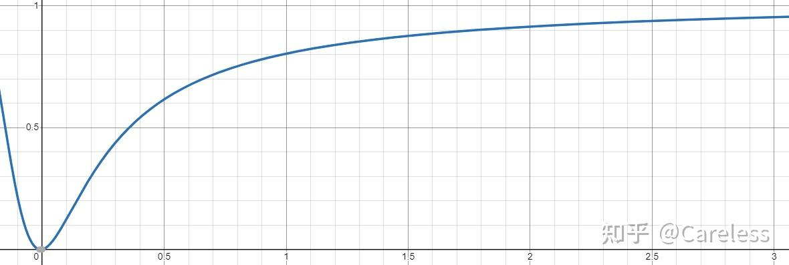
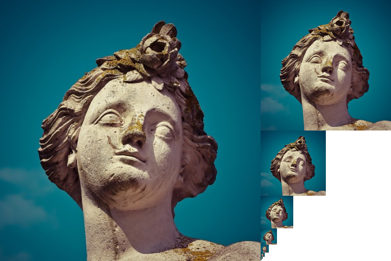

# 【技术美术】纹理技术概述

## 纹理类型

纹理从用途上可以简单分为三种：

- 2D纹理：常规意义上的图片。
- 3D纹理：存储体素信息，如向量场（粒子湍流）、密度场（体积云）。
- Cube纹理：由6张2D纹理包围构成，通过方向采样像素，常用于存储环境贴图。

## 纹理坐标系

### 2D纹理

2D纹理坐标系被称作UV，U是x轴，V是y轴。UV有两种坐标系：

- DX风格（左手系）：原点在左上，x轴向右，y轴向下。
- OpenGL风格（右手系）：原点在左下，x轴向右，y轴向上。

Unity采用的是OpenGL风格。

### 3D纹理

3D纹理（含Cube纹理），在Unity中则是采用的默认坐标系，即左手坐标系。

## 伽马与线性空间

伽马与线性空间都是一种颜色空间，颜色空间会影响显示色域的分配方式。色域的大小是恒定的，我们可以都认为是0-1的区间，但这两个空间的原始颜色和输出给显示屏的颜色的映射关系是不同的。

- 线性映射：线性，即不会修改原颜色，$y=x$。
- 伽马映射：非线性，会利用幂函数对原颜色进行校色，$y=x^a$，具体指数有不同的标准。

其中伽马空间是默认的颜色空间。

### 颜色空间的选择


#### 为什么使用伽马空间？

基于很多实际情况，人们发现颜色输出到显示屏时往往需要进行一些校色，才能保证好的显示效果，例如：

1. 早期阴极射线管（CRT）显示器的输出会比输入颜色看上去偏暗，所以需要抬高输入值。
2. 如今的显示器虽然可以实现线性输入输出，但也继承了 CRT 显示器的非线性特性。
3. 人的眼睛对暗色比亮色更加敏感，所以必须保证暗色部分的精度，图片视觉效果才会更加平滑。

#### 为什么需要线性空间？

虽然伽马空间显示的颜色效果更好，但用在非颜色数据上或进行光照计算时，线性空间才更符合直觉和物理规律，所以在着色器计算阶段，我们需要线性空间颜色数据。

### 颜色空间的存储

颜色空间只是影响原始颜色和最终输出到显示屏颜色的映射关系，并不会对颜色的存储产生影响，DCC软件中选择0.5，存储的也就是0.5（不包含渲染贴图等操作，这类操作没有明确数值，DCC软件会根据纹理空间，决定如何存储渲染结果）。

但这也已经应用上了伽马映射了，因为在选色界面时，你看到的0.5就已经是受显示器特性影响拉暗后的值，他对应在现实物理上的值实际可能是0.25。结果就是在DDC中创作的图片，选择的颜色相对物理值来说其实暗色会占大多数（暗色被分配更多色域的体现）。

利用二进制编辑器查看TGA文件就可以很容易发现这一点。虽然很多图片也有sRGB（一种伽马空间）的选项，但这也只是一个标记，提示该图片是在sRGB环境下制作的。

### sRGB

上文提到伽马映射中的指数有多种选择，而其中最著名的就是 sRGB，也是目前事实上的标准伽马空间。sRGB 的调色方式如下：$y=x^{\frac{1}{2.2}}$，可以看出其会牺牲亮色空间以存储更多暗色。由于显示屏天生会降低亮度，所以在sRGB环境中制作的颜色，输出到屏幕时实际不需要真的做校色处理，因为显示屏已经完成了。

### 颜色空间转换

Unity的URP中，默认颜色空间是线性的，因为这种更方便计算且结果更准确。其可以预先保证好着色器中的所有参数都是线性的，而不需要人为的计算前转换，但也因此 Unity 需要对期间的很多东西进行校色处理。具体而且其颜色空间的转化过程如下：

1. 自然界颜色值（线性空间）0.2，在 DDC 软件中显示为 0.5（伽马空间）。

   由于人眼感知的影响，我们不会发觉该值不是真正的中间值，而误以为它是黑白之间的灰色中性色。

2. 保存图片时继续以 0.5 存储（伽马空间）。

   从反照率的物理角度来看颜色值，该值其实是错误的，与自然界不符，因此计算前需要矫正，但对非颜色值（如法线、光滑度、高度），该值是正确的，因此后续不用矫正。

3. 根据纹理选项，决定如何向着色器传递图片颜色值，以及预览窗口效果。

   在 Unity 中对纹理启用 sRGB 选项后，Unity 会将把纹理的 0.5（伽马空间）转为 0.2（线性空间）后再传递给着色器，这样类似反照率的信息就物理正确了。不过在预览窗口，该贴图会继续按 sRGB 的传统图片方式呈现，所以看上去没有变化。

   相反如果关闭 sRGB，Unity 则不做任何改动，原封不动的按 0.5 传递给着色器。不过在预览窗口中会按 $0.5^\frac{1}{2.2}$ 进行显示，以和显示屏的伽马校色抵消，以体现其 $y=x$ 的对应关系，于是预览结果看上去就会比原图要亮。

   此时 Unity 渲染管道中所用全部颜色值应都是线性值的，而这些颜色才是正确的，符合自然界值，因此可以用于光照物理的计算。

4. 渲染出线性画面结果并进行后处理。

   基于线性参数渲染的画面自然是线性空间的结果。通常物体渲染完后还会进行一些后处理，大部分后处理是基于线性空间的数据处理，好在我们本来也是在线性环境下计算的线性结果，所以后处理时不需要进行额外的校色操作。

5. 最终画面绘制完毕后，Unity 将画面输出到帧缓冲区时，再次将颜色 0.2（线性空间）转为 0.5（伽马空间）存储。

   因为要兼容旧显示器输出画面会变暗的问题。此外还要考虑人眼特性，多存储暗色，否则看上去会有斑纹（图片精度低于人眼识别精度）

6. 显示器输出帧缓冲区内容，将缓冲区中的 0.5（伽马空间），输出为 0.2（线性空间）。

   线性空间才是自然界的颜色空间，因此显示屏输出画面到现实世界时需将伽马空间转为线性空间。此外该流程模拟了旧显示器的画面特性，从而实现兼容。

## HDR（高动态范围）

默认情况下颜色通道都是用单个字节存储的，只能表示一个 0-255 范围内的值，然而这并不能反映现实中的光照效果，因为现实中的存在非常亮和非常暗的颜色，远超 0-255 的精度范围。虽然伽马空间可以缓解暗色精度的问题，但对于亮色还是没有办法，因此 HDR 应运而生。HDR 是使用浮点数存储颜色，因此远超传统字节存储的范围和精度。

### HDR 兼容性

HDR 技术不是所有设备都支持的，一般来说有两个问题：

#### 显卡不支持 HDR 纹理

虽然显卡不支持直接存储 HDR 纹理，但我们可以对其编码，使用其他约定好的方式存储HDR颜色，然后通过解码在计算时还原出来，Unity已经帮我们实现了这个功能。

例如下方是Unity从默认环境贴图中提取光照颜色的方法，可以看到从纹理中直接取出的颜色值是不能用的，而需要额外的一步解码操作。

```hlsl
float4 encodedIrradiance = unity_SpecCube0.SampleLevel(samplerunity_SpecCube0, reflect(-v, n), mipLevel);
float3 color = DecodeHDREnvironment(encodedColor, unity_SpecCube0_HDR);
```

#### 显示屏不能显示 HDR 颜色



虽然可以确保使用 HDR 颜色进行计算，但计算出的 HDR 结果却不一定能在显示屏上显示，因此最终还是要把 HDR 限制回 0-255。默认情况下会直接截断，但那样就会损失亮部的细节，为此采用一个合适的函数进行校色才是明智之选，而发挥这一作用的就是后处理中的“色调映射（Tonemapping）”功能。

## mipmaps



mipmaps 是一种 GPU 采样策略。其先基于原纹理生成多张分辨率逐渐降低的小纹理，然后根据实际渲染时纹理在屏幕上的大小占比，选择其中最合适的纹理进行采样。

1. 分辨率降低以 2 的倍数进行，mipmap 等级越高分辨率越小。
2. 判断纹理占比大小的方式是通过`DDX`和`DDY`函数来对比当前像素与旁边像素的 uv 变化率来确定的，屏幕占比越小，变化率越大，采样所用的 mipmap 等级越大。

mipmaps 可以解决纹理分辨率和实际显示分辨率不同导致的过采样问题，具体而言有以下两点：

1. 减少过采样导致的性能浪费，因为分辨率越低的纹理采样性能越高。
2. 解决过采样导致的显示异常（摩尔纹，远距离物体在屏幕空间的uv变化率过大，导致相邻像素采样颜色也差别巨大）。

为了存储额外的低分辨率纹理，mipmaps 会占用一定额外空间，如果纹理的使用常见不存在上述问题（如 UI），则不应该使用 mipmap 功能。

### 各向异性


各项异性指从物体的表面的一点开始，往不同的方向观察，会发现其不同方向的属性变化率不一致。此处专指物体表面uv属性的各向异性现象：

- 如果正着看纹理，uv 双轴的变化率是差不多的，此时为各向同性。
- 如果倾斜看纹理，uv 双轴变化率可能相差非常大，此时为各项异性。

默认情况下 mipmaps 只考虑正视情况，生成的 mipmap 会均匀的混合周围所有的点，但倾斜时相比正视所能看到的点数量和位置是不同的。继续用这样的 mipmap 采样就会错误采到本该消失的点，导致出现晕影，看起来就像远处被模糊了一样。

所以启用 mipmaps 后应默认启用各项异性功能。这样 mipmaps 会额外存储一些不同宽高缩放比的 mipmap 以应对倾斜采样的情况。各向异性等级越高，这种 mipmap 就越多，应对能力也就越强。

## 过滤模式

指示 GPU 如何采用纹理。

- 点（无过滤）：只取 uv 最近像素的颜色信息。
- 双线性：取 uv 最近四个像素的颜色信息并混合。
- 三线性：对最近两张 mipmap 进行双线性采样，然后再混合。

## 寻址模式

指示 GPU 当采样时的 uv 输入值超出 $[0,1]$ 范围时如何处理。

- 重复：对输入值取模以纠正回范围内。
- 夹紧：将输入值限制在最大范围内。
- 镜像：类似乒乓的方式将输入值纠正回范围。
- 镜像一次：只在 $[-1,0]$ 范围内镜像一次，其他范围使用夹紧。

## 参考资料

- [Unity 文档-颜色空间](https://docs.unity.cn/cn/2022.3/Manual/LinearLighting.html)
- [Wikipedia-sRGB](https://en.wikipedia.org/wiki/SRGB)
- [游戏画面设置中的“各向异性过滤”是做什么的？](https://www.zhihu.com/question/411035839/answer/1986329452)
- [Unity 文档-纹理导入设置](https://docs.unity3d.com/2020.3/Documentation/Manual/class-TextureImporter.html)
