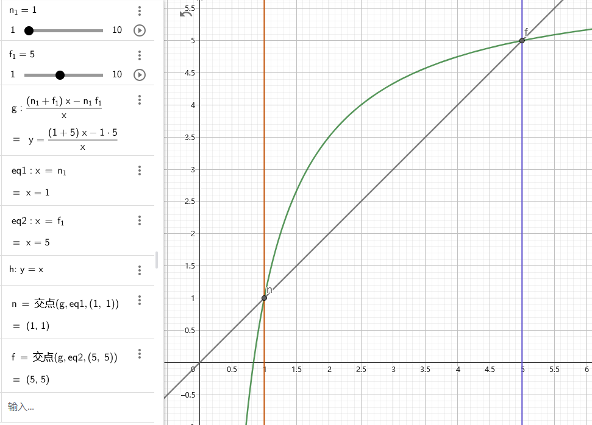

---
categories:
  - 个人研究
  - 技术美术
  - 空间矩阵
abbrlink: 4243868598
---
# 【技术美术】个人引擎内的投影矩阵

Unity 中官推的投影矩阵风格是 OpenGL，这可以直接从相机组件中拿到，但在DX平台，Unity传入着色器时实际上会将该矩阵转为 DX 风格。

DX 风格没必要了解，而且此处也不是 Unity 中使用的 DX 风格，而是个人自制游戏引擎时做的推导文章。

此处采用的NDC空间为：

- x：从左到右 (-1,1)
- y：从下到上 (-1,1)
- z：从前到后 (0,1)

## 正交投影

投影过程就是简单的范围缩放偏移，没有近大远小的效果，难以看出深度关系，常用于 2D 游戏。

若视锥体参数如下：

- l：视锥体左平面
- r：视锥体右平面
- b：视锥体下平面
- t：视锥体上平面
- n：视锥体近平面
- f：视锥体远平面

则投影矩阵为：

$$
ortho(r,l,t,b,n,f) =
\begin{bmatrix}
\frac{2}{r-l} & 0 & 0 & -\frac{r+l}{r-l} \\
0 & \frac{2}{t-b} & 0 & -\frac{t+b}{t-b} \\
0 & 0 & \frac{1}{f-n} & -\frac{n}{f-n} \\
0 & 0 & 0 & 1
\end{bmatrix}
$$

特别的，当视锥体的左右、上下平面坐标对称时：

$$
ortho(r,t,n,f) =
\begin{bmatrix}
\frac{1}{r} & 0 & 0 & 0 \\
0 & \frac{1}{t} & 0 & 0 \\
0 & 0 & \frac{1}{f-n} & -\frac{n}{f-n} \\
0 & 0 & 0 & 1
\end{bmatrix}
$$

推导过程

<https://zhuanlan.zhihu.com/p/474879818>

正交投影中从相机空间转换到裁剪空间，是一个方形空间到另一个方形空间的转换，所以只需分别考虑三个轴的各自变化就行，若根据直线实现映射，可构成以下公式：

$
\begin{aligned}
X_n &= k_1 X_e + b_1 \\
Y_n &= k_2 Y_e + b_2 \\
Z_n &= k_3 Z_e + b_3 \\
\end{aligned}
$

其中 n 下标表示转换后的剪辑空间坐标，e 表示原本的视图空间坐标。

当有以下参数：

- l：视锥体左平面
- r：视锥体右平面
- b：视锥体下平面
- t：视锥体上平面
- n：视锥体近平面
- f：视锥体远平面

映射效果如下（要注意图片使用的是 OpenGL 剪辑空间， Direct3D 的 Z 的计算与其不同）：

带入参数计算后即可推出：

$
\begin{aligned}
k_1 &= \frac{1-(-1)}{r-l} \\
b_1 &= X_n - k_1 X_e  \\
&= 1 - \frac{1-(-1)}{r-l} *r \\
&= \frac{r-l}{r-l} - \frac{2r}{r-l} \\
&= -\frac{r+l}{r-l}
\end{aligned}
$

$
\begin{aligned}
k_2 &= \frac{1-(-1)}{t-b} \\
b_2 &= Y_n - k_2 Y_e \\
&= 1 - \frac{1-(-1)}{t-b} * t \\
&= \frac{t-b}{t-b} - \frac{2t}{t-b} \\
&= -\frac{t+b}{t-b}
\end{aligned}
$

$
\begin{aligned}
k_3 &= \frac{1-0}{f-n} \\
b_3 &= Z_n - k_3 Z_e \\
&= 1 - \frac{1-0}{f-n} * f \\
&= \frac{f-n}{f-n} - \frac{f}{f-n} \\
&= -\frac{n}{f-n}
\end{aligned}
$

再将这种映射方法套用到矩阵即可得到

$
ortho =
\begin{bmatrix}
\frac{1-(-1)}{r-l} & 0 & 0 & -\frac{r+l}{r-l} \\
0 & \frac{1-(-1)}{t-b} & 0 & -\frac{t+b}{t-b} \\
0 & 0 & \frac{1-0}{f-n} & -\frac{n}{f-n} \\
0 & 0 & 0 & 1
\end{bmatrix}
$

## 透视投影

与人眼一样，随深度不同，具有近大远小的效果，容易看出物体距离远近，常用于 3D 游戏。

若视锥体参数如下：

- n：近平面
- f：远平面
- v：视野上下角度
- r：视野宽高比

$$
Perspective = Ortho(\tan(\frac{v}{2}) n / r,\tan(\frac{v}{2}) n,n,f) * \begin{bmatrix}
n & 0 & 0 & 0 \\
0 & n & 0 & 0 \\
0 & 0 & n+f & -nf \\
0 & 0 & 1 & 0
\end{bmatrix}
$$

推导过程

1. **问题分析**

   透视投影的空间是一个四棱台，将其变换到剪辑空间的步骤可以拆成两步：

   1. 将四棱台缩放为长方体，实现近大远小。
   2. 将长方体缩放到剪辑空间，等同于正交投影。

   由于正交投影已推导，故现在只需要求出将四棱台缩放为长方体的方法就行。

2. **公式推导**

   <https://www.zhyingkun.com/perspective/perspective/>

   

   由于缩放为长方体，故对于处在视锥线上的点，缩放后应与在近平面的 x，y 坐标一致。以上图为例，应有：

   $f(y) = y_s$

   根据相似三角形原理，可得：

   $
   \begin{aligned}
   \frac{y_s}{d} &= \frac{y}{z} \\
   y_s &= \frac{yd}{z}
   \end{aligned}
   $

   由于 d 就是近平面距离，若近平面距离为 n，则：

   $
   \begin{aligned}
   f(y) &= \frac{yn}{z} {（前面说过 y_s=f(y)）}\\
   f(x) &= \frac{xn}{z} \text{（x、y缩放一致）}
   \end{aligned}
   $

3. **矩阵推导**

   现在要将该公式反应在矩阵变换上：

   - 对于 n，这是一个定值，直接利用缩放矩阵的原理就可以实现。
   - 对于 z，这是一个变量，肯定无法直接写在矩阵中，但可以借助其次坐标 w 归一化的特性，将向量的 w （位置在 m43）设为 z 即可。

   于是便可得出初步矩阵：

   $
   \begin{bmatrix}
   n & 0 & 0 & 0 \\
   0 & n & 0 & 0 \\
   ? & ? & ? & ? \\
   0 & 0 & 1 & 0
   \end{bmatrix}
   $

   其中 z 的系数都被标记为？，因为 z 也会受 w 归一的影响，而我们实际需要 z 保持不变，故需要对这些能对 z 产生作用的系数进行推导，以确保最终计算出的向量归一化前的 z 分量为$z^2$。

   由于前两个系数（m31,m32）是与 x,y 相乘，我们不需要所以始终为 0，又因为输入向量的 w 分量默认为 1，此时当剩余的两个系数（m33,m34）分别为 A,B 时，可将问题写成以下公式：

   $
   Az + B = z^2
   $

   带入 n（近平面 z），f （远平面 z）两个已知实例：

   $
   \begin{aligned}
   An + B &= n^2 \\
   Af + B &= f^2 \\
   \end{aligned}
   $

   利用消元法可得出：

   $
   \begin{aligned}
   A(n-f) &=n^2-f^2 \\
   A &= \frac{(n+f)(n-f)}{n-f}\\
   A &= n+f \\
   \end{aligned}
   $

   $
   \begin{aligned}
   (n+f)n + B &= n^2 \\
   B &= n^2 - (n^2 + fn) \\
   B &= -nf
   \end{aligned}
   $

   于是最终矩阵可得出为：

   $
   \begin{bmatrix}
   n & 0 & 0 & 0 \\
   0 & n & 0 & 0 \\
   0 & 0 & n+f & -nf \\
   0 & 0 & 1 & 0
   \end{bmatrix}
   $

## 线性深度推导

利用透视投影计算出的新深度是非线性的。因为利用 $(n+f)z-nf$ 抵消除 z 得出的新 z，只能保证远近平面一致，而其他值域则会受到非线性变化（具体变化如下图）。因此当希望得到远近平面间的线性深度时，必须要进行进一步处理。

### 投影函数

首先归纳出各种投影对 z 的影响函数：

- 正交

  $
  z' = \frac{z-n}{f-n}
  $

- 逆正交

  $
  z = z'(f-n)+n
  $

- 透视

  $
  z' = \frac{(n+f)z-nf}{z}
  $

- 逆透视

  $
  \begin{aligned}
  z &=\frac{(n+f)z-nf}{z'}\\
  z&=\frac{(n+f)z}{z'}-\frac{nf}{z'}\\
  z-\frac{(n+f)z}{z'}&=-\frac{nf}{z'}\\
  z(1-\frac{n+f}{z'})&=-\frac{nf}{z'}\\
  z&=-\frac{nf}{z'-(n+f)}\\
  z&=\frac{nf}{n+f-z'}
  \end{aligned}
  $

### 投影过程

正常的投影过程如下：

$
z^{非线性}_{[n,f]} = 透视(z^{线性}_{[n,f]})\\
z^{非线性}_{[0,1]} = 正交(z^{非线性}_{[n,f]})
$

由此可以逆推出 $z^{线性}_{[0,1]}$ 的求解过程：

$
z^{非线性}_{[n,f]} = 逆正交(z^{非线性}_{[0,1]})\\
z^{线性}_{[n,f]} = 逆透视(z^{非线性}_{[n,f]} )\\
z^{线性}_{[0,1]} = 正交(z^{线性}_{[n,f]})
$

即

$
\begin{aligned}
z^{线性}_{[0,1]} &= 正交(逆透视(逆正交(z^{非线性}_{[0,1]})))\\
z &= \frac{(\frac{nf}{n+f-(z'(f-n)+n)})-n}{f-n}\\
z &= \frac{(\frac{nf}{f-z'(f-n))})-n}{f-n}\\
z &= \frac{n}{f-n}(\frac{f}{f-z'(f-n))}-1)\\
z &= \frac{n}{f-n}(\frac{f-(f-z'(f-n))}{f-z'(f-n))})\\
z &= \frac{n}{f-n}(\frac{z'(f-n)}{f-z'(f-n))})\\
z &= \frac{nz'}{f-z'(f-n))}\\
\end{aligned}
$
