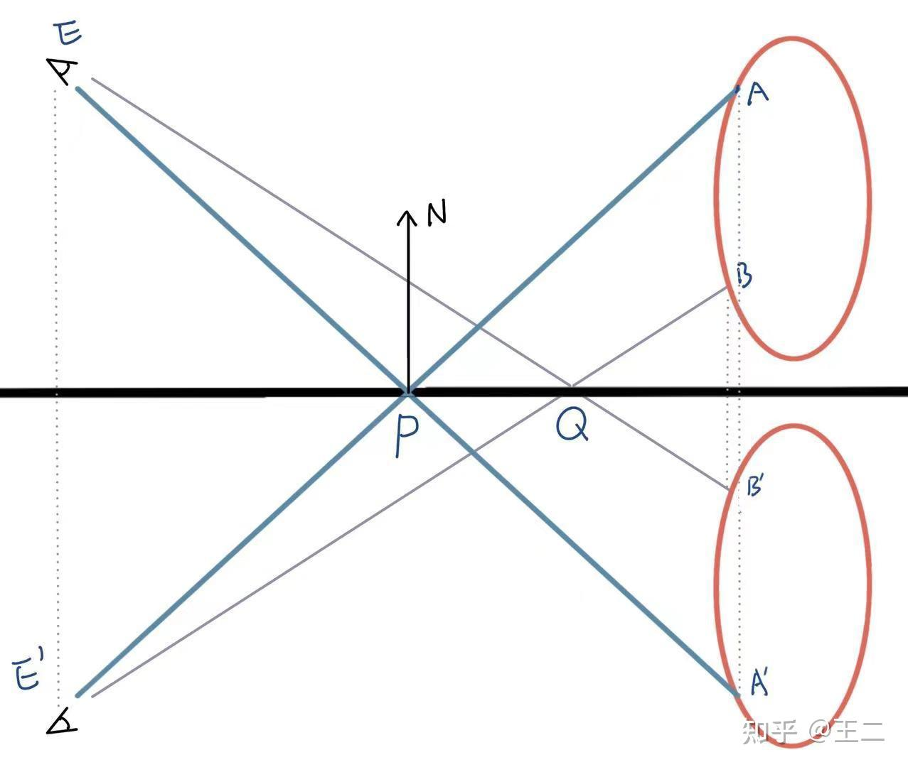
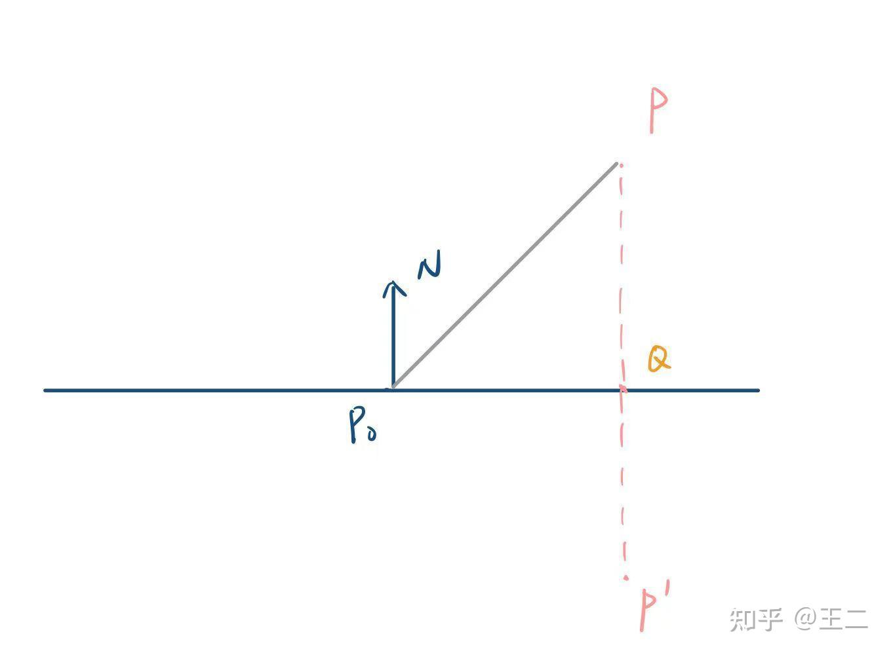
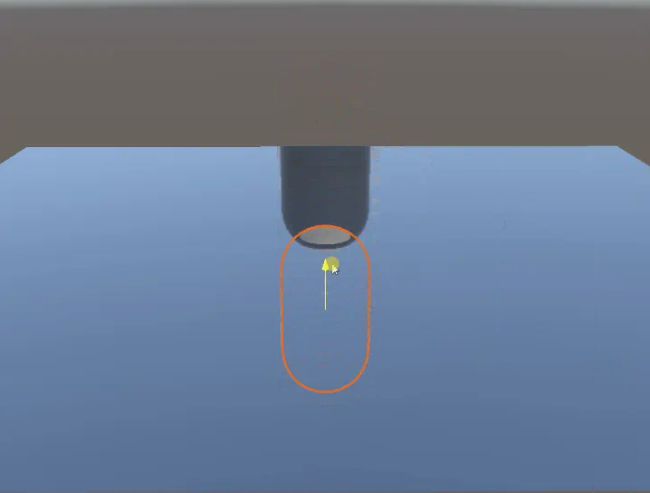
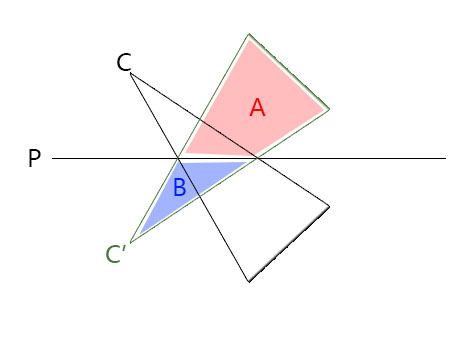
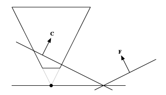
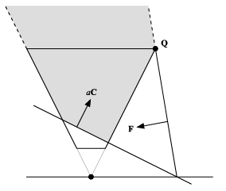

---
categories:
  - 个人研究
  - 技术美术
  - 空间矩阵
abbrlink: 3964607565
---
# 【技术美术】平面反射

如上图所示，实现平面反射说到底就是要实现，P 采样到 A，Q 采样到 B。A~B显然是需要渲染到纹理以供采样的，实现该过程有两种方法：

1. 最简单的方式是放一个镜像的摄像机 E' 去渲染 A，B。
2. 更高级的做法是E不动，但渲染每个物体的镜像（A'，B'），因此需要给每个物体做一步镜像变换。

## 镜像矩阵推导

镜像矩阵的作用如上，使顶点相对平面镜像，即 $P' = MP$，M就是要求的镜像矩阵。

推导矩阵的方式就是先不考虑矩阵，而是考虑如何用代数式实现，然后再将代数式的过程反映到矩阵中。

### 用线性代数表示

已知条件：

- $P_0$：平面原点
- $N$：平面法线
- $P$：被镜像的顶点

求：

- $P'$：镜像后的顶点

过程：

$
\begin{aligned}
P'
&= P - 2(\vec{QP})  \\
&= P - 2(N * |\vec{QP}|) \\
&= P - 2 * N * ((P-P_0) \cdot N)
\end{aligned}
$

### 用实数表示

其中 $((P-P_0) \cdot N)$ 展开分量后可得：

$
\begin{aligned}
((P-P_0) \cdot N) &= x_n(x - x_0)+y_n(y - y_0)+z_n(z - z_0) \\
&= x_nx+y_ny+z_nz-(x_nx_0+y_ny_0+z_nz_0)
\end{aligned}
$

其中 $-(x_nx_0+y_ny_0+z_nz_0)$ 完全由统一的已知量构成，故可以先简单看成一个常数，以简化后续式子的表达：

$d = -(x_nx_0+y_ny_0+z_nz_0)$

再将上述式子带入到完整公示中可得：

$
\begin{aligned}
(x',y',z') &= (x,y,z)-2*(x_n,y_n,z_n)*(x_nx+y_ny+z_nz+d) \\
x' &= x-2x_n^2x-2x_ny_ny-2x_nz_nz-2x_nd\\
x' &= (1-2x_n^2)x-(2y_nx_n)y-(2z_nx_n)z-2x_nd\\
y' &= -(2x_ny_n)x+(1-2y_n^2)y-(2z_ny_n)z-2y_nd\\
z' &= -(2x_nz_n)x-(2y_nz_n)y+(1-2z_n^2)z-2z_nd\\
\end{aligned}
$

### 用矩阵表示

将上述对每个分量的线性计算过程反映到矩阵中即可得到镜像矩阵：

$
\begin{bmatrix}
1-2x_n^2 & -2y_nx_n & -2z_nx_n & -2x_nd\\
-2x_ny_n & 1-2y_n^2 & -2z_ny_n & -2y_nd\\
-2x_nz_n & -2y_nz_n & 1-2z_n^2 & -2z_nd\\
0 & 0 & 0 & 1
\end{bmatrix}
$

其中

$d = -(x_nx_0+y_ny_0+z_nz_0)$

注意：直接使用该矩阵会导致面被反向（顺时针变逆时针），故需要反转渲染管线中的正面设定，在Unity中可以使用 `GL.invertCulling` 实现。

## 斜截视锥体

如果仅实现上述的镜像矩阵，那会出现对水下物体也进行镜像的错误反射画面：

原因在于拍摄镜像画面的相机默认会对水下场景也进行拍摄，然而这部分不应该参与反射。我们真正需要拍摄的范围实际是如下图的A区域。

为此我们需要屏蔽掉B区域。一种非常通用的方式是将投影矩阵的近平面修改为水面，从而自然的裁剪掉无用画面。这种特殊的视锥体就叫斜截视锥体。

### 平面的向量形式

总所周知平面的一般方程式为：

$$
Ax+By+Cz+D=0
$$

其中

- $A=\vec{n}_x$
- $B=\vec{n}_y$
- $C=\vec{n}_z$
- $D=-(\vec{n} \cdot \vec{p})$

基于该公式，我们可以将其压缩表示为一个四维向量：

$$C =(N_x,N_y,N_z,-N \cdot P)$$

从几何意义上来看，其xyz表示法向，w表示以负法向为正方向时离原点距离。

此外基于该向量的一些计算也是有意义的，例如只有 $V \cdot C = 0$ 的点才表示在平面上，如果 $N$ 是单位向量，点乘的结果还可以进一步表示为点离平面的距离和方向。当然这些都不是重点，之所以要将平面向量化，是为了便于带入后续的矩阵运算。

接下来讨论一些关于该平面向量的性质：

- $C' = (M^{-1})^TC$：由于C中包含法线信息，因此为了保持垂直关系，在矩阵转换方法上要和法线一致（协变向量的转换）。
- $C = aC$：C是四维的齐次坐标，这点从其xyz表示法向，w表示位移的几何含义中也可以看出，因此缩放不会影响其表示的平面。

### 平面向量在矩阵中的位置

注意：以下谈论的平面向量都是在视图空间下的，且投影矩阵采用OpenGL风格。

已知平面可以表示为向量，反过来向量（矩阵）也可以表示平面，因此视锥体的六个面实际上在矩阵中是有所体现的。虽然我们很难直观的找出它们所在的矩阵位置，但其在剪辑空间下的表示却非常简单。

我们假设所有平面的法线都朝着原点方向，则可得：

- 近平面：$(0,0,1,1)$
- 远平面：$(0,0,-1,1)$
- 左平面：$(1,0,0,1)$
- 右平面：$(-1,0,0,1)$
- 下平面：$(0,1,0,1)$
- 上平面：$(0,-1,0,1)$

接着我们可以通过将其转换回视图空间的过程来确定涉及到的矩阵参数。

设 $M$ 为投影矩阵，$C$ 和 $C'$ 分别表示视图空间和剪辑空间下的平面向量，则 $C' = (M^{-1})^TC$，反推可得：

$
\begin{aligned}
C
&= ((M^{-1})^T)^{-1}C' \\
&= ((M^{-1})^{-1})^TC' \\
&= M^TC'
\end{aligned}
$

以近平面为例，即$C'= (0,0,1,1)$，则$M^T$中能参与到计算的只有第三第四列，计算方式是相加。换到$M$中即第三第四行相加。

由此可得这些平面与投影矩阵的关系为（$M_x$ 表示 M 矩阵的第 x 行）：

- 近平面：$M_4+M_3$
- 远平面：$M_4-M_3$
- 左平面：$M_4+M_1$
- 右平面：$M_4-M_1$
- 下平面：$M_4+M_2$
- 上平面：$M_4-M_2$

因为我们要修改的是近平面，故可得 $C = M_4+M_3$ 。

### 斜截视锥体的深度问题

现在将C带入到远近平面公式中可得：

- $N = M_4+M_3 = C$
- $F = M_4-M_3 = M_4-(C-M_4)=2M_4-C$

可以看出，用C取代近平面时，会同时影响到远平面。而这一新的远近平面，有个很严重的问题。

设有点 $P=(x,y,0,w)$，且 $C \cdot P = 0$，即 $P$ 是 $C$ 上的一点，现在将 $P$ 带入到 $F$ 中计算：

$
\begin{aligned}
P \cdot F
&= P \cdot(C+(0,0,1,0)) \\
&= P \cdot C+P\cdot(0,0,1,0) \\
&= 0+(x,y,0,w)\cdot(0,0,1,0) \\
&= 0
\end{aligned}
$

$P \cdot F = 0$ 意味着 $P$ 同时也是 $F$ 上的一点，而因为 $C$ 就是 $N$，所以说明 $N$ 和 $F$ 不平行且在 $P$ 点相交。这和传统的投影矩阵结果完全不一样，此时剪辑空间的 z 轴不再是深度信息，而是远近平面的距离信息。这会导致很严重的精度问题，不同方向的深度也不再一样。

这个问题无法解决，但我们可以缓解它，为此我们要尽可能的缩小远近平面的夹角，但再小也不应小于原本的视锥体，故远平面的位置可以进一步确定。

Q 是原视锥体边界上的一点，优化后的远平面应与其相交，即 $Q \cdot F = 0$。

由于Q是原视锥体边界上的点，且始终在近平面的正前方，因此可以求出：

$Q' = (sgn(C'_x),sgn(C'_y),1,1)$（剪辑空间）

$Q = M_{old}^{-1}Q'$（视图空间）（此处 $M$ 为原投影矩阵）

有了具体的需求实例（$Q \cdot F = 0$），我们便可以进行解方程了。另外这里有个技巧，由于 $C=aC$，因此我们可以在不修改$C$的情况下凭空增加一个新参数来处理新需求，以便保留原本对 $C$ 的定义（此处有些玄学，实际上应该就是为了增加一个参数来方便计算，毕竟C的内容是由有我们自定义的，而直接增加系数是最方便的）。

配合上述条件后，我们便能从 $F$ 中求解出 $a$：

$
\begin{aligned}
Q \cdot F &= 0 \\
Q \cdot (2M_4 - aC) &= 0 \\
Q \cdot 2M_4 - a(Q \cdot C) &= 0 \\
a &= \frac{Q \cdot 2M_4}{Q \cdot C} \\
\end{aligned}
$

于是后续我们便可以将原本的 $C$ 替换成我们新的缓解了深度问题的 $aC$：

### 斜截视锥体的投影矩阵

解决了所有问题后，我们开始回归最初的任务，即求解斜截视锥体的投影矩阵。由于我们只想修改近平面，因此该问题还可以进一步定位为“如何修改 $M_3$，$M_4$ 的值？”

由于 $M_4$ 会影响到较多的其他平面，且通常它的值固定为 $(0,0,-1,0)$ 来实现深度除法，因此我们最终选择只修改 $M_3$。$M_3$ 同时会影响远平面，导致出现深度问题，不过这个我们已经在上一节解决了。

于是我们便能初步总结出 $M_3$ 的公式：

$
\begin{aligned}
M_4+M_3 &= aC & \\
M_3 &= aC-M_4
\end{aligned}
$

其中：

- $a = \frac{Q \cdot 2M_4}{Q \cdot C}$
- $Q = M_{old}^{-1}(sgn(C'_x),sgn(C'_y),1,1)$
- $C =(N_x,N_y,N_z,-N \cdot P)$

将其带入到标准的投影矩阵，我们还可以进一步简化：

1. 标准投影矩阵中$M_4$ 是一个定值，其值为 $(0,0,-1,0)$。
2. 标准投影矩阵不会修改xy轴的方向，故 $sgn(C') = sgn(C)$。

故最终我们得到的斜截视锥体投影矩阵信息如下：

$$M_3 = \frac{-2Q_z}{Q \cdot C}C+(0,0,1,0)$$

$$Q = M_{old}^{-1}(sgn(C_x),sgn(C_y),1,1)$$

$$C =(N_x,N_y,N_z,-N \cdot P) $$

提示：记得转换平面从世界到相机空间时，要用最新的镜像过的矩阵。
