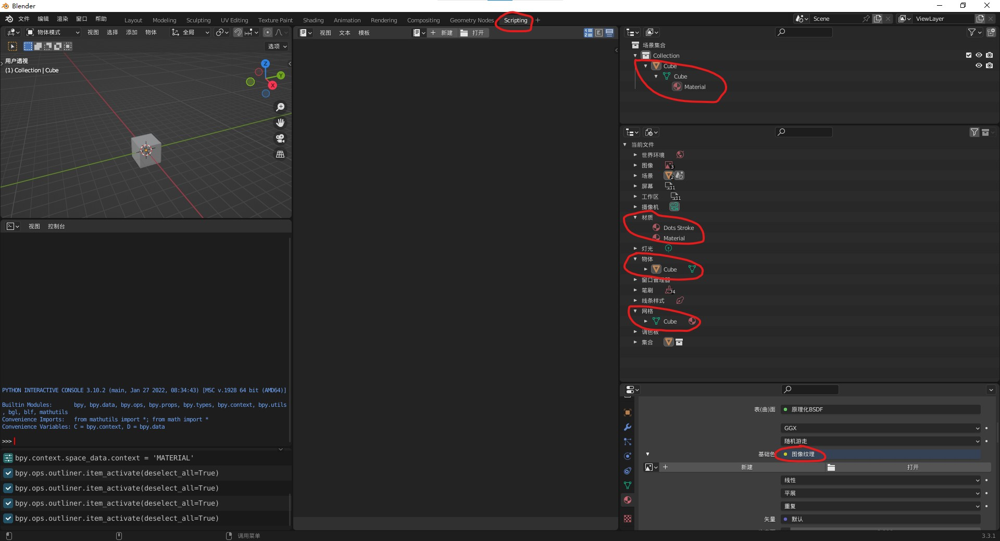
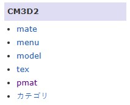

# 【COM3D2Mod 制作教程（2）】Mod 底层原理

## Mod 是什么？

Mod 一词想必你已经听过很多次了，因为很多游戏都可以装 Mod，而 Mod 可以为游戏增添一些额外的乐趣。但在 COM3D2 这款游戏中，Mod 和常规的意思并不一样，常规的 Mod 在这里叫做插件，两者不能混为一谈。

### Mod 是一种官方功能

> 一种用于增加额外的人物卡及其装扮的方法。

在 COM3D2 中 Mod 是一项官方功能，这是很特殊的一点，实际上官方所有的角色装扮和我们自己所做 Mod 本质是一样的，所以它的作用也有了明确表示：一种用于增加额外的女仆及其装扮的方法。

我们外部之所以也能做 Mod，是因为围绕着下方两个文件夹展开了，官方会自动加载这两个文件夹下的文件，这两个文件夹也分别代表着两种功能方向。

- Mod 文件夹：

  用于增加女仆装扮选项，但相关文件在游戏中仅有加载功能，所以无法直接制作，制作时需要额外借助第三方工具。

- Preset 文件夹：

  用于储存女仆身体信息，包括体型面部的参数，是游戏内置的捏人系统，虽然用 Mod 文件夹也可实现类似的功能，但难度过大一般不考虑。

_可见 Mod 由 Mod 和 Preset 两种文件组成，但因为 Preset 的内容在课程中的占比非常小，所以后续的 Mod 都默认指 Mod 文件夹的这部分。_

### Mod 可能被插件扩展

> 可以提供更多额外功能，但存在兼容性问题。

原版的 Mod 功能是比较弱的，所以一些技术玩家为此专门开发了一些插件，这些插件使得 Mod 可以额外加载一些文件，比如声音，剧本等（COM3D2.MaidLoader），更炫酷的材质效果（COM3D2.NPRShader.Plugin），额外的体型参数（CM3D2.AddModsSlider.Plugin）等等。

其中一些插件非常重要，以至于没有他们部分装扮将无法制作，再加上玩家一般都会通过 CMI 或类似的插件整合包安装插件，所以你基本可以默认玩家的游戏环境是带有这些插件的，但要注意这终究是第三方提供的功能，不一定百分百兼容，再考虑受众范围的问题，所以部分插件还是建议保守使用。

## Mod 的运行原理

我们知道 Mod 就是实现装扮功能，所以让我们先不考虑 Mod，考虑如何自己实现人物装扮的效果。

### 人体模型实现

> 人形模型绑定上人形骨架即可。

首先装扮是穿在角色身体上的，所以必须先考虑这些这些身体是如何做的，如果你有完成前置要求的任务，那这个问题应该相当简单，就是捏个人型模型在绑上一套人形骨架就行。另外为了实现动画的复用，一般多个角色的骨架都会使用同一套，即便略有区别那也是能向下兼容的那种。

### 装扮模型实现

> 单独的装扮模型但绑上和人体模型相同的骨架即可。

人体模型有了，现在我们要给他做一个能够替换和拆卸的衣服，很显然这样的衣服和人体一定不能是同一个模型，可我们需要让衣服和人体一起运动。我们知道模型是受骨架控制而运动的，而且不同模型依旧可以绑上相同的骨架，所以只要骨架一样就能同时控制装扮和身体，于是就有了种穿上衣服的感觉。也因此对装扮便只有了骨架的要求，模型得以随意替换。

### 体型变化实现

> 把人体模型和装扮的胖瘦都捏一份，通过形态键计算过渡。

体型的变化是显然通过网格变化体现的，但游戏不是建模软件也不可能现场改模型，所以必须有成熟便利的功能自动修改网格形状。骨骼就是一种，但这种实时计算的方式不可控，而要严格保证网格变化前后是符合要求的方法就是形态键，但形态键的缺点是必须提前确定变化前后的形状，所以要做两遍，人体模型和装扮模型都要。

### 结论

> Mod 的本质其实就是特制的 3D 模型而已。

我们知道 Mod 是和装扮有关，所以第一点和我们没关系，我们只要用官方的人体模型就行，但这也指明了我们制作装扮时所要绑定的骨架。而第三点太麻烦了，所以我们可以不考虑体型变化。那有关的只有第二点，而这一点说明了装扮实现的原理，也即 Mod 的原理。

## 模型的组成原理

上述我们谈到 Mod 就是 3D 模型，那如何把这个 3D 模型放到游戏内？使用 FBX 这些格式肯定不可能的了，COM3D2 是 Unity 开发的，Unity 内部有着自己的格式，但你也别怕，因为模型的本质在哪都是一样的，我们可以先看看在 Blender 中模型是如何构成的。

### 模型文件构成

1. 随意创建一个正方体，通过右上角的大纲视图可以看到它由**物体**和**网格**组成。
2. 接着我们可以为物体添加**材质**，材质中有一个节点功能，它的专属编辑面板在 Blender 中叫 Shading，换成名词就是**着色器**（Shader）.
3. 材质的面板上可以设置各种参数，包括被称作**纹理**的图片。

_我为什么用这些名称称呼他们？通过大纲视图的 Blender 文件模式，你可以看到在 Blender 中就是这样称呼的（见下图标记处）。_

### 模型文件拆分

传统的单文件模式（FBX 这类格式），会把上述所有资源都打包在一起，但这不利于资源文件的复用和定制，所以最终到游戏引擎中会将各个资源分开储存，也即我们上述提到的那五种基本资源，简单描述一些他们各自的功能。

- **物体**

  保存着父子关系，变换信息（位移旋转等），以及对网格和材质的引用信息。

  - **网格**

    点线面信息，包括 uv，权重，顶点色等。

- **材质**

  表明所用的着色器，以及使用着色器时使用的资源（纹理）和参数。

  - **着色器**

    一段代码，用于指导电脑如何去绘制我们的屏幕画面。

  - **纹理**

    图片文件

## Mod 的组成原理

你总算可以知道 Mod 里的文件都是干啥的了，所以现在请直接掏出一款现有的 Mod 做参照，因为下文所讲述的内容将会和 Mod 文件一一对应。

先让我们查看 Mod 制作 Wiki 的左侧的文件类别（上图），可以确定 Mod 的基本文件共有 5 种（最后一个不是文件类型），具体按功能可以分为以下三类（你不需要在意具体分类，对学习 Mod 制作来说这是无所谓的）。

_为什么不做上图中最后一个日文标签的文件说明？因为那个不是文件类型，而是 menu 文件中一个属性，用于指明装扮类别（如指明装扮是头发，上衣，裤子等）。后续编写 menu 文件时，我们通常是直接对官方 menu 文件进行修改而不是从头创建，所以不需要去特别记忆。_

### 模型文件

- model 文件（模型点线面信息）
- mate 文件（如何绘制点线面）
- tex 文件（绘制时用到的贴图）

> 广义理解的 3D 模型文件，可以想成被拆分存储的 FBX。

这部分应该不需要过多解释了，就是上文“模型文件”两节提到的那些，这些文件凑成了一个基本模型所需的所有数据，具体到 COM3D2 中还进行了一定简化，结合上文对比下图你就知道对应关系和含义了，注意文件之间存在依赖关系。

flowchart RL
    object["物体 Object"]
    mesh["网格 Mesh"]
    material["材质 Material"]
    shader["着色器 Shader"]
    texture["纹理 Texture"]
    subgraph Model文件
      object
      mesh
      subgraph Mate文件
        material
      end
    end
    subgraph tex文件
      texture
    end
    mesh-->object
    material-->object
    shader-->material
    texture-->material

可以看到 model 文件中包含 mate 文件，所以 model 中用到的 mate 是不需要单独导出文件的，只要一个 model 文件即可。**（由于刚出教程时我没发现这个问题，所以后面可能会让你导出，但你完全可以无视。如果修改了 mate，也是直接重新导出 model 文件即可）**

着色器是内置在游戏中的，所以没有单独导出的文件，但着色器是由材质引用的，所以之后我们需要在材质中写明着色器信息。

### COM3D2 文件

- menu 文件

> 对应游戏内装扮菜单，告诉游戏如何使用模型文件。

现在我们有模型了，但如何告知 COM3D2 去使用它呢？这就需要 menu 文件。menu 是一个由多个键值对组成的文件，他直接对应着女仆编辑菜单中的菜单项，所以理所当然的它必须要知道一些基本的菜单信息，比如装扮名，装扮描述，装扮类别图标等。他的功能相当强大，以至于指定“点击该菜单项为女仆穿上特定模型文件”这一功能只是他的可选项之一，其他还能做到比如，调整颜色，隐藏部位，特定时刻更换材质球模型（常见如插入时内裤改为半脱状态）等操作。

### Unity 文件

- pmat 文件

> 透明模型专用，用于处理绘制顺序问题。

这个文件只包含了一个整数值和一个材质球名称，他决定了使用该材质球的模型绘制顺序，具体顺序为其整数值的正序排列。为什么需要控制绘制顺序？因为计算机绘制画面是按材质球为单位一层一层覆盖上去的，所以材质球绘制的先后顺序可能会对画面产生影响。在不透明物体中，这点不重要，因为有一个叫深度值的东西会帮我们避免错误覆盖，但在透明物体中就存在问题了，因为透明的性质导致绘制时必须要先知道前一个颜色才行，所以先后顺序必须确定。比如我们通常都是先看到裙子再看到内裤，所以如果裙子是半透明的，那必须要让计算机先画上内裤，然后再画上裙子才行。

_为什么我按如上方式进行文件分类？这是站在 Unity 的角度来分类的。模型文件都是由外部工具制作再导入 Unity 的，是构成完整模型的必要资源；COM3D2 文件则是 COM3D2 独有，是游戏开发者自定的文件；而 pmat 则确实是 Unity 自身的资源，是在 Unity 中进行编辑的。_

### 其他文件

> _不在教程范围内_

_实际上除了上述几种文件之外，游戏或插件还额外提供了一些文件类型，但考虑难易度和兼容性，教程中不会使用也不会教授，如有需求可自行去了解。_

## 总结

这章主要讲述了 COM3D2 的 Mod 运行原理及其文件构成，偏理论课程，所以看起来会比较枯燥困难，但实际制作中会更轻松的一些，比如上述的很多文件，到时我们是不需要从头创建的，即使是建模环节也是通过移植第三方模型来解决。下一章我们将正式开始搭建制作环境，并了解 Mod 文件是如何制作出来的。
