# 【COM3D2Mod 制作教程（5）】实战！制作身体部分（中）

帽子是很典型的装扮类型，较为简单适合入门，所以我们先制作帽子 Mod，流程基本和第二章中的概述相符。因为导入插件及其功能位置也都已在第二章说明，所以这些相关内容我不会再重复。

_这里选择帽子而非头饰也是有意为之，头饰的情况更复杂，其使用一套独立的骨架，所以移植时需要在 menu 中设定额外的位置参数，这太复杂了。而帽子和头发等头部部位有共用的根骨骼，也即是相同的坐标系，所以不需要动任何位置就可以完美匹配，在移植 Mod 中头饰往往和头发绑定，所以为减轻工作量，将所有头饰改用帽子的做法，最为合适。_

## 一. 制作 menu 文

### 1. 观察示例 menu 文件

导入刚导出的官方帽子 Mod 中的 menu 文件进行观察，其内容如下：

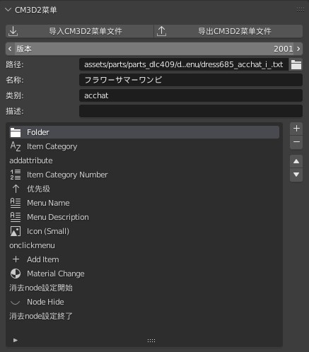

很不幸，其实里面大部分内容至今我也不知道是干啥的，但我很清楚因为现在要做的同为帽子菜单，所以大部分内容应该都是相通而无需改动的，而其余部分通过我过去的观察和实验我也有一些自己的经验，具体而言我会将这个菜单解读为如下内容：

1. 以“版本”为第一行，那前五行，也即“Folder”之上的内容：  
   可以很明显的观察到它们都在下方深色区域之外，这些都用不到，其中有些改了也不起作用，所以你完全不需要动他们。

2. Folder、Item Category、Item Category Number：  
   看样子是类别信息，因为同为帽子，所以这些也不要动。

3. addattribute：  
   不清楚是干啥的，但结合后续的一些同类条目来看，似乎是将内容进行了分割而导致了区域的产生，或许也正是导致前五行无效的罪魁祸首，因为前五行中的部分内容在这一区域内也重复出现了，或许因此导致发生了覆盖，而这也正好符合了这一条目的名称。

4. 优先级：  
   是菜单中的排列顺序，值越小，对应的装扮选项越显示在前面，不重要所以也不动（动了也没用，因为想插队的不止你一个，结果导致队伍排序直接失去了意义，如果装扮太多建议使用“CM3D2.EditMenuFilter.Plugin”插件来辅助筛选）。

5. Menu Name、Menu Description、Icon(Small)  
   字如其名，就是显示给用户的菜单名、菜单描述、图标，这个不同装扮肯定不同，所以要改一下，但为了图省事我一般只填名称，描述留空，所有装扮一个图标，结果就类似下方这样。
   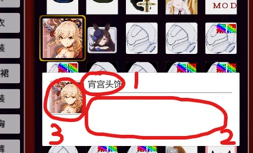

6. onclickmenu  
   很明显又是一个分区，看名字应该是表示“当用户点击菜单时所该发生的事”，该区域内的两项条目也均为动词，很好的证明了这一点。

7. Add Item  
   非常重要的一项，观察其内容会发现里面填写着该菜单对应 model 文件名，这一项告诉了游戏当玩家点击菜单时应该让角色穿上哪个装扮模型，由于我们也是自己准备 model 文件，所以这一项显然也要改。

8. Material Change  
   观察后会发现和“Add Item”很类似，显然这是表示点击时该让 model 文件使用哪个 mate 文件，但根据第一章我们可知 model 文件实际天生带有对 mate 文件的引用，所以此项可有可无，为了省事我们可以直接它他删掉。之所以官方使用该条目或许是为了实现装扮换色功能，一个装扮有多个颜色选项，于是就有了一个 model 对应多个 mate、menu 的情况。

9. 消去 node 设定开始  
   又是一个新区域，这里的 node 指的是角色身体部位，所以这个区域的功能就是可以将人物的特定部位隐藏起来。那为什么需要这个功能呢？想象一下你要做一个紧身衣，因为要贴合身体还不能穿模那工作量显然相当之大，一种取巧的办法就是去掉原本的部位，让紧身衣直接替代它，这样就不存在重叠也不存在穿模了。

10. Node Hide  
    只要在这里填上正确的部位名就可以隐藏相关部位了，可惜这个参考 menu 这里填了空，所以什么也不会隐藏，想想也很简单，因为帽子根本不会遇上上述的穿模问题。因此我另外找了一个隐藏了脊柱的示例，给大家直观的看看效果。
    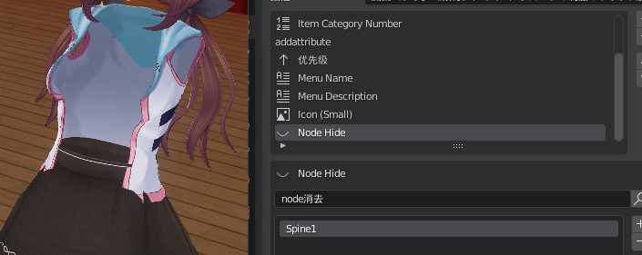

11. 消去 node 设定终了  
    预示着消去 node 的功能分区到此结束了。话说为什么其他分区没有这种显式的结束标注？观察插件的添加命令功能，我还发现这个分区并没有出现在里面，理应出现的位置被“自定义”条目代替了，难道这些信息只是没有实际作用的注释？对于你的疑惑接下来我将进行补充。

#### 关于 menu 文件的补充

- 区域的作用？  
  上述文件解析中可以看到 menu 内是由多个区块组成，但经我实测后发现即使不分区，不放在区域内，相应的条目也可继续生效。所以我猜测这些分区实际只是方便编者阅读的注释而已，不起实际作用，又或者是因为区域具有默认值。但反正多一事不如少一事，非必要情况我建议是不管它们。
- 条目的参数该填啥？  
  这个问题问我，我也不知道，唯一能靠得住的只有你自己，因为解决办法只有一个，那就是一定要学会多观察多实验。多去导出官方 Mod 做参考，大胆的去修修改改，去游戏中观察现象。比如我上面那个脊柱的例子，我原本根本不知道“Node Hide”是隐藏部位，“Spine1”是脊柱，但我会导出官方 Mod，我导出了一件上衣，发现这些新玩意，于是我会尝试比如这条去掉并观察实验结果，所以我才发现了它们的作用。

### 2. 修改成自己的 menu 文件

根据上述解析此时改成我们自己的 menu 文件就非常简单了：

1. “Menu Name”以上全部不动，既省事又安全。
2. “消去 node 设定”和“Material Change”全部删除，因为不用。
3. “Menu Name”我改为了“绫华头饰”，这很符合我们源模型的名称。
4. “Menu Description”偷懒不写，但至少要把原本的装扮描述去除，所以留空就行。
5. “Icon(Small)”需要一个图标图片，我们先预填一个“ayaka.tex”，具体后面再做。
6. “Add Item”需要一个模型文件，恰好就是我们之前拆出来的帽子模型，所以改成“ayaka_hat.model”

改完后大概这样，由于条目太多截图不方便，具体细节大家自己脑部吧，总之帽子装扮的 menu 文件，此时我们就制作完成了：
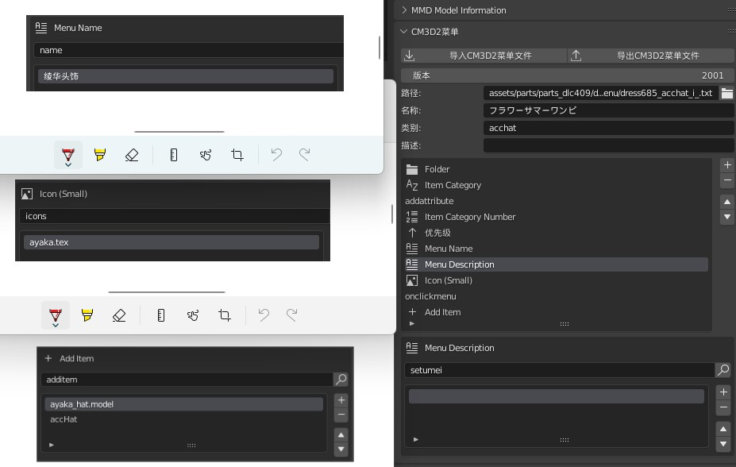

### 3. 通过 menu 文件得出后续制作目标

通过上述 menu 文件的编写可以看出 menu 里还关联了一些其他文件，不同的装扮 menu 可能有不同的关联情况，目前我们的帽子 menu 里就需要下面这两个。

- ayaka_hat.model
- ayaka.tex

这两个分别是帽子模型和菜单图标，也正是我们接下来要做的任务。

## 二. 制作 model 文件

用于移植的 model 原模型，我们在前几节就准备好了，那接下来只要完成绑定骨架这一项即可。

### 1. 导入参考 Model

骨架存在于官方 model 文件中，所以我们现在将所有参考的 Mod 的 model 文件导入 blender 中，可以看到我们需要的骨架已经出现，就是下图那些黑色条状物。

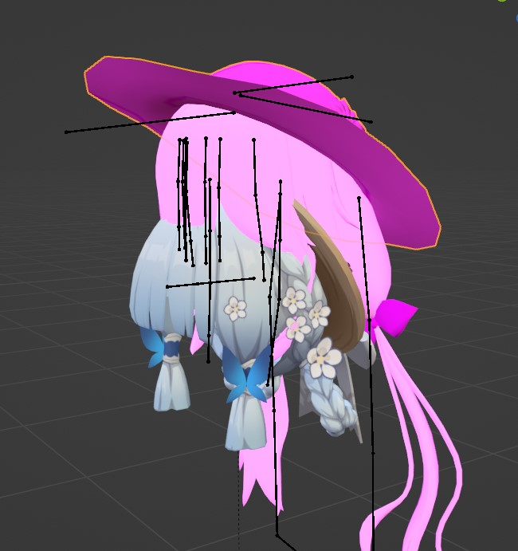

你可能会好奇明明我们只是做帽子，为什么要把所有 model 都导入呢？这是一个制作技巧，因为我们是移植 Mod，新模型都是从原本的一个整体模型上分离出来的，为了保证日后不要因此留下接缝，所有我们应该整体移动所有的新模型，因此后面对齐骨架时我们不仅要对齐帽子，包括头发这些也要同时对齐好。

### 2. 对齐至参考 Model

接着我们开始对齐新模型和参考模型，缩放移动都可以，只要记得所有头部模型整理调整就行，越是贴合参考模型，后续用插件自动复制权重时就会越准确。下图就是我调整后的结果，把两边的模型都尽可能的放在了一起。

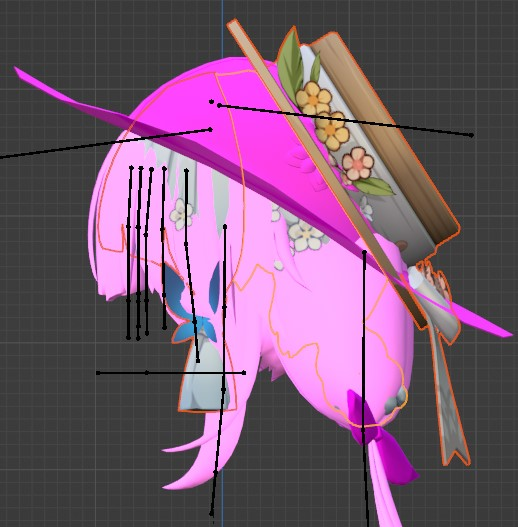

### 3. 重新绑定骨架

在身体制作环节，源模型的骨架对我们来说没有作用，现在我们要把新模型的骨架改为参考模型的骨架，这个应该算是 blender 基本操作了，我就不细说了，记得先把属于旧骨架的顶点组之类的无用数据都清除，这样可以减少模型大小。

### 4. 进行权重转移

接着最终要的一个环节来了，就是刷权重，真从头刷肯定累死，好在插件有功能让我们可以把参考模型的权重自动转移到我们的新模型上。权重转移的功能位置如下，只需要保证被转移模型和目标模型都在同一骨架下，接着先选被转移模型再选目标模型，即可使用该功能，虽然名字叫转移，但实际是起到复制的效果。

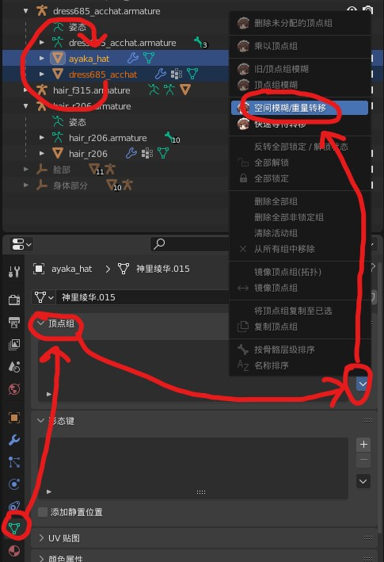

接着通过权重绘制模式我们就可以观察到我们的帽子新模型的权重已经被刷好了。

_介绍一个 blender 技巧，先选骨架再选模型，然后进入权重绘制模式，这时我们就可以通过“alt+鼠标左键”自由切换所要绘制权重的骨骼了_

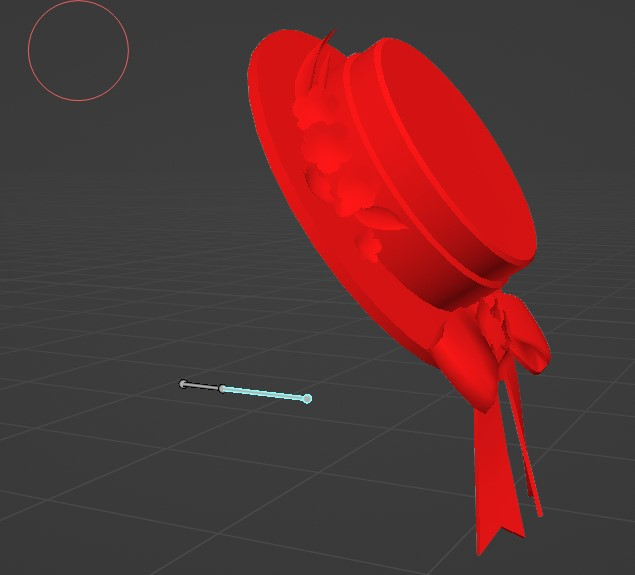

当然这是因为帽子的骨架较为简单，在更复杂的情况下，还有一些要点要注意：

1. 权重毕竟是自动计算的，多少都会有些不正确，所以通常权重转移后我们还会需要人工检查修补一下。
2. 查看权重后会发现部分骨骼是完全没有权重的，这是正常的，有部分骨骼确实不能用来刷权重，否则模型将无法导出，具体参考官方模型的权重刷取方式就行。

### 5. 通过 model 文件得出后续制作目标

这样子我们的 model 文件就基本做好了，但之前说过 model 和 mate 文件有关联关系，所以此时是不能直接导出 model 的，这也指引了我们的下一个步骤：制作 mate 文件。

## 三. 制作 mate 文件

现在开始制作 mate 文件，mate 文件的编辑位置在第二章也已说过，进入后可以发现，模型原本就已经自带了一些材质，但由于 shader 的不同，材质并不能直接通用，所以我们必须要进行些处理才能做出 mate 文件。

shader 功能就是下图“使用节点”中的内容，blender 默认的 shader 是“原理化 BSDF”，而我现在用的是之前 pmx 导入插件提供的“MMDShaderDev”，你可以在图中看到这一点。所以自然 COM3D2 的也有着自己的 shader 格式，我们必须将材质与之匹配才行。

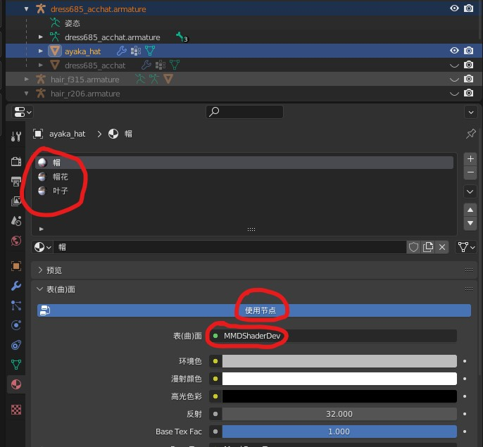

### 1. 整理原模型材质

虽然原模型材质并不能直接使用，但其上面的信息有助于告诉我们转换材质时的一些信息该如何填写。

1. 确定所用贴图  
   基本上我们只要注意颜色贴图就行，其他贴图可以不管，特别是对于这种卡通风格人物，很多阴影高光信息都会额外在颜色贴图上有所表示，所以通常一个颜色贴图就可以通吃了。  
   现在通过分析上图的材质，我们可以发现“帽”中用了贴图“体.png”，而“帽花”和“叶子”同用了另一张贴图“裙.png”  
   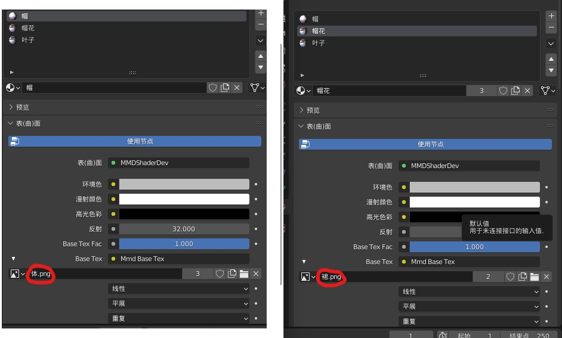

2. 确定透明方式  
   通过观察模型显示效果我们可以发现“帽”和“叶子”是不透明的，而“帽花”是半透明的，这将导致我们后面转换材质时要选择不同的选项。  
   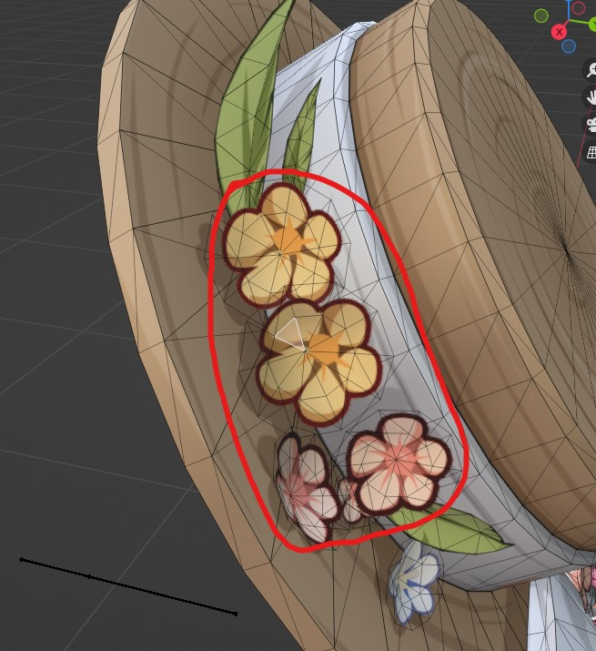

3. 简化材质  
   “帽”肯定是单独占一个材质了，因为他所用的贴图不同，但“叶子”如果选择使用透明材质，那就可以和“帽花”合并起来。第一章我们说过关于透明材质的一个风险问题（pmat 的起因），但考虑“叶子”空间占比不大且和“帽”之类的不透明物体较为贴合（因为不透明物体有深度信息，能起遮挡作用），所以可以选择直接偷懒和“帽花”共用，这样我们要做 mate 文件就缩减成两个了，实际合并后效果如下，显然并无太大影响。  
   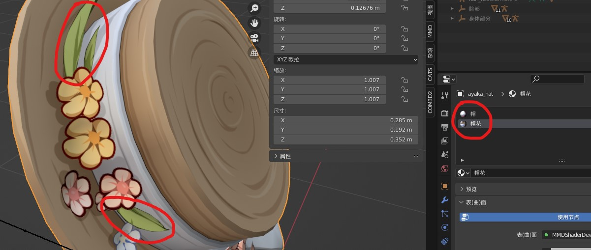

### 2. 转换材质至 COM3D2 格式

现在开始转换上述的“帽”和“帽花”材质，转换按钮就在下方，另外我还给这两个材质球按照之前的命名要求进行了改名，便于我们后续导出 mate 文件。  
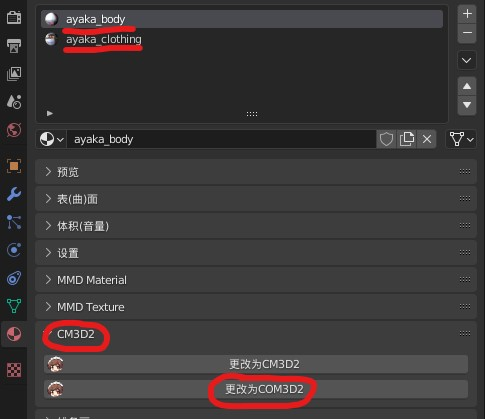

可转换到 COM3D2 材质类型有多种（如下图），但还是那句话，我自己也搞不清这些具体都是干啥的，只能给出一些我个人的经验之谈。

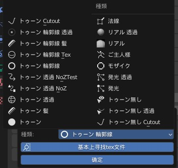

- 右侧“种类”栏：  
  可以直接无视，这些都是一些特效材质，我们的普通装扮并不需要。
- 左侧栏：  
  可以观察到这一栏的材质全是相同的日语前缀，这句日语是一种卡通风格的名称，显然这些就是我们卡通人物最常用的材质。
- 带“NoZ”：  
  不要用这种，Z 是深度意思，正常材质都需要深度信息，所以这材质也只有一些特效会使用，我们不需要。
- 带“轮廓线”：  
  这会给模型额外加一圈描边效果，这个效果倒是看个人喜好，真正的重点是这个材质提供双面效果，给模型背面也加上颜色，如果是单面的衣服，用这个会比较方便。
- 带“透过”：  
  带了就是启用半透明效果，没有就是不透明，用半透明就会出现 pmat 的问题，所以如无必要优先使用不透明。
- 带“Cutout”：  
  一种特殊的半透明效果，正常透明一般根据阿尔法值可实现渐变透明，而这个就是完全无法渐变，它通过比较设定的阈值使表面要么完全透明要么完全不透明，适合于如树叶，布料之类的效果。
- 其他：  
  抱歉剩下的我也没玩过，或者没看出啥名堂。还是那句话多一事不如少一事，当然如果有兴趣，你可以自行研究。

_因为 COM3D2 是使用 Unity 开发，所以上述的很多材质类型包括后续的一些参数都和 Unity 中有所关联，这也是为什么我会知道这些，下方是他们所在 Unity 开发手册中的内容，包括 pmat 问题，手册也有提到。_

_关于深度测试：_  
<https://docs.unity.cn/cn/2019.4/Manual/SL-CullAndDepth.html>

_关于材质类型：_  
<https://docs.unity.cn/cn/2019.4/Manual/StandardShaderMaterialParameterRenderingMode.html>

#### 实战结果

根据上述说明我们可以就正式将我们的材质转换成合适的 COM3D2 格式了：

- “ayaka_body”转化为“轮廓线”材质（用于启用双面以解决单面衣服背面不显示的问题）
- “ayaka_clothing”转换为“透过”材质（不使用轮廓线，是防止双面效果加剧 pmat 的问题）

#### 3. 填写 COM3D2 材质参数

COM3D2 的材质中有多个参数可用，不同的材质间参数也会有些许差异，但不用害怕，基本上大部分参数插件都会自动帮我们填好默认值，我们只要改动我们需要的地方就行，这里我使用“ayaka_body”材质做示范，“ayaka_clothing”同理即可。

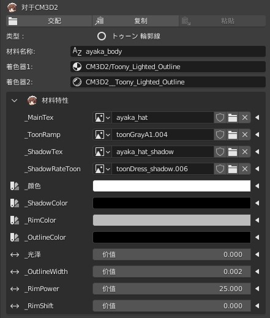

- 从整体来看的前三项：  
  这部分是“名称”、“着色器”信息：“名称”根据之前我们的材质命名此处插件已经自动填好了；“着色器”也是根据之前我们选择的着色器类型由插件自动填写的，所以着三项内容都不需要动。

- 材料特性中的前四项：  
  可以看到前四项是图片参数，这意味着会关联到其他外部文件，因此这部分必须确保无误。通过插件填好的默认值，我们能从中看出一些端倪：比如带“ayaka”前缀的显然是我们自己的文件，所以需要我们按其准备；其余文件通过数字后缀我们可以看出同名纹理已被重复创建了多次，显然这是一个公共纹理，所以我们只要把它的名称修复好就行。  
  其中“\_MainTex”是颜色贴图的意思，这个贴图原模型已经提供给我们了，身体加衣装的贴图共两张；“\_ShadowTex”是阴影贴图，这个我们没有，但我之前说过，很多卡通风格贴图，光照阴影这些往往在颜色贴图上也会有所表示，所以我们可以直接通过颜色贴图代替实现。

- 剩下的其他项：  
  这些都是存在材质中的内置参数，不需要我们额外准备什么，所以为了省事我们不动它们，直接使用默认值就行。如果你想尝试修改，通过名称也能看出些其作用，比如“OutLine”是轮廓线的意思，那显然“\_OutlineColor”就是轮廓线颜色，“\_OutlineWidh”就是轮廓线宽度。

#### 实战结果

根据上述解析，我们对转换后的材质进行修改，结果如下（遵照命名要求纹理的名称被我从原来的“体”改成了“ayaka_body”）：

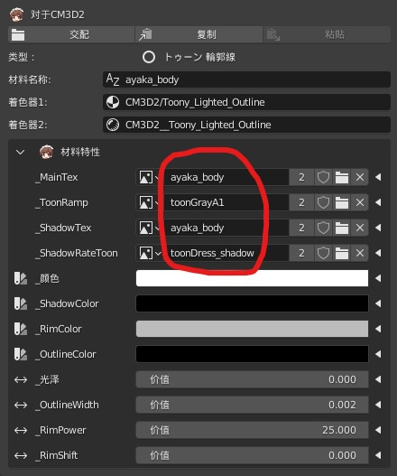

#### 4. 通过 mate 文件得出后续制作目标

这样子我们的 mate 文件也做好了，但其中对贴图的引用，又指向了我们的下一个目标，tex 文件的制作。

## 四. 制作 tex 文件

因为 tex 是纯图片，不存在后续引用文件，所有说总算到了最后一个文件制作环节了，制作也很简单，使用“TexTool.exe”直接转换即可。通过上述的环节我们共获知需要制作三个 tex 文件。

- ayaka_body.tex：  
  由于贴图已经由原模型提供了，所以我们直接将其转换然后改个名即可。
- ayaka_clothing.tex：  
  上一节我省略了“ayaka_clothing”材质的转换过程，但不代表你可以不做，既然 model 需要两个材质那我们都要准备好，这个纹理就是另一个省略材质中所用的贴图。
- ayaka.tex：  
  图标文件要我们自己制作一下，具体看个人喜好，我是选择直接用立绘裁张大头照，然后转换就行。

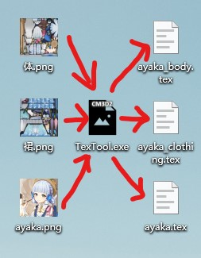

## 七. 导出帽子 Mod 文件

现在将我们上面做的所有文件进行导出，导出方式我在上一章已有简述，**有一点要说的是导出 model 文件时可千万别忘了应用变换，不归零的话导出到游戏后可能会出现错位拉伸等问题**，具体导出后是以下这些文件：

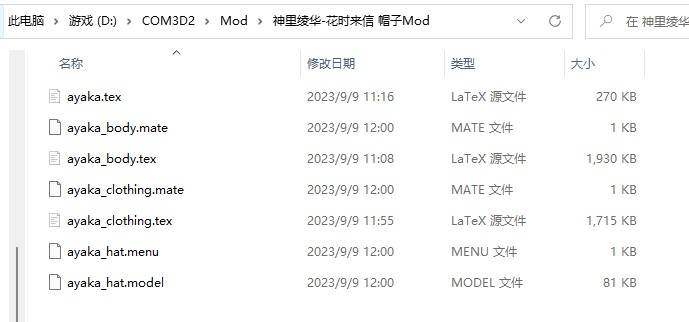

- 一个 menu：帽子装扮菜单项。
- 一个 model：帽子模型。
- ~~两个 mate：帽子模型用到两个材质。~~（**后来我才发现这两个根本不用导，model里已经包含mate文件，单独导mate是没有用的**）
- 三个 tex：其中两个是材质所用贴图，另一个是菜单图标。

现在让我们将上述文件放入 COM3D2 游戏的 Mod 文件夹中，启动游戏，编辑女仆（**如果游戏已启动，则需要使用重载插件，相关插件在第二章已说明，每次添加新文件都必须使用重载功能**）......恭喜你！你成功做出了第一件 Mod。

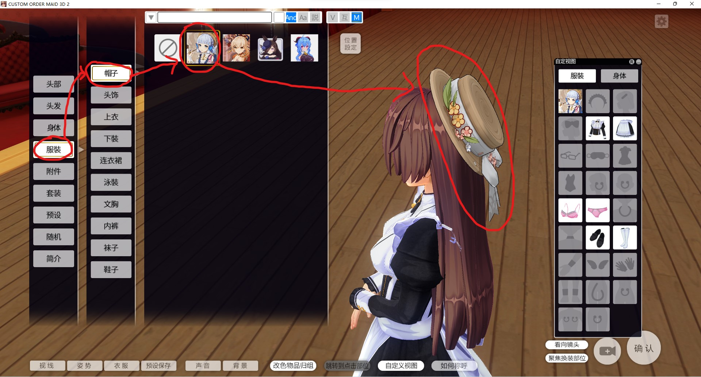

## 八. 完善帽子 Mod

话说你发现上图的一个问题了吗？原本在背后的叶子出现在了帽花的前方，结果我们还是触发了 pmat 问题啊。不过教程写完后我才发现这个问题，那就在最后一步处理吧。现在让我们看看如何解决这个问题？

- 使用 pmat 调整渲染顺序：  
  麻烦且不是第一期实战教学的内容，更关键的是这种方法，根本没法解决前后两种方向都能观察时的渲染顺序问题，所以无法使用。
- 不在材质球上偷懒，还是将叶子单独分配一个不透明材质：  
  推荐，实际上最后做完你就会发现这些材质基本也都是需要做的，那不如这次顺带把它做好了。

所以我重新添加了一个新材质，为了区分新旧材质，将旧的“ayaka_clothing”材质名增加了个符合其特征的后缀，改为了“ayaka_clothing_trans”，并将叶子和帽花模型所有的材质进行重设，结果如下：  
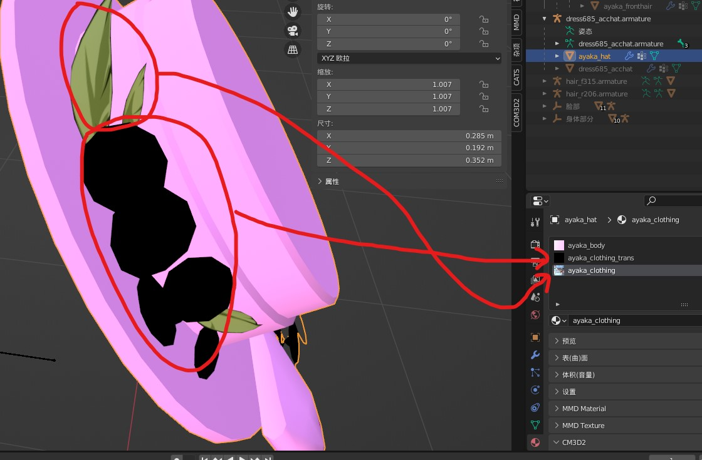

最后重新导出帽子的 model 文件和相关 mate 文件到游戏 Mod 文件夹，在游戏中重载 Mod 并重新装扮帽子，可见问题成功解决了：  
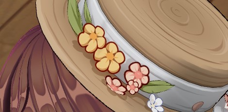
