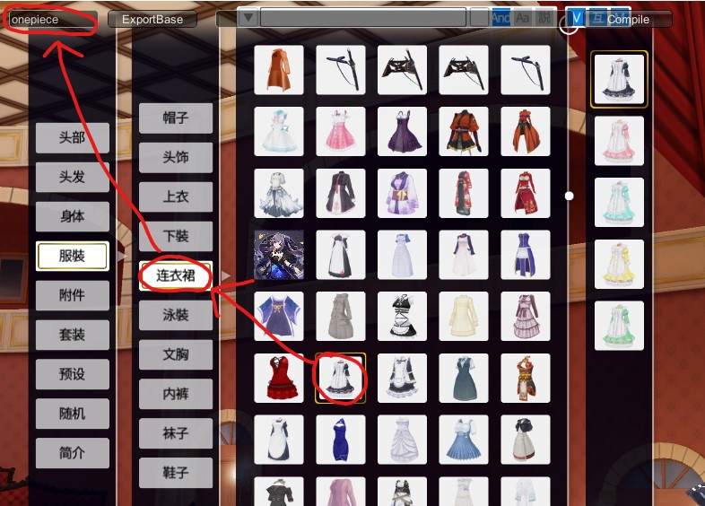

# 【COM3D2Mod 制作教程（7）】实战！制作衣服部分（上）

## 教程介绍

隔了 N 个月终于迎来了第二期的 Mod 教程部分，这一期我们将开始制作人物的衣服部分。

因为体型适配的原因，衣服部分要比身体部分难得多，但主要也就是多了个刷权重和制作形态键的任务，只要掌握技巧，勤加练习，做起来也不会太难。

由于大量步骤和身体部分相同，这期教程的内容会有所简化，所以一定要先把前置的第一期学好，只要理解了 Mod 的制作原理，哪怕不看教程，自己也能举一反三。

## 确定目标

本期教程将使用三种装扮类型作为教学内容：“裙子”、“袜子”、“鞋子”，这三者是人物的外衣，是最能体现人物的装扮，同时对应着几种不同的制作方向，作为教程内容再适合不过了。


- 裙子：

  裙子是特征点最多的衣物，并且往往还会附带配饰，要绑定的骨骼和形态键也是最多的，所以要在权重和形态键的制作上要下功夫。

- 袜子：

  袜子由于和鞋子相连，通常无法得到完整的原始模型，但因为都长得都差不多，我们可以利用这一点，直接使用示例模型加改贴图的方式实现。

- 鞋子：

  鞋子通常是从袜子上拆出来了，加上游戏对高跟鞋不兼容，鞋子需要额外的一些建模处理，不过因为鞋子模型比较简单又是对称的，所以可以自己改模。

_为啥是袜子而不是裤子，首先我们没法获取到袜子模型（腿部模型只有一层，看成裤子就没袜子了），另外从游戏内看裤子模型比袜子模型更复杂，大部分源模型的特征也更接近袜子（穿裙子后谁还穿正经裤子啊，结果不是黑丝就是白丝）_。

## 导入官方身体模型

在头发部分我们确定模型是否正确的方式是：直接导入游戏，对照游戏进行修改，再重导再测试。这种方式对简单的模型来说还能接受，但对复杂的衣服部分就不再适用了。

而且除了刷权重，衣服部分还多了制作形态键，确认身体部位等工作，所以我们必须要获取官方身体的相关数据才行。

### 1. 获取身体模型

幸运的是官方身体也是 Mod 的一种，我们可以在“SybarisArcEditor”中搜索 body 来获取到官方的身体模型，或者我在之前的“Mod 制作工具”整合中也留了一份。

和正常的 Mod 一样，我们将 model 文件导入到 Blender 即可。


### 2. 调整身体姿势

可以看到身体模型的默认姿势成 C 型的扭曲状，这种姿势适合查看人物的肌肉表现效果，但并不适合我们绘制权重和调整网格，所以我们必须先将身体姿势调整为易于使用的 T 型姿势。

因为之前有网友给我提供了 T 型姿势的动画文件，所以我们不需要再手动调整了。选中我们的身体，然后利用“Blender-CM3D2-Converter”插件导入动画的功能，导入“Mod 制作工具”（第三章给出的工具整合包）中的 T 型姿势文件即可。

注意，插件导入动画的功能只会调整你在姿势模式中选中的骨骼，所以如果通过上述方法导入姿势后，实际姿势没有发生变化或只有部分变化，那可能是因为你没有在姿势模式下选择全部骨骼。


### 3. 增加导出姿势

现在我们已经有了 T 型身体，但要注意的是原先官方默认的姿势是 C 型的，这意味着我们导出 Mod 时也必须保持 C 型，幸运的是插件提供了自定义姿势与默认姿势切换的功能。

让我们进入姿势模式，在确保当前身体姿势是 T 型的情况下，使用“姿势-应用-当前姿势的身体”菜单项，稍等片刻后，在骨架面板便会多出两种姿势切换的对应按钮。


**上述的处理流程不仅对身体生效，因为我们制作 Mod 时要用到官方示例 Mod，所以同样要对示例 Mod 的模型处理一边，之后我们将采用 T 型制作，C 型导出的方式，进行 Mod 开发。**

## 制作裙子 Mod

现在让我们正式进入教学内容，根据身体部分的制作经验，此时你应该知道如何预处理模型，以及导入官方示例模型了，所以我将跳过这部分，假定你已经拆好了模型，并准备好了官方示例模型。

和以往的帽子 Mod 之类不同的是，这次我们先制作裙子 Mod 的 model 文件，最后再制作 menu 文件，因为 menu 文件的部分参数必须要根据具体的模型情况填写。

### 一、制作 model 文件

model 文件是制作最为复杂的文件，我将挨个写出我的制作流程，并将该流程中的一些注意事项或技巧写在下面。

#### 1. 匹配模型姿态体型

源模型和身体模型在姿态和体型上一般都有所差别，首先我们要减少这些差异。这一步可以不处理太细致穿模问题，但要保证两模型基本相符。良好的初始状态有利于我们后续的制作，现在做越贴合后面进一步的细节调整就越少。

在这一步我们选择利用源模型本身骨架进行模型调节，调节完后应用骨架修改器完成网格编辑，因为本身就是按身体结构绑定的，所以当我们想调整特定身体部位时会很方便，这样子对齐模型的效果又快又好。

##### 提示

- 对于部分骨骼可以先在编辑模式中进行拆分再使用，从而避免影响到子骨骼。
- 匹配时建议稍微往外偏一些，这样可以减少穿模发生的概率，但也别偏多。
- 如果发现骨骼调不动，可以确认一下变换属性是不是被锁上了。
- **留意胸部、裙子等区域是否和示例 Mod 的骨骼匹配，不然会影响后续的权重刷取。**

##### 示例

和身体以及裙子进行了匹配，~~裙子确保在示例模型的外面~~（做完了才发现错了，和示例模型的裙子差不多最好，不然前面的裙子和手会穿模，好在最后用衰减编辑救了下）；身体部分略有穿模，后续简单调一下网格即可。


#### 2. 匹配模型面大小

移植 Mod 的源模型大多是一些游戏模型，面的精度较低，做出的蒙皮网格容易出现穿模的情况，提高面数可以方便解决这一问题，而且还可以提高权重、形态键转移的精度。

所以源模型和示例模型的面大小应尽可能匹配，可以更精细，但一定不能少，对于一些特殊部位还可以根据情况再加面

##### 示例

利用边的细分功能，我在不影响模型形状的情况下将源模型的面精度增加了一倍，从而使得源模型和示例模型的面大小基本匹配。


#### 3. 解决模型穿模问题

现在我们的模型与示例模型基本一致，即将进入骨骼绑定阶段。但对比身体模型，仍有部分穿模情况，我们需要调整网格解决这些。

##### 提示

- 适时调整身体模型的视图显示方式，便于对比或选点。
- 先选身体模型再选源模型编辑，这样身体模型将有特殊的颜色标记，便于区分。
- 打开显示叠加层中的线框，方便查看顶点位置。
- 利用雕刻模式调整网格。
- 利用选择菜单、顶点组、隐藏等功能调整网格选区。
- 利用法向坐标系、变换轴心点、法向缩放工具调整网格。
- 利用衰减编辑来调整网格，这样可以批量处理且效果也更平滑。
- 利用平滑顶点功能修复调整后网格可能过尖锐的问题。
- **上述方法不仅是该阶段，后续的所有网格处理都可使用。**

##### 示例

利用上述提示中的方法，我轻松解决了穿模问题。


#### 4. 制作骨骼权重

现在模型已完美贴合在身体模型上，直接利用之前的“权重转移”功能，进行我们的初始权重刷取。

但自动刷取的权重肯定是不完美的，我们要按具体情况进一步优化。

接着借助身体模型确认不会发生穿模。

##### 提示

- 将身体和源模型所用骨架共用为衣服骨架，并调整衣服骨架姿势，检修穿模情况。
- 检查衣服上的装饰，确保符合其物理性质。
- 利用“权重”菜单中的处理功能调整权重，如快速实现权重区域扩大平滑，**注意这些处理功能默认是对全部骨骼处理**。
- 利用直接编辑“顶点组”的方式调整权重，如快速移除错误权重区域。
- 将骨架修改器的罩体和编辑模式显示打开，继续利用“解决模型穿模问题”环节的方式解决穿模。
- **犄角旮旯的地方优先通过调整顶点位置来解决穿模，否则选择自己刷权重可能适得其反。**
- 增大骨骼间公共的权重区域可以有效解决过渡生硬的问题。
- **想重算或专门绘制部分区域的权重时，可分离物体再编辑然后合并或借助数据传递修改器实现。**

##### 示例

1. 我先用权重转移获得了初始权重，然后给骨架摆些检查姿势，进行二次穿模解决。
2. 胸部权重稍微人工画了下，因为初始权重把胸部前端识别偏了。
3. 胸部和腰部的权重都用“光滑”功能扩展了下范围，这样和胸部交界处能平滑些。
4. 肩部的丝巾和腰后的蝴蝶结手动调了下权重，并通过编辑顶点组移除了一些骨骼权重，使其符合物理性质。
5. 脖子加强了对应骨骼的权重，去除了其他骨骼对其的影响，使其完全跟着脖子骨骼动，从而解决穿模。
6. 腋下顶点通过沿法线偏移的方式大幅扩大范围来防止穿模，附近骨骼权重仅做了些平滑处理。

   这是我写完教程后补上的环节，当时摆姿势看不出来，结果一跳舞就穿模，检查起来太麻烦了。

   原先是先尝试调的权重，结果调了一整晚都没调好，甚至更差了，所以最后选择了调顶点的方式来解决，这样效果好些，做也简单。

   而为了还原到旧的权重，我复制了份模型，重新运行了转移权重，再通过数据传递修改器还原了腋下附近骨骼的权重，之后就如该条所说的，通过调整顶点来解决穿模了。

7. 修复其他杂七杂八的穿模，基本用雕刻模式画一遍即可。


#### 6. 制作形态键

形态键和绑骨非常类似，并且插件也支持形态键的转移功能，所以我们可以先用插件制作初始的形态键。

但同样，自动形态键也是不能直接用的，部分可能还得自己重做。

最后一样利用身体模型检验结果，并且要混合绑骨效果进一步检查。

##### 提示

- 前两个环节的很多提示在该环节也适用。
- 注意确定选的是要编辑的形态键，别做完发现搞错形态键或搞到基态上去了。
- 可以把形态键有问题的部分分离出来单独做，然后再合并回去，特别是一些装饰品。
- 衰减编辑不仅是用于平滑调整的工具，还可以让我们拉出特定形状，做胸部很实用。
- 胸下垂的形态键在胸大小形态键的基础上制作会更方便，此时可以打开形态键编辑模式选项。
- 如果怕麻烦，部分形态键可不做或不百分百匹配，但这也会导致可适配的体型变少。

##### 示例

上半身形态键就 5 个，一个凹陷效果的形态键我感觉对衣服没用就没做，肚子和手臂的形态键用自动转移的改改就 OK 了，胸部形态键用衰减编辑自己做了下，身上的金属挂饰拆下来单独做了形态键。

最后再组合一下权重和多形态键，大致处理了下穿模问题，还是有部分穿模但想着触发概率较低，就不搞那么严格了。


### 二、制作 mate 文件

哎，我又犯了个错误，在过去的教学中我声称 mate 和 model 是引用关系，然而我现在才发现实际上它们是包含关系，model 文件中包含了 mate 文件的信息，这也解释了以往修改 mate 文件后还得重导 model 的原因。

这样一来的话，因为我们没有中途变更材质的需求，所以可以完全不导出 mate 文件，这样可以省下很多时间，而且因为 mate 的使用成本就此下降，我们可以更加自由的使用 mate 来为每件装扮做出定制化的效果。

所以从新的视角来看，mate 文件不再是工作负担，而将是我们用于简化美化 Mod 开发的便利工具，例如以下几种常见用法：

- 利用半透明效果消除人物皮肤

  我们做的是衣服，但源模型是连带人体部分的，所以做出来衣服上会带有皮肤，显然这是不应该出现的。所以我们要使用半透明类材质，接着改贴图，使皮肤部分透明度为 0，即可消除。

  但注意半透明类材质有 pmat 问题，如果多个半透明材质叠加就可能需要制作额外的 pmat 文件。

  或者你也可以故意留着，这样可以帮你遮挡因为 Node

- 解决衣服单面导致背面不可见的问题

  这个我之前也有说过，只要利用轮廓线类材质的双面特性，就可以让模型背面也能显示出颜色。

  但注意双面衣服就不要使用了，因为两个面间距过小可能导致背面效果穿模，从而产生异常的黑斑。

- 解决衣服拐角处角度过大导致高光的问题

  默认材质会在模型边缘添加高光效果，而拐角处的权重比较难刷，容易出现不平滑导致误识别为边缘的情况，这是可以通过直接修改材质中的“\_RimColor”属性，降低高光亮度，这样玩家看到的差异感会小很多。

- 多类材质混合使用

  一个 model 是可以同时使用多个材质的，所以可以根据面的不同情况使用不同的材质，比如部分区域半透明，配饰加上轮廓线等。

  因为 mate 文件不再需要手动导出，所以可以放心搭配，利用这种方式甚至可以解决 pmat 的问题，因为半透明材质将不再被滥用。

#### 示例

1. 裙子自带正反面，所以没有双面问题，不需要用轮廓线材质。
2. 裙子背面根据源材质情况，用的半透明材质。没有编写 pmat 文件，因为虽然面积较大，但有不透明的裙子正面做遮挡。
3. 其他部位就是正常的颜色贴图，但修改了下高光亮度，解决腋下等部位的因不平滑而高亮的问题。
4. 胸上的皮肤部分和裙子背面可以共用贴图，所以也共用了透明材质，后续再将贴图的皮肤部分扣掉，隐藏显示。


### 三、制作 tex 文件

虽然 mate 文件不再需要导出，但所使用 tex 文件还是需要的，但 tex 文件基本就那几个，导出也很简单，甚至在制作身体部分时可能就已经把所需的 tex 都导好了。

我们目前所用的两张贴图之前已经导出过了，只有一个衣服贴图要把皮肤扣一下，可以直接用 Blender 的绘图工具扣，扣完重导一下就行。


### 四、制作 menu 文件

终于解决 model 文件了，现在让我们观察一下示例 Mod 的 menu 文件......

前面的部分基本上和之前的帽子 Mod 等一样，但后面较多的出现了些新的带 Item 和 Node 的菜单项。


#### 认识关键词

首先让我补充一些有关 Item 和 Node 的知识点，这两个关键词其实都有着明确的特殊含义，很有必要认识它们。

- **Item**

  > 代表装扮部件，如：头发、上衣、鞋子。

  装扮部件很容易理解，因为我们现在就是做装扮部件，玩家使用的也是装扮部件，每一次都必须要带的条目“Add Item”就是把指定模型设置为装扮部件的意思。

  如何知道想要的 Item 所对应的部件名？我们可以利用之前说过的“M-O-D”快捷键打开的信息面板查看，比如下图就可以判断出“连衣裙”的部件名即“onepiece”

  

- **Node**

  > 代表身体部位，如：颈椎、胸部、脚趾。

  Node 在游戏中没有直接的查看方式，但从原理上讲它是通过识别骨骼名称和权重实现的，如控制胸部有专门的骨骼，而它的这些骨骼所会影响的顶点构成的面就将被认为是胸部范围。

  所以如果想知道一个 Node 的具体名称和范围，只需要在 Blender 中查看相关骨骼的名称及其顶点组即可：

  

#### 对应的新增条目

了解了这些知识后再回头看 menu 文件，很多条目就能看懂了，且在衣服部分的制作中，我们也将经常用到这些条目。

- **Mask Item**

  > 隐藏目标装扮部件。

  衣服是一层一层穿上的，当穿上外套时内衣自然就会不可见，而这个菜单项就是用来实现这个效果的，通常我们也不需要调节这个项，因为示例 Mod 的菜单项一般都够用。

- **Node Hide/Display**

  > 目标部位及其子部位标记隐藏/显示。

  我们的衣服要做的贴合身体，但贴合又会容易导致穿模的发生，而该项可以将目标身体部位变的不可见，这样就能从根本上解决部分身体部位的穿模问题，可以说是非常实用的一项功能。

  **但注意该项在用法上还比较特别，首先它的作用范围不仅是目标部位还包括它的子部位，而且名为标记的作用方式也很可疑。**

  - 什么叫子部位？

    了解 Node 的含义后可以容易的想到骨骼的层级关系，没用错，目标部位的子部位其实就是目标部位所对应骨骼的子骨骼范围而已。

    

  - 什么叫标记？

    标记意味着这项功能不会立即生效，而是记录一个信息，表示在之后的某个时间要把该部位隐藏/显示。这种延迟的特性使得标记在真正生效前能够被多次修改，这样我们就可以利用多个“Node Display”和“Node Hide”联动，抵消子部位的隐藏。

  - 其他细节

    - 填写 Node 名称时只要包含关键词即可，这样我们便可以只用一个 Node 同时作用两边的部位。
    - 身体部位默认显示，结算时只负责隐藏，所以如果一个区域同时被多根骨骼影响，优先隐藏。

#### 示例

裙子的 menu 文件中除去上述的几项外，因为有了之前的 Mod 制作经验，我想你应该都会填写了，那这谈到的几项该如何填呢？

- **Mask Item**

  首先“Mask Item”我们基本用示例 Mod 自带的就好，因为裙子都是差不多的，所以需要隐藏的东西也差不多，比如一样都要隐藏内衣这些，除非你做的是半透明的衣服。

  这次我们的模型是常见的裙子款式，所以“Mask Item”直接使用了示例参数。

- **Node Hide/Display**

  再者“Node Hide/Display”则需要我们手动填一下，因为我们的模型不像官方模型有严格的部位遮蔽标准，所以要根据实际的能覆盖的身体部位进行隐藏。

  不过暂时不想处理这个，因为主要还是为防穿模准备的，如果不穿模可以不弄，所以先继续用默认值，后续再看。

### 五、完善裙子 Mod

最后我们将上述制作的文件导入到我们的游戏中，由于有些文件被简化或已被制作过，结果裙子 Mod 就只多了个 model 和 menu 文件，重导了张 tex 文件而已。

穿上衣服摆几个姿势，确认一下 Mod 没有问题......果然有问题啊。


1. 手穿到裙子里了

   之前做模型匹配时我故意把裙子做在了示例 Mod 外面，因为放里面会导致腿穿模，结果现在发现放外面也不行，会手穿模。( ╯□╰ )

   解决方法就是把裙子的前面部分用衰减编辑往后拉一些，确保和示例裙子差不多位置，即恰好互相穿模，不能多太多。

   

2. 背后的飘带不见了

   发现因为飘带没有自带正反面模型，解决方法就是给它单独设置了一个轮廓线材质，这样我不需要建模，处理起来比较简单。另外为了和衣服匹配，将它的轮廓线宽度设为了 0，只要双面效果，背面的颜色也没用默认值。

   

3. 部分人物身体破面

   因为这部分利用“Hide Node”隐藏了，而我们的模型又不能完全遮盖这个区域，解决方法就是让这个部位显示，即去掉对应的“Hide Node”。

   看了下肚子和脖子下都是会破面的，所以这些部分不再隐藏，只隐藏了手臂和胸部，手臂靠肩和手的区域也不能隐藏，胸部的上半也是。

   ```text
   //新编写的菜单项及其内容如下

   node消去 Mune //隐藏整个胸部
   node消去 UpperArm //隐藏整个手臂
   node表示 Hand //取消手的隐藏
   node表示 Foretwist_ //取消手腕的隐藏
   node表示 Uppertwist_ //取消肩膀的隐藏
   node表示 Mune_L_sub //取消左上半胸的隐藏
   node表示 Mune_R_sub //取消右上半胸的隐藏

   //Mune_L_sub是Mune的子部位，所以标记隐藏时会连带。但Mune_L_sub是全部胸部，而我们只要Mnue代表的上半胸，所以后面要取消Mune_L_sub的隐藏，其他取消隐藏的部位基本也是同样原因。

   //大部分部位可以利用模糊匹配的规则，不需要名称写全，但Mune_L_sub等因为L和R的区别恰好卡在文字中间，所以只能分别写明。
   ```

4. 肚子上有一条缝

   图上看不出来，但通过摆姿势时看到了，原因是模型预处理没做好，那个地方是断面。利用“网格-合并”功能融并了两边的顶点来解决了，很庆幸这功能没有影响到形态键这些。

5. 部分权重不自然和少许穿模

   用之前的制作方法继续完善即可。

6. 在大体型中衣服扭曲

   说明权重或者形态键没做好，当时只想着别穿模，却忘了考虑衣服的线条布局是否正确。

   嘛，这个就不管了，反正我更喜欢幼的~(￣ ▽ ￣)~\*

### 六、完成裙子 Mod 制作

其他就基本没啥问题了，把上述这些小问题修好后，我宣布“衣服部分最难的裙子 Mod 制作成功！”

太棒了，差点一命通关，我甚至感觉时间还能缩，踩完了坑，掌握了技巧，做起来真的好简单。\\^o^/


