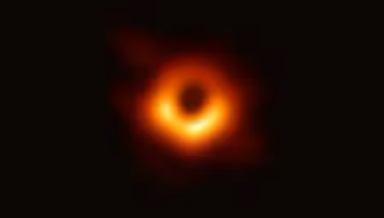
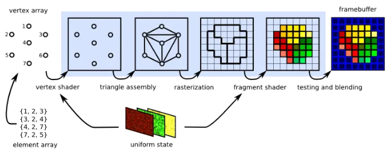
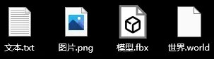

# 【杂谈】关于我对数学和世界的感悟

前段时间中二病犯了，突发奇想了些个人感悟，这波总算趁着过年时间把病发完了。

别看标题有数学，放心，全文不用计算任何公式，很多前置知识还配有科普小视频，阅读起来毫无难度，除了写的乱七八糟外。

（高端的我也写不出来啊\_(:з)∠)\_）。

---

## 引入

“你听说过牛顿分形吗？”

“哎，没有吗？”

“那，不妨我们先来玩一个游戏吧。”

我这有三只不同颜色的笔，请用它们帮我在张空白的纸上作画，题目的要求是，能让我在纸上任意圈个圆圈都能圈到且只能圈到一种颜色或三种颜色。

你随意搭配着三种颜色，迅速涂满了白纸，这下圈哪都能有一种颜色了。但等等，我将圈画在两种颜色的交界处，“你看这里有两种颜色，而非只有一种或三种。”，“这不简单。”，你立即在我圈中的范围内画上了第三种颜色，并立即对所有的两两相交的颜色边界上涂上了一道细细的用第三种颜色画出的线。我没有停止游戏，而拿出放大镜，在刚刚涂上的线的一端又确定了新的范围，虽然很困难，但手巧的你任然接下了挑战，在旧线的两端画上了更细更细的新线。你两手叉腰，沾沾自喜的看着我，似乎在宣告着游戏的结束，直到......我从身后默默掏出了一台显微镜。

你怒斥我是作弊，表示游戏无法胜利，白纸上的颜色，永远都有交际，补上一道缝隙，又显两条边线，我叫你不要着急，有公式可以解题。（rap 起来了哈哈）



## 正文

咳咳，先让我们将时空转换到现实，开始进入正题部分。

某天工作时间，我正在编写一个能够随机生成噪波图的功能，而我的同事被我通过将时间做偏移，多次迭代来产生随机数的方式引起了兴趣，我兴奋的向他分享有关混沌与分形的奇妙，可惜我口才不佳，加之时间久远，描述的那是不知所云。虽然最后未能引起他的共鸣，但却让我深深陷入了回忆。



### 数学可以感知世界

回家的路上，天空飘起的小雨打湿了我的眼镜，原先路边昏暗的灯光透过粘上水滴的镜片，变成了一片片五颜六色的光晕，层层叠加映入我的眼眸，如此景象不由的让我回忆起记忆中的牛顿分形。

若说不断在交界处画小圈是符合游戏规则的话，那同样的，在小圈里不断画上三种颜色也一样奏效，两股力量互不相让，结果就导致了分形的发生。当然，学完泰勒展开式后，我已知晓有限和无限其实是可以相互的转换的，因而对于牛顿分形表现出的结果，其实也并无神奇之处。

虽然不是什么卡 BUG 的产物，但要论喜感，和其他那些克苏鲁风格的分形相比，牛顿分形绝对是第一名。看着牛顿分形就好似让我看到一个孩童，为了完成老师布置的根本不可能完成的作业，拆东墙补西墙，转头发现东墙坏了，又去拆了西墙，搞到最后只得不断的贴上一层又一层的画片。在此之前，我从未见过世界会像今天一样出戏，真是太可爱了啊。不得不感概，数学的力量是真的强大，如此稀奇古怪的东西，居然也可以用公式所表示，并证明出其的存在。

以此类推，那数学是否也可以表示出其他类似的特殊事物，即使它们闻所未闻？

我立即想到了一个非常符合的故事，黑洞最开始不就是先由数学公式推到得出的吗？最早在 18 世纪末就开始有人预言，算来到今天黑洞照片的问世，竟早了 200 多年，那么与此类似的大量天体类型，甚至像引力波这种连实体都没有的东西，等等全部都是先由公式带出结果，再出仪器实际验证，而且无一例外的都得到证实。只能呆在地球上依靠薄弱五官的人类，有太多太多无法感知的东西，但数学却能无一例外精准的描绘出来，充当了人类的第六感，而这份力量甚至可以超越时间空间，乃至形体的限制。

我能感受到我心中的某样东西发生了不可逆转巨变。我意识到我必须要开始重新审视数学。回家坐在沙发上，我根本无法平静。一直以来我都不过把数学当做一个相对通用的工具，理科的垫脚石而已，但现在我忽然发现平时常出现在菜市场的它，背后似乎隐藏着整个世界的秘密，其所蕴含的力量，意义皆不可估量，若一定要用言语去形容，那我只能回答：∞。

### 数学可以描绘世界

我并没有很高的知识水平，因而我开始尝试用数学去审视更贴近于我的事物。我开始好奇既然数学连天体和规则都能表示，那对于我周围的环境事物是否也有同样的效果。我回想起之前向我的表妹介绍建模软件基础知识的时候，以及向她解释点线面是如何从一个个向量通过渲染管线最终呈现到屏幕上。这每一步都是通过数学公式在解析，从简单但难以理解的数学量一步一步到宏伟且直观明了的 3 画面。那反过来岂不也可以将我的目之所及全部转化为一道道数学公式？我开始构思，逆推，化简.;....“等等，这不是就高数第一章的空间解析几何吗？”，以此类推高中的平面几何，初中的三角形，圆面积公式，小学的物体数量温度描述.......哈哈，原来很早很早，我们就已经开始尝试用数学描述世界了，只可惜今天我才如此清晰深刻的意识到这点。

小的时候，我还没有觉醒现在这种一口气讲一堆废话的能力，写作文一直都是我的一大痛处，费劲心事才勉强把字数凑够，但光靠数量还不够，我无法精准描述老师需要的内容。大戏剧家莎士比亚曾说过：“一千个观众眼中有一千个哈姆雷特。”，这既是文学的浪漫，也是文学的缺陷，人与人的交流总是会不可避免的丢失部分信息，对于要精准描述整个世界这样宏大的任务，唯有数学可以选择。将世界的一切化为一个个公式，像写作文一样填在一张无比巨大的纸上，而我只需分享这张纸，任何人便都可以从中无损的描绘出整个世界，这就好比计算机中的人们用来传递各种数据的资源文件一样。

### 数学可以揭秘世界

以此为原理，我脑中开始畅想另一个世界的模样。我虽未见过四维空间，但我知道二维三维的公式，并以此可以推出四维世界的一隅。我兴奋的把公式写在纸上，但一切不像猜想的那样顺利，我失败了，我完全无法解析这张”.world“文件。我知道它的属性，并拥有着当前世界做参照物，也有着五官作为大脑的输入设备，但我无法理解它。我用数学窥探到了这个世界的信息，但我无法将其转为我五官可接受数据的任何一个。

名为世界的文件庞大又复杂，阅读它并不容易，实际上至今我对世界的了解，都不过是从已被前人解读后留下的笔记中取得的。只会复制粘贴，对我来说这是一种遗憾，但同时这也是人类或者说是生命的希望。我很高兴人类是一种生物一种生命而非普通的无机物，俗话说：”水往低处流，人往高处走。“，生命是不断发展，逆熵而行的物质，我也因此始终相信，只要投入足够的时间精力，即使和愚公移山一样，一点一点也终有一天，整个世界都可以拿下，将其变为一个真正的”.world“文件，从里面人类可以读取到有关这个世界的任何一条信息，甚至是时间的公式，乃至发展到控制时间使时间倒流也不无可能。

但是，但是若需要带入的参数并不在定义域内该怎么办？我忽然想到了这一绝望的可能，心情像到达了终点的过山车一样平稳了下来，只是略带一丝失望。晚上我和往常一样翻阅着网络视频，忽然一则有关虚数的故事让我眼前一亮。虚数！那个长着像未知数，却从未摘下它面具的家伙。我回忆起了有关它的故事。一个看不见摸不着，无法用任何仪器测量出，不是任何物质和能量的东西，可每当套公式时，我都能真真切切的感受到有一股我五感无法感知的力量在蠢蠢欲动，似乎有一种更高维度的东西发挥了作用。



我幡然醒悟，意识到之前的鲁莽，我自大的将世界画在自己的圈中也错误的忘记了数学的发展力。世界很大很大，远比我想象的更加奇妙，任何一部科幻电影都无法与其媲美。而数学是解题的工具，是应人类需要而拥有了描绘世界的能力，同样应人类需要数学还可以不断进化。

### 数学不止如此

数学是人类用来链接世界的桥梁，它从远古时期随人类诞生于世界，到今天科学体系的完备建立，如影随形不断成长。它比我年长许多，是一位无所不知的聪慧老者；它比我年轻许多，是一个潜力无限的奋斗青年。我无比相信它的未来，和它所创造的未来，相信终有一天，即使是世界也将会成为它手中的玩物。它无比强大且稳定，是人类最忠诚的管家，是人类最成功的发明。

得数学者得天下，我这样相信着。