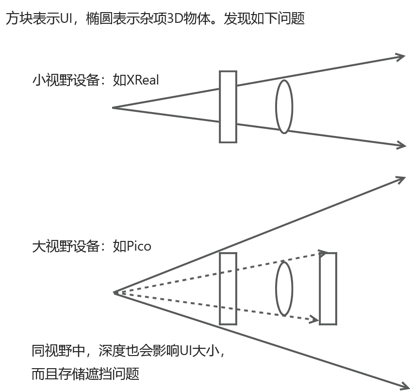

# 【Unity】XR开发常见问题

解决那些常见但官方未解决的需求。

## 基于 3D 空间的贴屏 UI

在 VR 中，屏幕空间画布不可用，但跟随相机之类的 UI 需求仍然存在，若改用 3D 空间加常驻相机前方的方式实现，存在两个问题：

1. 没有统一的参考空间，导致 UI 大小难以控制，无法和美术设计的效果匹配，且只能实机测试。（如果是屏幕模式则可固定参考1920*1080）
2. 3D 空间渲染存在遮挡、顺序问题，当用户靠近展示物体时，很容易出现贴屏 UI 穿模的情况。

要解决这两个问题，我们需要采用两种方法：

1. 基于 3D 空间模拟的屏幕坐标。
2. 分层渲染，强行分离UI和物体的渲染队列。

对于方法1，直接使用Unity自带的画布模式 “Screen Space-Camera” 即可。但该模式设置的距离过小时，会出现 UI 跟随不稳定的问题，所以需要配合方法2，使 UI 渲染不用考虑距离遮挡。

对于方法2，最传统的方式是分两个相机渲染，但相机需要剔除排序后处理等操作，再加上xr是双目渲染，导致增加相机的开销很大。最好的方式是直接从渲染流程上下手，在单相机中完成分层渲染，可以提升10帧左右的性能。

## 启用后处理和 HDR 效果

后处理和HDR对很多特效来说非常重要，有没有完全是两种视觉效果，但 PICO 官方却并不支持，如果开启这两个选项中任意一个，都会导致 MR 效果中背景变黑屏。然而经过研究后，可以发现，实际上是能支持的。

+ PICO MR 的原理？PICO 实现 MR（混合现实）效果的原理就是，将虚拟画面叠加到现实画面中，具体的叠加方式，是通过 Alpha（透明度）进行混合，这种方式非常简单，和 PS 里的混合没有差别。

在知晓 MR 的原理后，再考虑背景变黑（不能正常混合）问题时，我们可以优先检查一下是不是透明度有问题。测试之后就很容易发现，后处理和HDR确实会影响透明度，具体而言，影响方式如下：

+ 后处理：Unity默认的后处理Shader，在完成后处理后，不会复原透明度，alpha 始终返回 1，导致透明信息丢失。
+ HDR：开启 HDR 后，Unity会更换渲染附件的纹理格式来支持浮点数存储，但默认其使用R11G11B11，其不带透明度通道（未开启时为R8G8B8A8）。

所以我们要依次解决这些问题：

+ 对于后处理：我们需要修改默认的后处理 Shader，在返回结果时，从原贴图中采样回alpha再返回。
+ 对于HDR：通过阅读 URP 源码，可以发现 Unity 本身是有考虑使用透明度的情况，触发方式就是 Player 设置中的 Render Over Native UI 选项，启用后Unity就会改用待透明度的HDR格式（R16G16B16A16）。

## 处理辉光效果丢失的问题

启用后处理并打包后，会发现辉光效果不正常，这还是因为 Unity 的后处理不考虑透明度的原因。我们当前能正常显示，是因为我们获取了原纹理的透明度内容，但辉光的光晕是原纹理中不曾拥有的。可以尝试为辉光生成透明度，但都比较麻烦或低效，所以我们换种策略。

PICO MR 的混合，默认是基于传统叠加法（`SrcAlpha OneMinusSrcAlpha`），所以辉光部分乘上透明度就消失了。但我们实际上可以不使用传统叠加，不让虚拟画面再乘透明度（而且这样才应该是对的，因为虚拟画面在渲染期间就已经应用过透明度，二乘透明度反而不对）。可以把`SrcAlpha`换成`One`，这样辉光之类的画面就可以始终保持。

## 处理部分物体无法单独显示的问题

在一些老式或自定义的着色器中，会出现物体单独不显示，但背靠物体能显示的情况。这个直接原因和辉光丢失是一样的。所以如果解决了辉光丢失问题，那该问题也自然会解决。或者你也可以从根本原因下手。

为了实现虚拟画面内的透明度混合，这些着色器是肯定会输出透明度的。但这些透明度不会存储到渲染附件中，因为他们的着色器中 `Mask` 为 `RGB`，需将其改为 `RGBA` 才行。

## 处理按钮难以点击的问题

Unity默认按钮触发需要用户确保手指放在按钮区域上，并按下一定程度后重新在区域内抬起。但这一操作很多人会出现，按不到，按歪，按过头的情况，于是始终无法触发按钮。

解决方法就是不要用原生的按钮事件，改为 `IPointerEnterHandler`, `IPointerExitHandler`触发。这两个事件在遇到手柄或鼠标时，会触发扫过就触发的现象，但在手势操作中，只有手接触时才会触发，故可正常使用。

## 提高实机画面清晰度

[https://developer-cn.picoxr.com/document/unity/enhance-image-quality/](https://developer-cn.picoxr.com/document/unity/enhance-image-quality/)

为了节省性能，默认的XR渲染都是非完整分辨率渲染的，需要在URP中设置渲染缩放，以提高分辨率（但注意不要超过最大分辨率，否则画质不会进一步提升还存在渲染开销，建议使用1.3）。

此外还有些操作可以优化画面：

1. 使用TextMeshPro制作文字UI。
2. 启用MSAA，一般4倍即可。
3. 对所有纹理启用mipmaps。

## 网络上的效果参考视频

完全适配后处理功能后的效果：[https://www.bilibili.com/video/BV1cj6zBjE8B](https://www.bilibili.com/video/BV1cj6zBjE8B)

利用透明度混合机制能实现的效果：[https://www.bilibili.com/video/BV1oN411t7gk/](https://www.bilibili.com/video/BV1oN411t7gk/)
