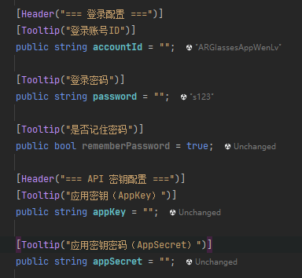

# 【生活杂谈】不要让全自动 AI 毁掉你的代码

如今是 AI 的时代，我相信没有人没用过 AI，实际上现在大部分程序员都在使用 AI 编程。甚至很多美工、策划等本不是程序员的人，也能借助 AI 进行程序编写了。我本人也是经常使用 AI 查资料写示例代码，这效率远比搜索引擎或自己查文档高效的多。而且事实上，因为商业化的原因，搜索引擎已经逐渐失去了查找资料的能力，网络上充斥“机翻、驴头不对马嘴、灌水、AI生成、广告、墙“等各种影响获取正确资料的阻碍。 相比之下，资料库经过筛选的 AI，反而能更好的提供原始正确资料。

目前使用 AI 编程，主要有两种方式：

1. 仅借助 AI 查资料，整体思路和最终实现还是由人工完成。（保守派）
2. 使用全自动 AI 编程，思路和实现全部交给 AI，自己仅提需求。（激进派）

我本人是保守派，因为我信不过 AI 的编程能力（事实也确实如此），但根据工作经验，现在大部分都属于激进派，而且远比我想象的还要激进。

## 辅助驾驶≠无人驾驶

任何一个 AI 服务，一定都有在声明中说过：

> AI 也可能会犯错。请核查重要信息。
>

但很多人都在无视这条说明，不会去修补完善 AI 的代码漏洞，甚至不会回头看 AI 编写的代码是否正确，如果程序无法执行，也只是直接向 AI 反馈问题，完全放弃了对程序实现思路的控制。整个过程就好像为了应付毕业论文的大学生，或一名不懂编程而使用 AI 编程的新手一样。

这种行为在我看来，就和用夹子夹住方向盘，从而让辅助驾驶的汽车一直运行，而自己直接呼呼大睡的司机一样。这种事只能中午干，因为早晚要车毁人亡。当然，写代码不会致人死亡，但却会导致项目变成一坨完全无法维护的屎山，这在大型项目上更为明显。

现在利用 AI 全自动编程，做一些临时小项目是可以的，但对于大型长线发展的工业级项目，是完全不够格的。以下我就举一些常见问题。

## 毁掉项目的异常和日志机制

```csharp
//AI写法
void StartGame([NotNull]Player player)
{
    try{
        Debug.Log("准备开始游戏");

        Debug.Log("获取游戏参数");
        if(player == null)
            return;
        int id = player.ID;

        Debug.Log("开始游戏");
        JoinGame(id);
    }
    catch (Exception e){
        Debug.LogError($"开始游戏时发生异常：{e.Message}");
    }
}
```

上述代码放到正式环境中存在如下问题：

1. player不存在为什么直接返回？无法正常执行逻辑，不应该直接报错？
2. 这是内部函数，player永远都有，不可能为空，为什么要进行为空判断？
3. 为什么要捕获异常但不处理？为什么Log异常时要抹除异常的堆栈信息？
4. Log很消耗性能，而且明明没有调试的需求，为什么要写那么多Log？

这只是一个代码片段，实际上AI会轻松写上几百行代码，以及各种嵌套的进一步调用，这些代码中会有大量的上述行为，如果放到生产环境就会导致如下问题：

1. 程序员误操作，传了个空参数，结果软件无法正常运行，但又拿不到任何报错信息。
2. 整个项目疯狂弹Log，平白消耗珍贵性能，从中截取需要的Log也变的非常麻烦。
3. 软件报错了，但错误信息被捕获，接着输出了一个没有堆栈的错误信息，完全不知道错误位置。

此时你让 AI 去解决该问题，他八成是解决不了的（异常和日志系统完全失效，真人也无从下手），于是它只能屎山上加屎，比如增加额外的为空判断处理，花了半天劲，歪打正着终于解决了，代码又加了几百行。

```csharp
//正确写法
void StartGame([NotNull]Player player)
{
    JoinGame(player.ID);
}
```

## 完全多余莫名其妙的功能实现

```csharp
//这是一个会被挂载在场景中单例系统脚本
//AI写法
class GameSystem : MonoBehaviour
{
    public static GameSystem Instance{
        get{
            if(instance == null)
            {
                instance = Object.FindObjectOfType<GameSystem>();
                if(instance == null)
                {
                    GameObject go = new GameObject("GameSystem");
                    instance = go.AddComponent<GameSystem>();
                    DontDestroyOnLoad(go);
                }
            }
            return instance;
        }
    }

    private static GameSystem instance;

    private void Awake()
    {
        if (instance == null)
        {
            instance = this;
            DontDestroyOnLoad(gameObject);
        }
        else if (instance != this)
        {
            Destroy(gameObject);
        }
    }

    [SerializeField] private string gameName = "DefaultGameName";
}
```

上述代码存在如下问题：

1. 都是挂载在场景中了，为什么获取单例时还要实现实时创建？
2. `Awake`里已经`DontDestroyOnLoad`，为何创建时要再执行一遍？
3. 如果是实时创建的，那`[SerializeField]`的意义在哪？根本没地方改。
4. 单例但场景里有多个，不应该是异常提醒程序员删除吗，为何掩盖这行为？

这只是一种功能的实现示例，实际代码中会有大量功能，都采用完全没必要甚至故意掩盖程序缺陷的写法，结果就会导致很多问题：

1. 程序运行效率很低，实际执行功能的代码很少。
2. 人为误操作被掩盖，游戏漏洞屎山代码不断积累。

```csharp
//正确写法
[DefaultExecutionOrder(-100)]
class GameSystem : MonoBehaviour
{
    public static GameSystem Instance{ get; private set;}

    [SerializeField] string gameName = "DefaultGameName";
    
    void Awake()
    {
        Instance = this;
    }
}
```

其他的例子：

```text
这是一款弹窗UI的对象层级布局：
- Window（窗口根画布）
  - Content（窗口内容）
  - OK（窗口确认按钮）
```

```csharp
//这是触发OK时关闭窗口的代码
void OK()
{   
    if(Window != null)
        Window.Close();
}
```

能看出什么问题吗？

## 将高级语言劣化成汇编语言

AI到底无法思考，只是模仿人的行为，而无法理解其原因。其写出的代码片段非常适合新手阅读，因为其代码集中且考虑很多，所以能方便的阅读并从中学到很多东西。但这种写示例代码的思想放到实际生产环境中就会变成一场灾难。

### 不会封装复用和模块化

如果没有人为干涉，AI 偏好把所有功能代码都放一个脚本中实现。

+ 对于新手学习：这很友好，因为需要调用的功能都可以在一个脚本中看到，也不需要配置额外的依赖环境。
+ 对于实际生产：这很糟糕，不能实现代码复用，每个脚本都非常臃肿。
    1. 不会使用第三方库，喜欢重复造自己的轮子，学习维护成本很高。
    2. 造出的轮子也不知道封装成工具类，无法被其他功能复用，每个功能反复增加非实际业务的代码，对后期项目开发也没有任何价值。
    3. 功能都一个脚本实现，也不考虑软件工程设计，最终实现依赖地狱，模块难以修改拆分。

### 不切实际的花里胡哨

如果没有人为干涉，AI 喜欢写一堆无效甚至负作用的代码，说到底他们不会考虑实际的工作环境（实际上他也无法思考这些）。

+ 对于新手学习：这很友好，可以拓展性的学习到很多新知识，能看到对各种可能问题的思考和处理。
+ 对于实际生产：这很糟糕，脚本中充斥着无效代码，严重影响阅读和性能，且各种擅自的操作，使得功能变的不可控，形成黑盒，让人无法预估功能的运作行为。

### 无法理解软件工程设计

AI 默认情况下不会使用什么软件设计方法，但实际上它也无法真的理解设计模式之类的开发方法。任何一个功能，你随意指派给他一种设计方法，他都能给你生成对应的代码，但具体代码是否如实、是否高效，它完全无法保证。AI 对设计方法的理解，完全就像是小白第一次用设计模式一样，邯郸学步生搬硬套，功能没实现先给自己的项目扣上一层枷锁，强行增加自己的编码难度，最后适得其反，名为框架的锁，把所有功能牢牢耦合在一起。

而且 AI 一个很严重的问题是，他无法真的思考这些问题，基本上你说啥，他都“对对对”，于是 AI 的工作能力，就很看重操作员的指挥。但很遗憾的是，大部分操作员就是因为不会编程、不想编程，才会让 AI 全自动跑代码，于是操作员只能让 AI 分析，然后 AI 接到分析指令，就一定要分析个所以然出来，接着一套屎山框架就出来了。

### 随手写出巨额代码量

上述的各种问题带来的最显著结果，就是巨额的代码量，超复杂的脚本关系。一个小功能，它能给你搞出几个甚至十几个相互耦合的脚本（为了强行设计、或者单脚本代码太多被要求拆分），而且每个脚本都有上百甚至上千行代码。当代码复杂到这个程度的时候，基本就已经无法阅读了。

这远比人类造成的屎山要严重的多，因为人类都尽可能会少写代码，屎山的代码复杂，是因为不会写而不是故意写，而且多少还保有些人的思考逻辑在。但 AI 这就纯故意了，完全不考虑他人感受。AI 写出的代码，基本无法再被人为维护。

有人认为 AI 写代码多的一部分原因是因为注释多（这也没事找事和写教学代码的典型表现），而注释提高了可读性，所以 AI 代码的可读性很好。但看看下面这个属性注释：



.png)

这些注释单纯就是把英文又翻译了一遍，完全没有实际作用，而这种水货注释充满了项目，不知道的还以为产品是按代码量收钱。

.png)

找这些注释的时候我还发现了上面这个代码。请问有什么用？单纯为了发一个Log，占用一个Awake函数。要知道Log和Awake都是有性能消耗的，而且这个Log完全可以放到单例创建时播报。此外注释放这里又是干啥？别人不去看公开的单例，而且去翻私有的空Awake函数，来了解这个系统是单例创建的？

回顾时我还发现了其他问题，在我的IDE中，永远不会被使用的代码将会被标记为灰色，可以发现，上面不少变量都是灰色的，所以说这不仅是注释，而且其中很多实际代码都是无效内容，而这些垃圾还会在一次一次的迭代中不断累积。

.png)

看一下人类的注释，不去解释属性名（没有必要），而是去解释用法作用和特殊情况。

## 不听话且不负责的做事态度

AI 的知识储备远比人类丰富，所以非常适合检索资料，但其编码水平说实话还是屎山水平。人类也写屎山，但 AI 的破坏力远比人类强得多，我甚至不敢让 AI 改我的代码，因为它随随便便就能把我的代码大换血，但换个人类小白，他还知道要少改代码。而且相比人类小白，AI 的行事方式是最为危险的。

+ AI 不会真的思考
+ AI 没有长期记忆

### 无法完全理解和遵照指令

在很多大型公司，包括Unity、.Net自身，都是有一套编码规范的，因为这是提高开发效率，方便多人合作的必要建设。那么换 AI 上岗，能否继续遵守编码规范？

实测是不可以的，它可能能对部分规范遵守，但很多规范，他不能正常执行，而且随着上下文的增长，越用就越会发现他违规的地方。尝试让他牢记，并每次提醒，但并没有用，首先它根本无法做到牢记，也无法准确理解意图运用规范，即使多次纠正，但每次提醒后，它理解的方式也会发生改变。

### 不同时段的思考无法维持

AI 不会思考，导致他总是犯错，写出固执己见的代码。那么就按 AI 自身意图来，它表现的又如何？

同样也是不行。AI 有限的上下文，使得隔一段时间就要重新开始新的对话，此时换来的就像是一个全新的员工。有限的上下文也使得其思考范围非常窄，如果一个系统相关的代码非常复杂繁多，他也是无法完全理解的。结果又由于它非常喜欢写超级多的代码，这些代码同样最后变成了 AI 也要面临的屎山。

当屎山出错时，AI 肯定是永远都有办法的（你说啥他都“对对对”的典型表现）

+ 一种情况是它永远不奏效，你要是一直听他的，甚至能偏到让你改源码（源码错了，那其他项目咋没事的）。
+ 另一种是让它知道的部分错误原因后，他能歪打正着的解决，但解决不了根本原因，他只能避免问题，屎上堆屎。

连 AI 自己写的代码，它都弄不懂，那么最后这座屎山改由谁负责？

## AI真的带来了效率提升？

谈了上述的各种问题后，你可以想说，牺牲性能、代码变黑盒，但换来了效率提升，这是值得的。就好像C++应用的效率很高，但通常人们还是会选择java、python这些低效的解释性语言。因为他们更现代化，更易于使用。

但是AI真的让你变快了吗？AI真的能够像编译器那样准确翻译代码吗？

<https://mp.weixin.qq.com/s?__biz=Mjc1NjM3MjY2MA==&mid=2691566538&idx=1&sn=dac9297157536671c0a11b8c6c9eb4a4&chksm=a8cac4d279e87836f4646daa0101f5f870430482b22332866a8afba1f8da0ea59855a8352aa0&mpshare=1&scene=24&srcid=04057n87TWlqJ9axpHyfwO1O&sharer_shareinfo=1d80fba302ce1795fb96d1175c5d50a9&sharer_shareinfo_first=1d80fba302ce1795fb96d1175c5d50a9#rd>

## 后记感悟

AI 浪潮势不可挡，我很讨厌 AI，但我也用 AI。我期望 AI 能达到和科幻电影一样，真正变成和人一样的存在，但可惜至少现在还不是。它模仿的很像，终究不是人，需要人去监管和督促，然而很可惜的是，我看到很多人似乎已经过早的沉沦在了这场美梦中，他们放弃了思考。

有脑子的人最终选择去相信没脑子的机器，我感觉很讽刺真的。但这也是个人的自由，就如同在辅助驾驶上呼呼大睡的司机一样，但是这么干之前，请想想车上的其他人，想想路上的行人，想想等着你平安抵达的人们。这个世界，每个人都息息相关，AI 会改变你的生活，也会改变你周围人的生活。
